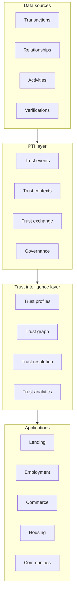
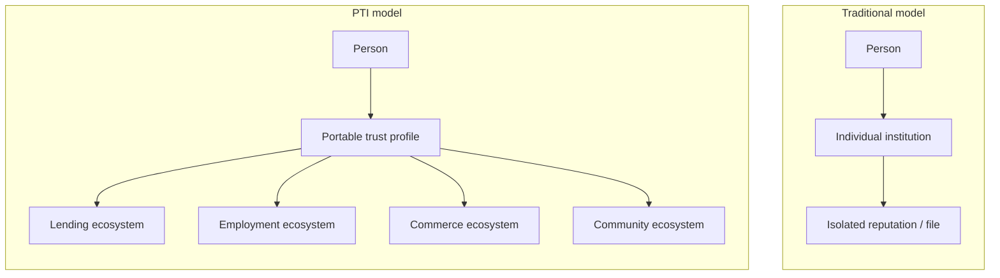
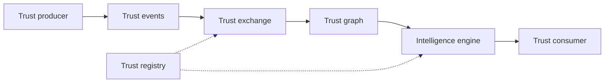

import SpecHero from '@site/src/components/SpecHero';

<SpecHero
  kicker="Reference architecture"
  title="Trust Infrastructure Stack"
  lead="How applications, intelligence services, PTI core contracts, and source data compose into portable trust infrastructure."
  badges={[
    {label: 'Informative', variant: 'default'},
    {label: 'RFC-001', variant: 'normative'},
  ]}
/>

This page is an **informative** stack view. Normative requirements are in [RFC-001 Architecture](/pti/rfcs/rfc-001-architecture) and [Specification v1.0](/pti/specification/v1.0/architecture).

## Diagram 1: Trust infrastructure stack

| Layer | Role |
|-------|------|
| **Applications** | Decision workflows — underwriting, hiring, tenancy, merchant onboarding |
| **Trust intelligence** | Context scores, graph traversal, identity resolution, explainability |
| **PTI layer** | Normative events, contexts, exchange rules, consent and audit |
| **Data sources** | Raw activity from partners, registries, credentials, and verifications |

## Diagram 2: Traditional vs PTI model

| Model | Characteristic |
|-------|----------------|
| **Traditional** | Trust accumulates inside one institution; portability is manual and lossy |
| **PTI** | Trust profile persists across ecosystems with context isolation and provenance |

## Component map

| Stack element | PTI document |
|---------------|--------------|
| Trust events | [Trust events](/pti/reference-architecture/trust-events) · [RFC-003](/pti/rfcs/rfc-003-trust-events) |
| Trust contexts | [Trust contexts](/pti/reference-architecture/trust-contexts) · [RFC-002](/pti/rfcs/rfc-002-trust-contexts) |
| Trust exchange | [Trust exchange](/pti/reference-architecture/trust-exchange) · [RFC-006](/pti/rfcs/rfc-006-trust-exchange) |
| Trust graph | [Trust graph](/pti/reference-architecture/trust-graph) · [RFC-005](/pti/rfcs/rfc-005-trust-graph) |
| Trust resolution | [Trust resolution](/pti/reference-architecture/trust-resolution) · [RFC-011](/pti/rfcs/rfc-011-identity-resolution) |
| Lookup API | [Trust APIs](/pti/reference-architecture/trust-apis) · [RFC-004](/pti/rfcs/rfc-004-trust-lookup-api) |
| Governance | [RFC-007](/pti/rfcs/rfc-007-governance) · [Specification governance](/pti/specification/v1.0/governance) |

## Trust flow (end-to-end)

See [Trust flow](/pti/reference-architecture/trust-flow) for step-by-step detail.

## Related

- [Reference architecture index](/pti/reference-architecture/)
- [Why PTI exists](/pti/why-pti/)
- [Build Your Own PTI](/pti/build-your-pti/)
