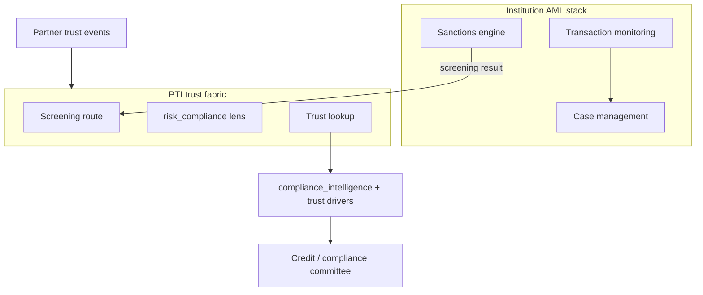

# PTI and AML

Anti-Money Laundering (AML) programs detect, investigate, and report **financial crime risk** — sanctions exposure, suspicious transaction patterns, and typology-based alerts. PTI is not an AML engine; it **integrates AML and screening outputs** into a governed trust fabric alongside behavioral trust signals.

## 1. What AML is

AML encompasses **policies, technology, and reporting** mandated by financial crime regulations. Core capabilities include:

- **Sanctions screening** — OFAC, UN, EU, and regional consolidated lists
- **PEP and adverse media screening** — politically exposed persons and negative news
- **Transaction monitoring** — rules and models for suspicious activity detection
- **Case management** — analyst investigation, SAR/STR filing workflows
- **Customer risk rating** — periodic review based on behavior and profile changes

AML systems optimize for **regulatory compliance and suspicious activity detection** within a financial institution's transaction perimeter.

## 2. What problem AML solves

| Problem | AML response |
|---------|--------------|
| Sanctions evasion | Real-time and batch list screening |
| Structuring and layering | Transaction pattern rules |
| Terrorist financing | Watchlist and typology monitoring |
| Regulatory examination | Audit trails, model validation, SAR records |

AML answers: *Does this customer or transaction present financial crime risk requiring action?* It typically does not provide **portable behavioral trust** — rental reliability, community validation, informal-sector repayment — for inclusion-focused decisions.

## 3. What PTI adds

  

    <h3>AML</h3>
    <ul>
      <li>Sanctions and PEP screening</li>
      <li>Transaction monitoring alerts</li>
      <li>Institution-internal case files</li>
    </ul>
  

  

    <h3>PTI adds</h3>
    <ul>
      <li><strong>Compliance lens context</strong> — <code>risk_compliance</code> scopes screening alongside trust</li>
      <li><strong>Screening as trust evidence</strong> — structured <code>screening_summary</code> with provenance</li>
      <li><strong>Fail-closed semantics</strong> — explicit <code>not_run</code> and <code>unavailable</code> states</li>
      <li><strong>Behavioral + compliance composition</strong> — one lookup envelope for committee review</li>
    </ul>
  

PTI's [Compliance guide](/pti/specification/v1.0/compliance) defines how screening dimensions integrate into trust lookup responses — **additive intelligence**, not a replacement for the institution's AML program or filing obligations.

## 4. How they compose together

**Integration pattern:**

1. Institution maintains full AML stack for transactions and regulatory reporting.
2. At trust lookup time, PTI may invoke **contracted screening providers** (sanctions, PEP, identity registry) and return structured `compliance_intelligence`.
3. Behavioral trust signals from `lending`, `merchant`, or `informal_sector` contexts appear as **drivers** in the same report.
4. Analysts and automated policy engines receive **explainable, provenance-backed** inputs — institutions remain responsible for SAR decisions.

For subjects not yet on the trust network, PTI supports **external screening routes** when strong identifiers are present — billing screening separately from standard lookup tiers.

## 5. When to use each

| Scenario | AML system | PTI |
|----------|------------|-----|
| Wire transfer monitoring | **Required** | Not involved |
| Sanctions check at account opening | **Required** | May compose screening result |
| MFI loan decision for thin-file borrower | Screening **Required** | **Recommended** for behavioral trust |
| Cross-institution portable repayment proof | Outside AML scope | **Required** |
| SAR filing | **Required** (institution) | PTI does not file |

PTI **complements** AML by unifying compliance screening artifacts with portable trust intelligence — it does **not** reduce AML program scope or regulatory accountability.

## 6. Related PTI spec/RFC links

- [Compliance specification](/pti/specification/v1.0/compliance)
- [Explainability guide](/pti/specification/v1.0/explainability)
- [RFC-002 — Trust Contexts](/pti/rfcs/rfc-002-trust-contexts) (`risk_compliance` lens)
- [RFC-012 — Trust Evidence](/pti/rfcs/rfc-012-trust-evidence)
- [RFC-007 — Governance](/pti/rfcs/rfc-007-governance)

## See also

- [KYC](./kyc)
- [Fraud systems](./fraud-systems)
- [Risk engines](./risk-engines)
