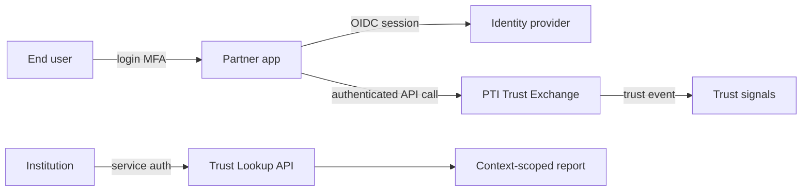

# PTI and Authentication

Authentication verifies **that a presented credential belongs to the claimed subject in this session**. PTI does not replace login flows, MFA, or token issuance — it consumes authenticated sessions as the **trust boundary** for signal ingestion and lookup authorization.

## 1. What authentication is

Authentication is the process of validating **credentials** — passwords, passkeys, OTPs, hardware tokens, client certificates, or federated assertions (SAML, OIDC) — to establish a **session or token** with a defined lifetime and assurance level.

Common patterns:

- **OIDC / OAuth 2.0** — delegated authentication with ID and access tokens
- **FIDO2 / WebAuthn** — phishing-resistant possession factors
- **mTLS** — machine-to-machine authentication for API clients
- **API keys and HMAC signatures** — service authentication for batch ingest

Authentication answers: *Is this request genuinely from this actor right now?*

## 2. What problem authentication solves

| Problem | Authentication response |
|---------|-------------------------|
| Impersonation | Credential verification, MFA step-up |
| Session hijacking | Short-lived tokens, binding, rotation |
| Service spoofing | mTLS, signed webhooks, API key scopes |
| Federated login | Trust transfer via IdP assertion |

Authentication protects **channels and sessions**. It does not aggregate repayment history, rental reliability, or employment verification into portable trust intelligence.

## 3. What PTI adds

  

    <h3>Authentication</h3>
    <ul>
      <li>Session and token validity</li>
      <li>Actor identity at request time</li>
      <li>Assurance level (AAL, eIDAS LoA)</li>
    </ul>
  

  

    <h3>PTI adds</h3>
    <ul>
      <li><strong>Post-auth trust events</strong> — verified activity becomes durable evidence</li>
      <li><strong>Producer authentication profile</strong> — entitled ingest per trust context</li>
      <li><strong>Consumer authentication profile</strong> — scoped trust lookup permissions</li>
      <li><strong>Provenance binding</strong> — events attributed to authenticated producer tenant</li>
    </ul>
  

PTI's [Authentication Model](/pti/specification/v1.0/authentication-model) defines how **trust producers and consumers** authenticate to PTI APIs — distinct from end-user login. End-user authentication remains in the partner or institution application; PTI trusts the **producer's authenticated assertion** that an event occurred.

## 4. How they compose together

**Typical flow:**

1. End user authenticates to partner application (existing OIDC/MFA stack).
2. Partner system authenticates to PTI (mTLS, OAuth client credentials, or signed webhook).
3. Partner emits trust events **on behalf of** the authenticated subject, tagged with `context_id`.
4. Institution authenticates to PTI as a **trust consumer** and requests lookup for a permitted context.

Authentication establishes **who may emit or read**; PTI establishes **what trust evidence exists** once emission is authorized.

## 5. When to use each

| Scenario | Authentication | PTI |
|----------|----------------|-----|
| User login to mobile app | **Required** | Not involved |
| Partner webhook ingest of repayment event | Service auth **Required** | **Required** for trust fabric |
| Institution API trust lookup | Consumer auth **Required** | **Required** |
| Password reset flow | **Required** | Not involved |
| Cross-MFI portable repayment proof | Auth per app | **Required** |

Never substitute PTI API authentication for end-user login, or vice versa. They operate at different trust boundaries.

## 6. Related PTI spec/RFC links

- [Authentication Model](/pti/specification/v1.0/authentication-model)
- [RFC-008 — Security](/pti/rfcs/rfc-008-security)
- [RFC-003 — Trust Events](/pti/rfcs/rfc-003-trust-events)
- [Reference API Specification](/pti/specification/v1.0/reference-api-specification)

## See also

- [Identity](./identity)
- [Authorization](./authorization)
- [Verifiable credentials](./verifiable-credentials)
