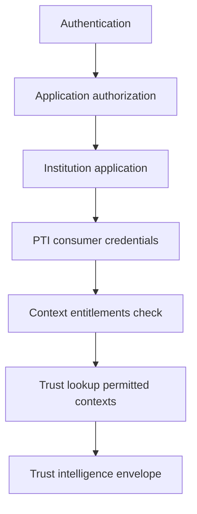

# PTI and Authorization

Authorization determines **what an authenticated actor may do** — read a resource, invoke an API, or act on behalf of a subject. PTI extends authorization into the **trust domain**: which contexts a producer may emit, which contexts a consumer may lookup, and what subject data crosses tenant boundaries.

## 1. What authorization is

Authorization systems enforce **access control policies** after authentication succeeds. Models include:

- **RBAC** — role-based permissions (admin, analyst, teller)
- **ABAC** — attribute-based rules (department, clearance, jurisdiction)
- **ReBAC** — relationship-based access (owner, delegate, guardian)
- **OAuth scopes** — coarse-grained API permissions on tokens
- **Policy engines** — OPA, XACML, custom rule evaluation

Authorization answers: *Given this authenticated actor, is this action on this resource permitted?*

## 2. What problem authorization solves

| Problem | Authorization response |
|---------|------------------------|
| Over-privileged API access | Scope and role restrictions |
| Cross-tenant data leakage | Tenant isolation, row-level security |
| Regulatory purpose limitation | Purpose-bound consent and policy tags |
| Audit accountability | Decision logs, policy version trails |

Authorization protects **resources and operations**. It does not define how trust signals are structured, scoped to life areas, or exchanged across institutions.

## 3. What PTI adds

  

    <h3>General authorization</h3>
    <ul>
      <li>API endpoint permissions</li>
      <li>Resource-level CRUD control</li>
      <li>Application feature flags</li>
    </ul>
  

  

    <h3>PTI adds</h3>
    <ul>
      <li><strong>Context entitlements</strong> — producers emit only entitled <code>context_id</code> values</li>
      <li><strong>Lookup scopes</strong> — consumers request only contracted contexts</li>
      <li><strong>Trust envelope disclosure</strong> — minimum necessary intelligence export</li>
      <li><strong>Consent gates</strong> — cross-context resolution requires subject consent</li>
    </ul>
  

PTI's [Authorization Model](/pti/specification/v1.0/authorization-model) is a **trust-specific policy layer**. Your existing IAM/OAuth scopes govern application access; PTI entitlements govern **trust production and consumption**.

## 4. How they compose together

**Integration pattern:**

1. Institution user authenticates and passes application-level authorization (e.g., "loan officer" role).
2. Application calls PTI Trust Lookup API with **consumer credentials** scoped to `lending` and `risk_compliance`.
3. PTI evaluates **contract entitlements** — rejecting lookup requests for contexts not in the institution's profile.
4. Response returns a **trust envelope** — structured intelligence without raw partner PII beyond contract.

Institution policy engines may **further restrict** which staff roles see lookup results — PTI does not replace internal HR authorization.

## 5. When to use each

| Scenario | Application authorization | PTI authorization |
|----------|---------------------------|-------------------|
| Teller can view customer account | **Required** | N/A |
| Lender can run trust lookup for lending context | App role check | **Required** (context entitlement) |
| Partner emits merchant onboarding events | Partner app auth | **Required** (`merchant` context entitlement) |
| Cross-context score fusion without consent | Should deny | **MUST deny** per RFC-007 |
| API gateway rate limiting | Either layer | Either layer |

Use application authorization for **UX and internal workflow**; use PTI authorization for **trust data boundaries**.

## 6. Related PTI spec/RFC links

- [Authorization Model](/pti/specification/v1.0/authorization-model)
- [RFC-002 — Trust Contexts](/pti/rfcs/rfc-002-trust-contexts)
- [RFC-007 — Governance](/pti/rfcs/rfc-007-governance)
- [RFC-009 — Privacy](/pti/rfcs/rfc-009-privacy)
- [Privacy specification](/pti/specification/v1.0/privacy)

## See also

- [Authentication](./authentication)
- [KYC](./kyc)
- [Risk engines](./risk-engines)
