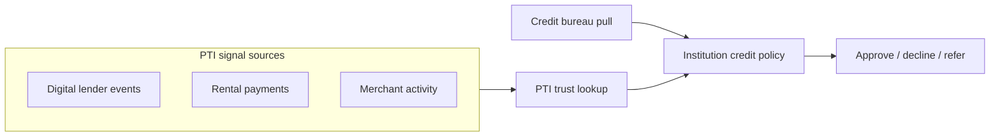

# PTI and Credit Bureaus

Credit bureaus aggregate **formal credit histories** — tradelines, inquiries, public records, and bureau scores — for regulated lending decisions. PTI explicitly **does not replace** credit bureaus. It extends trust evaluation to **thin-file populations** and **non-lending contexts** while composing bureau data where available.

## 1. What credit bureaus are

Credit bureaus (credit reference agencies) are **centralized repositories** of consumer and commercial credit information reported by lenders, utilities, and public sources. They provide:

- **Credit reports** — tradeline history, balances, delinquencies
- **Credit scores** — statistical models (FICO, VantageScore, bureau-specific indices)
- **Inquiry records** — who accessed the file and when
- **Dispute resolution** — consumer correction workflows
- **Regulatory frameworks** — FCRA, GDPR, POPIA, and local credit reporting laws

Bureaus optimize for **formal financial repayment history** within jurisdictions where reporting is mandatory and comprehensive.

## 2. What problem credit bureaus solve

| Problem | Bureau response |
|---------|-------------------|
| Lender needs repayment history | Centralized tradeline file |
| Portfolio risk benchmarking | Population-level score distributions |
| Fraudulent identity on credit app | Inquiry patterns, file consistency |
| Regulatory credit reporting duty | Standardized furnish-and-pull model |

Bureaus answer: *What is this subject's documented formal credit history?* They typically **exclude** rental ledgers, gig income, community savings groups, merchant seller history, and cross-border informal activity — leaving large populations **thin-file or no-file**.

## 3. What PTI adds

  

    <h3>Credit bureaus</h3>
    <ul>
      <li>Formal tradeline credit files</li>
      <li>Bureau scores for lending</li>
      <li>Regulated pull-and-permissible-purpose model</li>
    </ul>
  

  

    <h3>PTI adds</h3>
    <ul>
      <li><strong>Non-bureau trust signals</strong> — digital lender, rental, merchant, community</li>
      <li><strong>Context isolation</strong> — lending score ≠ rental score</li>
      <li><strong>Thin-file inclusion</strong> — credibility from real activity, not absence of tradelines</li>
      <li><strong>Explainability</strong> — drivers and coverage gaps, not one opaque number</li>
    </ul>
  

PTI is **trust infrastructure**, not a credit bureau. Where bureau pulls are permissible and available, institutions **should continue** using them — and may treat bureau outcomes as **inputs** to PTI-enriched decisioning or parallel policy paths.

## 4. How they compose together

**Integration pattern:**

1. Institution runs **standard bureau pull** where regulation and data availability require it.
2. Parallel or sequential **PTI trust lookup** for `lending` context — incorporating partner-reported repayment, mobile-money patterns, and community validation.
3. Credit policy engine weights bureau score and PTI drivers — with explicit **coverage_gaps** when bureau file is thin.
4. For **rental**, **employment**, or **merchant** decisions, bureau data may be irrelevant — PTI provides context-native intelligence.

Adverse-action and fair-lending obligations remain with the **institution**; PTI supplies structured explainability artifacts (`explain_score.v1`) to support those workflows.

## 5. When to use each

| Scenario | Credit bureau | PTI |
|----------|---------------|-----|
| Regulated mortgage underwriting with full file | **Required** where mandated | Optional enrichment |
| Digital microloan to thin-file borrower | Limited bureau value | **High value** |
| Tenant screening | Bureau sometimes used | **PTI rental context** primary |
| Employer background trust check | Not applicable | **PTI employment context** |
| Cross-MFI repayment portability | Bureau may lag | **PTI core use case** |

**Rule of thumb:** use bureaus for **formal credit file** requirements; use PTI when decisions need **portable, multi-source, context-scoped trust** beyond the bureau perimeter.

## 6. Related PTI spec/RFC links

- [Why PTI Exists](/pti/introduction/why-pti-exists)
- [Key concepts — not a credit bureau](/pti/introduction/key-concepts)
- [RFC-002 — Trust Contexts](/pti/rfcs/rfc-002-trust-contexts)
- [RFC-004 — Trust Lookup API](/pti/rfcs/rfc-004-trust-lookup-api)
- [Explainability guide](/pti/specification/v1.0/explainability)

## See also

- [Open banking](./open-banking)
- [Risk engines](./risk-engines)
- [Reputation systems](./reputation-systems)
