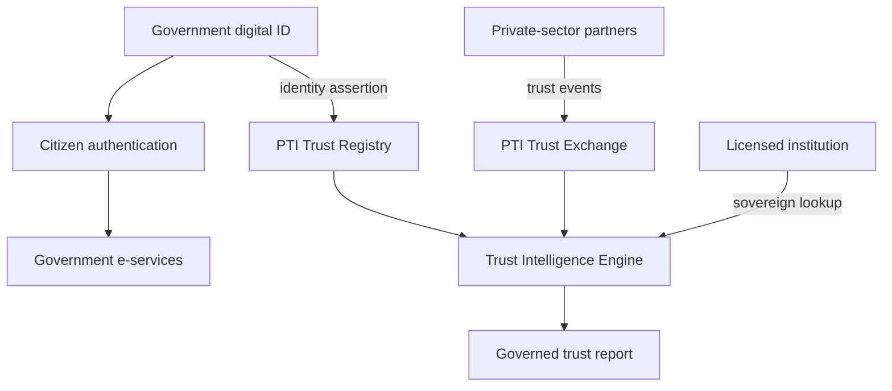

# PTI and Digital Identity

Digital identity programs — national ID, eIDAS, Aadhaar-style registries, federated government wallets — establish **sovereign or regulated identity assurance**. PTI operates **above** digital identity: composing ID verification with multi-source trust signals for institutional decisions across contexts.

## 1. What digital identity is

Digital identity encompasses **government and regulated identity infrastructure**:

- **National digital ID** — unique citizen identifier with biometric or smartcard binding
- **eIDAS / EU Digital Identity Wallet** — cross-border qualified electronic identification
- **Federated identity frameworks** — sector-specific identity federations (health, tax, social protection)
- **Civil registry integration** — birth, death, marriage records as identity anchors
- **Digital public goods** — MOSIP, ID4D, and open-source identity platforms

Digital identity answers: *Who is this person according to authoritative registry or government assertion?*

## 2. What problem digital identity solves

| Problem | Digital identity response |
|---------|---------------------------|
| Duplicate or ghost identities | Unique national identifier |
| Service access without physical ID | Digital authentication to government services |
| Cross-agency identity silos | Shared registry or federation bus |
| Election and benefit fraud | Strong binding to civil registry |

Digital identity solves **identification and authentication to public services**. It does not automatically provide **lending repayment history**, **rental reliability**, **informal-sector trust**, or **cross-private-sector signal exchange**.

## 3. What PTI adds

  

    <h3>Digital identity</h3>
    <ul>
      <li>Sovereign or regulated ID assertion</li>
      <li>Authentication to government services</li>
      <li>Civil registry truth</li>
    </ul>
  

  

    <h3>PTI adds</h3>
    <ul>
      <li><strong>Trust layer above ID</strong> — behavior and attestations beyond "who"</li>
      <li><strong>Private-sector signal exchange</strong> — MFIs, landlords, merchants as producers</li>
      <li><strong>Context-scoped intelligence</strong> — same citizen, different trust per life area</li>
      <li><strong>Governed portability</strong> — consent-first cross-institution lookup</li>
    </ul>
  

Governments implementing digital ID **should not conflate identity with creditworthiness**. PTI enables **inclusion**: a valid digital ID plus portable behavioral proof supports loan, rental, and employment decisions for populations with strong identity but thin formal credit files.

## 4. How they compose together

**Sovereign deployment pattern:**

1. National ID system provides **high-assurance identity binding** to `pti_id` at registry level.
2. Licensed private partners emit trust events under **contractual and regulatory** frameworks.
3. Government or regulated institutions consume **trust lookups** for social protection, SME lending, or housing programs — with audit trails suitable for public sector accountability.
4. **Data minimization** — institutions receive trust envelopes, not full cross-agency dossiers.

PTI aligns with **digital public infrastructure (DPI)** strategy — see [Digital public infrastructure](./digital-public-infrastructure).

## 5. When to use each

| Scenario | Digital identity | PTI |
|----------|------------------|-----|
| Citizen logs into tax portal | **Required** | Not involved |
| Government benefit eligibility (identity-only) | **Required** | Optional |
| National inclusive finance program | ID **Required** | **PTI Recommended** |
| Private landlord tenant screening | ID verification | **PTI rental context** |
| Cross-border identity recognition | eIDAS / bilateral MOU | PTI federation optional |

Digital identity is **foundational**; PTI is **trust infrastructure** that respects sovereign ID without replacing registry authority.

## 6. Related PTI spec/RFC links

- [RFC-011 — Identity Resolution](/pti/rfcs/rfc-011-identity-resolution)
- [RFC-006 — Trust Exchange](/pti/rfcs/rfc-006-trust-exchange)
- [Governance specification](/pti/specification/v1.0/governance)
- [RFC-007 — Governance](/pti/rfcs/rfc-007-governance)
- [Trust Context Catalogue](/pti/reference-architecture/trust-contexts) (`civic` lens)

## See also

- [Identity](./identity)
- [Verifiable credentials](./verifiable-credentials)
- [Digital public infrastructure](./digital-public-infrastructure)
