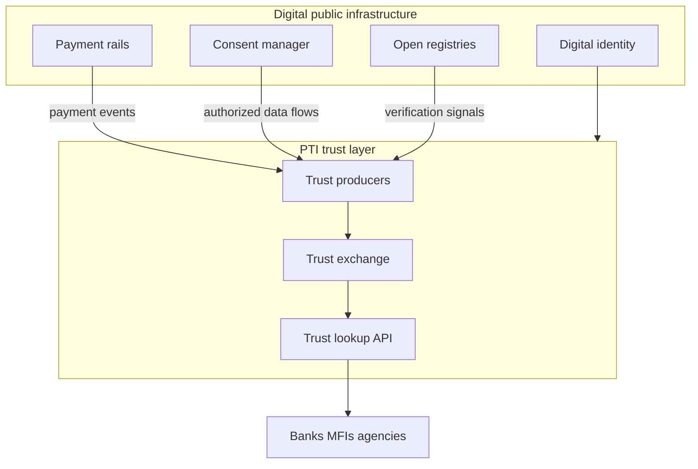

# PTI and Digital Public Infrastructure

Digital Public Infrastructure (DPI) refers to **shared, interoperable public rails** — digital identity, instant payments, open data registries, and consent managers — that enable inclusive service delivery at national scale. PTI is a **trust layer** that composes DPI components into **governed, portable trust intelligence** for private and public sector decisions.

## 1. What digital public infrastructure is

DPI stacks typically include:

- **Digital identity** — national ID, authentication, attribute sharing
- **Payment rails** — real-time retail payments (UPI, Pix, FedNow-style systems)
- **Open data and registries** — business registration, land records, tax identifiers
- **Consent managers** — citizen-controlled data sharing (Account Aggregator, CM frameworks)
- **Open protocols** — Beckn, MOSIP, and interoperable API standards

DPI answers: *How do we build inclusive digital services on shared public foundations rather than proprietary silos?*

## 2. What problem DPI solves

| Problem | DPI response |
|---------|--------------|
| Fragmented citizen services | Shared identity and data rails |
| Cash-heavy informal economy | Instant payment ubiquity |
| Private gatekeeping of public data | Open registries and APIs |
| Cross-ministry duplication | Reusable infrastructure components |

DPI solves **access and interoperability at population scale**. It does not automatically define **how private institutions evaluate trust** across lending, rental, employment, and commerce — nor how **behavioral signals** from diverse partners compose under consent and audit.

## 3. What PTI adds

  

    <h3>Digital public infrastructure</h3>
    <ul>
      <li>Identity, payments, registries, consent</li>
      <li>Public-good interoperability rails</li>
      <li>Citizen-to-government service delivery</li>
    </ul>
  

  

    <h3>PTI adds</h3>
    <ul>
      <li><strong>Trust as DPI layer</strong> — programmable trust lookup alongside ID and payments</li>
      <li><strong>Private-sector signal exchange</strong> — governed producer/consumer model</li>
      <li><strong>Context-scoped outcomes</strong> — same citizen, multiple life-area evaluations</li>
      <li><strong>Inclusion thesis</strong> — thin-file populations access credit via portable proof</li>
    </ul>
  

Policy thinkers describe **India Stack** (identity + payments + data consent) as foundational DPI. PTI extends that model with **Trust Stack** semantics — not replacing UPI or Aadhaar, but enabling MFIs, landlords, and employers to **consume portable trust** built on top of those rails.

## 4. How they compose together

**National inclusion pattern:**

1. Citizen authenticates via **national digital ID** (DPI identity layer).
2. Payment and account activity flows through **consent manager** to authorized trust producers.
3. PTI ingests **derived trust events** — repayment, income regularity, business registration confirmation.
4. Regulated institutions and government programs run **trust lookups** for SME lending, social housing, or farmer finance — with sovereign auditability.

Governments MAY operate PTI-compatible **trust exchange** as public infrastructure; private implementations MUST interoperate via [RFC-006 — Trust Exchange](/pti/rfcs/rfc-006-trust-exchange) profiles.

## 5. When to use each

| Scenario | DPI component | PTI |
|----------|---------------|-----|
| Citizen receives pension payment | Payment rail **Required** | Not involved |
| National farmer subsidy eligibility (identity-only) | ID + registry | Optional |
| Inclusive MFI lending at scale | ID + payments DPI | **PTI Recommended** |
| Cross-ministry data sharing | Consent manager | PTI for **trust outcomes** |
| Private landlord screening | ID verification via DPI | **PTI rental lookup** |

PTI **extends** DPI; it does not compete with sovereign identity or payment authority.

## 6. Related PTI spec/RFC links

- [RFC-001 — Architecture](/pti/rfcs/rfc-001-architecture)
- [RFC-006 — Trust Exchange](/pti/rfcs/rfc-006-trust-exchange)
- [Interoperability specification](/pti/specification/v1.0/interoperability)
- [Governance specification](/pti/specification/v1.0/governance)
- [Why PTI Exists — inclusion thesis](/pti/why-pti/)

## See also

- [Digital identity](./digital-identity)
- [Open banking](./open-banking)
- [Verifiable credentials](./verifiable-credentials)
