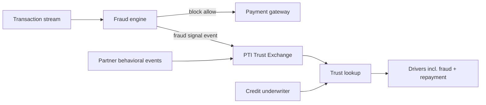

# PTI and Fraud Systems

Fraud detection systems identify **real-time abusive behavior** — account takeover, synthetic identity, payment fraud, and device anomalies. PTI is not a transaction fraud engine; it **integrates fraud outcomes** as trust signals and provides **cross-context credibility** that point-in-time fraud scores alone cannot supply.

## 1. What fraud systems are

Fraud systems combine **rules, machine learning, and graph analytics** to score risk on sessions, devices, payments, and account changes. Categories include:

- **Account fraud** — ATO, credential stuffing, synthetic identity
- **Payment fraud** — card-not-present, ACH fraud, chargeback prediction
- **Application fraud** — first-party and third-party misrepresentation at onboarding
- **Device intelligence** — emulator detection, velocity, geolocation anomalies
- **Case management** — analyst queues, block/allow lists, feedback loops

Fraud systems optimize for **immediate block/allow decisions** with millisecond latency on high-volume transaction streams.

## 2. What problem fraud systems solve

| Problem | Fraud system response |
|---------|----------------------|
| Stolen credentials used for payment | Real-time decline or step-up |
| Bot-driven account creation | Velocity rules, CAPTCHA, device fingerprint |
| Friendly fraud patterns | Behavioral models, dispute history |
| Merchant collusion | Network graph and anomaly detection |

Fraud systems answer: *Should we block or challenge this transaction or session right now?* They typically do not maintain **long-horizon trust portfolios** — rental payment consistency, community endorsements, informal-sector group savings — for inclusion-focused credit and tenancy decisions.

## 3. What PTI adds

  

    <h3>Fraud systems</h3>
    <ul>
      <li>Real-time transaction/session scoring</li>
      <li>Block, challenge, or allow actions</li>
      <li>Short-horizon anomaly detection</li>
    </ul>
  

  

    <h3>PTI adds</h3>
    <ul>
      <li><strong>Fraud flags as trust signals</strong> — structured events with provenance</li>
      <li><strong>Cross-context view</strong> — fraud in <code>merchant</code> vs credibility in <code>lending</code></li>
      <li><strong>Longitudinal trust</strong> — months of verified activity beyond session score</li>
      <li><strong>Explainable lookup</strong> — fraud indicators as drivers, not hidden list membership</li>
    </ul>
  

A fraud decline at checkout and a positive **12-month repayment history** are both relevant — but to **different decisions and contexts**. PTI's context isolation prevents conflating a merchant fraud flag with a rental application unless policy explicitly composes them under governed rules.

## 4. How they compose together

**Integration pattern:**

1. Fraud engine continues **inline transaction decisions** — PTI does not add latency to payment authorization paths.
2. Significant fraud outcomes (confirmed fraud, synthetic identity match, account recovery) emit **trust events** to PTI where contract permits — tagged with appropriate context and severity band.
3. Positive behavioral events from partners accumulate in parallel.
4. Institution underwriter requests **trust lookup** — seeing fraud-related drivers alongside repayment and verification evidence with explicit **coverage_gaps**.

Never use PTI lookup as a **real-time fraud substitute** on payment rails; use it for **decision-time trust evaluation** (lending, merchant onboarding review, tenancy).

## 5. When to use each

| Scenario | Fraud system | PTI |
|----------|--------------|-----|
| Card payment authorization | **Required** (milliseconds) | Not inline |
| Merchant onboarding periodic review | Fraud rules helpful | **PTI merchant context** |
| Microloan underwriting | Application fraud check | **PTI lending lookup** |
| Account login step-up | **Required** | Not involved |
| Portable trust after fraud recovery | Fraud list internal | **PTI with explicit drivers** |

Fraud systems protect **transaction channels**; PTI orchestrates **durable trust evidence** for institutional decisions.

## 6. Related PTI spec/RFC links

- [RFC-003 — Trust Events](/pti/rfcs/rfc-003-trust-events)
- [RFC-012 — Trust Evidence](/pti/rfcs/rfc-012-trust-evidence)
- [Explainability guide](/pti/specification/v1.0/explainability)
- [RFC-002 — Trust Contexts](/pti/rfcs/rfc-002-trust-contexts)
- [Security specification](/pti/specification/v1.0/security)

## See also

- [AML](./aml)
- [Risk engines](./risk-engines)
- [Authentication](./authentication)
