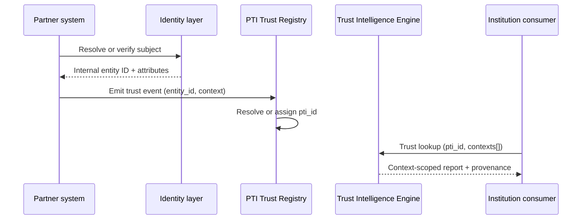

# PTI and Identity Systems

Identity systems answer **who is this subject?** Portable Trust Infrastructure answers **what trust evidence exists for this subject, in which life-area context, with what provenance?** They are complementary layers in a modern trust stack.

## 1. What identity systems are

Identity systems maintain **subject directories** — registries of people, organizations, and devices with stable internal identifiers, attribute stores, and (often) deduplication logic. Categories include:

- **Customer identity and access management (CIAM)** — consumer onboarding profiles
- **Enterprise directory services** — workforce identity (LDAP, Active Directory)
- **Customer master data management (MDM)** — golden records across CRM and core banking
- **Identity resolution platforms** — probabilistic matching across datasets

Identity systems optimize for **uniqueness, attribute freshness, and account lifecycle** within an organization's boundary or federation contract.

## 2. What problem identity systems solve

| Problem | Identity system response |
|---------|--------------------------|
| Duplicate accounts | Merge rules, deterministic keys, probabilistic matching |
| Attribute drift | Profile updates, verification timestamps |
| Cross-application SSO | Federated identifiers, token claims |
| Regulatory ID capture | Storage of legal name, DOB, national ID number |

Identity systems excel at **account management**. They typically do **not** maintain portable trust history, context-scoped credibility scores, or cross-institutional signal exchange.

## 3. What PTI adds

  

    <h3>Identity systems</h3>
    <ul>
      <li>Internal customer or employee IDs</li>
      <li>Attribute profiles and verification status</li>
      <li>Account lifecycle (create, merge, deactivate)</li>
    </ul>
  

  

    <h3>PTI adds</h3>
    <ul>
      <li><strong>Portable <code>pti_id</code></strong> — persists across partners and institutions</li>
      <li><strong>Entity linking</strong> — maps partner entity IDs to one subject graph</li>
      <li><strong>Trust signal orchestration</strong> — events become context-scoped evidence</li>
      <li><strong>Lookup at decision time</strong> — institutions consume trust intelligence, not raw PII</li>
    </ul>
  

PTI treats identity resolution as an **input plane**. A verified identity assertion may become a trust signal; the **PTI-ID** becomes the anchor for all subsequent trust events regardless of which partner emitted them.

## 4. How they compose together

**Integration pattern:**

1. Partner completes identity capture through existing IdP or KYC flow.
2. Partner emits a **trust event** referencing its entity ID and entitled trust context.
3. PTI Trust Registry resolves the subject to a **`pti_id`** (creating or linking as needed).
4. Institution consumers request **trust lookups** by `pti_id` — not by re-querying the partner's identity store.

## 5. When to use each

| Scenario | Use identity system | Add PTI |
|----------|---------------------|---------|
| Single-app login and profile | Yes | Optional |
| Multi-partner signal ingestion with portable trust | Yes (per partner) | **Required** |
| Cross-institution trust lookup at loan/rental/hire decision | Partial (subject match only) | **Required** |
| Merging duplicate CRM records within one bank | Yes | No |
| Linking repayment history across MFIs and merchants | No (outside scope) | **Required** |

**Rule of thumb:** keep your identity stack for **authentication and account management**; add PTI when trust must **travel with the subject** across institutional boundaries.

## 6. Related PTI spec/RFC links

- [RFC-011 — Identity Resolution](/pti/rfcs/rfc-011-identity-resolution)
- [Reference Data Model — Subject identity](/pti/specification/v1.0/reference-data-model)
- [RFC-005 — Trust Graph](/pti/rfcs/rfc-005-trust-graph)
- [Core Design Principles — Portable by Design](/pti/introduction/design-principles)

## See also

- [Authentication](./authentication)
- [Digital identity](./digital-identity)
- [KYC](./kyc)
