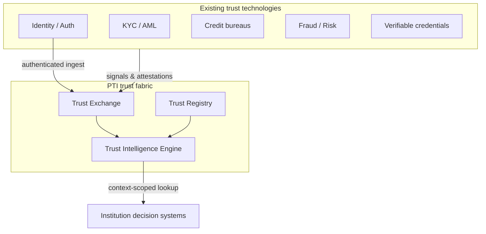

# PTI Comparisons

Portable Trust Infrastructure (PTI) is an **orchestration and composition layer** for trust. It does not compete with identity providers, KYC vendors, credit bureaus, or fraud engines on their own terms — it connects their outputs into **context-scoped, portable, explainable trust intelligence** that institutions can consume at decision time.

  

    <h3>What these pages are</h3>
    
Vendor-neutral explanations of how PTI <strong>complements</strong> existing trust technologies — what each layer solves, what PTI adds, and how they compose in production architectures.

  

  

    <h3>What these pages are not</h3>
    
Product comparisons, feature matrices, or replacement guides. PTI assumes you will keep your IdP, KYC stack, bureau feeds, and fraud tools — and orchestrate them through a portable trust fabric.

  

## The composability thesis

Most institutions already operate a **trust stack**: identity resolution, authentication, authorization, KYC/AML screening, bureau pulls, fraud scoring, and policy engines. Each component produces valuable signals. The structural failure is not the components — it is the **absence of infrastructure** that:

- Assigns a **portable subject identifier** (`pti_id`) across partner and institution boundaries
- **Scopes signals to life-area contexts** (lending, rental, employment, merchant, …) instead of collapsing them into one opaque score
- **Preserves provenance** so every outcome traces to attributable evidence
- **Exposes programmatic trust lookup** with explainability suitable for audit and adverse-action workflows

PTI fills that gap. See [Problems with Existing Systems](/pti/introduction/problems-with-existing-systems) and [Core Design Principles](/pti/introduction/design-principles).

## Comparison catalogue

| Technology | Primary job | What PTI adds |
|------------|-------------|---------------|
| [Identity systems](./identity) | Resolve *who* a subject is | Portable `pti_id`, cross-partner entity linking |
| [Authentication](./authentication) | Prove *session* authenticity | Trust event attribution after auth succeeds |
| [Authorization](./authorization) | Enforce *access* policy | Context-scoped entitlements for trust data |
| [KYC](./kyc) | Verify identity at onboarding | KYC outcomes as attestable trust signals |
| [AML](./aml) | Detect money-laundering risk | Screening results in compliance lens context |
| [Credit bureaus](./credit-bureaus) | Formal credit history files | Non-bureau trust signals + context isolation |
| [Open banking](./open-banking) | Consented financial data access | Cash-flow signals scoped to lending context |
| [Verifiable credentials](./verifiable-credentials) | Cryptographically signed claims | VC issuance and verification as trust evidence |
| [Digital identity](./digital-identity) | National or federated ID programs | Sovereign ID as input; PTI as trust exchange layer |
| [Fraud systems](./fraud-systems) | Real-time transaction fraud | Fraud flags as signals; PTI for cross-context trust |
| [Risk engines](./risk-engines) | Institution policy and scoring | External intelligence envelope + explainability |
| [Reputation systems](./reputation-systems) | Platform ratings and reviews | Community signals with governance and provenance |
| [Digital public infrastructure](./digital-public-infrastructure) | Shared rails (payments, ID, data) | Trust as a programmable DPI layer |
| [Knowledge graphs](./knowledge-graphs) | Entity-relationship analytics | Trust graph model with context-scoped edges |

## How to read each page

Every comparison follows the same structure:

1. **What the technology is** — neutral definition
2. **What problem it solves** — the job it was built for
3. **What PTI adds** — orchestration, portability, context-scoping
4. **How they compose together** — reference integration pattern
5. **When to use each** — decision guidance for architects
6. **Related PTI spec/RFC links** — normative references

## Architectural placement

## Start here by role

| Role | Recommended reading order |
|------|---------------------------|
| **Architect / CTO** | [Identity](./identity) → [Digital identity](./digital-identity) → [Credit bureaus](./credit-bureaus) → [Risk engines](./risk-engines) |
| **Compliance / AML** | [KYC](./kyc) → [AML](./aml) → [Verifiable credentials](./verifiable-credentials) |
| **Platform / fintech engineer** | [Authentication](./authentication) → [Authorization](./authorization) → [Open banking](./open-banking) → [Fraud systems](./fraud-systems) |
| **Policy / DPI strategist** | [Digital public infrastructure](./digital-public-infrastructure) → [Knowledge graphs](./knowledge-graphs) → [Reputation systems](./reputation-systems) |

## Related documentation

- [Why PTI Exists](/pti/why-pti/)
- [PTI Specification v1.0](/pti/specification/v1.0/)
- [Trust Context Catalogue](/pti/reference-architecture/trust-contexts)
- [RFC Index](/pti/rfcs/)
