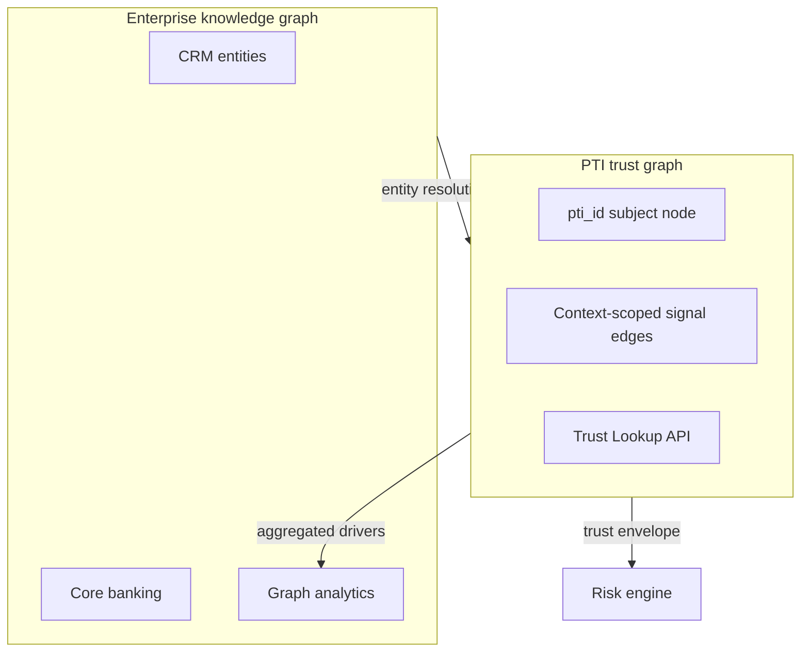

# PTI and Knowledge Graphs

Knowledge graphs represent **entities and relationships** — people, organizations, products, events — as nodes and edges for search, analytics, and inference. PTI's internal **trust graph** shares graph thinking but adds **normative trust semantics**: context isolation, provenance chains, consent gates, and consumer lookup contracts.

## 1. What knowledge graphs are

Knowledge graphs (KGs) are **semantic data structures** — often RDF, property graphs (Neo4j, Neptune), or vendor analytics graphs — that enable:

- **Entity resolution** — link records across datasets
- **Relationship traversal** — multi-hop queries (who knows whom, who owns what)
- **Inference and reasoning** — ontologies, rule expansion, GNN embeddings
- **Enterprise search** — unified discovery across siloed systems
- **Fraud and intelligence analytics** — network exposure and community detection

Knowledge graphs answer: *What entities exist, how are they connected, and what can we infer from the graph structure?*

## 2. What problem knowledge graphs solve

| Problem | Knowledge graph response |
|---------|--------------------------|
| Data silos in enterprise analytics | Unified entity-relationship model |
| Complex dependency tracing | Multi-hop graph queries |
| Recommendation and similarity | Graph embeddings and paths |
| Investigative analysis | Link chart visualization |

Knowledge graphs excel at **analytics and discovery**. They typically lack **normative trust contracts** — consent-bound signal ingestion, context-scoped scoring APIs, and governed cross-institution exchange profiles.

## 3. What PTI adds

  

    <h3>General knowledge graphs</h3>
    <ul>
      <li>Flexible entity-relationship modeling</li>
      <li>Analytics and inference workloads</li>
      <li>Internal enterprise scope</li>
    </ul>
  

  

    <h3>PTI adds</h3>
    <ul>
      <li><strong>Trust graph model</strong> — normative subject, signal, and context edges</li>
      <li><strong>Context-scoped propagation</strong> — signals do not leak across life areas</li>
      <li><strong>Provenance on every edge</strong> — attributable trust events (RFC-012)</li>
      <li><strong>Lookup API contract</strong> — decision-time export, not ad-hoc graph queries</li>
    </ul>
  

[RFC-005 — Trust Graph](/pti/rfcs/rfc-005-trust-graph) defines PTI's graph semantics — not as a general-purpose ontology, but as a **trust-specific subgraph** with enforcement rules institutions can rely on for compliance.

## 4. How they compose together

**Integration patterns:**

1. **Side-by-side** — enterprise KG for internal analytics; PTI trust graph for **cross-institution portable trust**. Entity resolution hints may flow one direction; PTI does not expose raw graph traversal to consumers.
2. **PTI as governed subgraph** — institution deploys PTI-compatible registry; internal KG syncs **derived features** from trust lookup responses, not full partner graphs.
3. **Fraud analytics** — enterprise KG runs link analysis; confirmed outcomes emit **trust events** into PTI for durable institutional memory.

PTI **restricts** open graph query access by design — consumers receive **trust intelligence envelopes** per [RFC-004 — Trust Lookup API](/pti/rfcs/rfc-004-trust-lookup-api), preventing uncontrolled graph exfiltration.

## 5. When to use each

| Scenario | Knowledge graph | PTI trust graph |
|----------|-----------------|-----------------|
| Internal AML link analysis | **KG ideal** | Emit outcomes as signals |
| Cross-MFI portable trust | KG alone insufficient | **PTI Required** |
| Marketing customer 360 | **KG** | Not applicable |
| Institution trust lookup at decision | Ad-hoc queries risky | **PTI lookup API** |
| Research ontology development | **KG** | PTI profiles subset |

Use knowledge graphs for **analytics breadth**; use PTI for **governed trust depth** with interoperability guarantees.

## 6. Related PTI spec/RFC links

- [RFC-005 — Trust Graph](/pti/rfcs/rfc-005-trust-graph)
- [RFC-011 — Identity Resolution](/pti/rfcs/rfc-011-identity-resolution)
- [Reference Data Model](/pti/specification/v1.0/reference-data-model)
- [RFC-012 — Trust Evidence](/pti/rfcs/rfc-012-trust-evidence)
- [RFC-004 — Trust Lookup API](/pti/rfcs/rfc-004-trust-lookup-api)

## See also

- [Identity](./identity)
- [Reputation systems](./reputation-systems)
- [Fraud systems](./fraud-systems)
