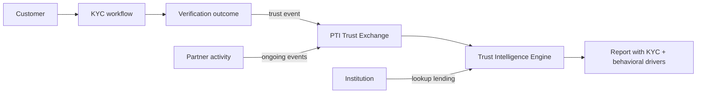

# PTI and KYC

Know Your Customer (KYC) processes establish **identity assurance at onboarding** — document verification, liveness checks, registry lookups, and risk classification. PTI does not perform KYC checks itself; it **orchestrates KYC outcomes** as attestable trust signals and composes them with ongoing behavioral evidence.

## 1. What KYC is

KYC is a **regulatory and operational workflow** for verifying that a customer is who they claim to be and assessing initial customer risk. Components typically include:

- **Document verification** — ID card, passport, driver's license OCR and authenticity checks
- **Biometric liveness** — presentation attack detection
- **Registry and watchlist screening** — national ID databases, sanctions initial pass
- **Customer due diligence (CDD)** — occupation, source of funds, expected activity
- **Enhanced due diligence (EDD)** — elevated scrutiny for high-risk profiles

KYC produces a **verification outcome** — pass, fail, refer, or expire — tied to a point-in-time onboarding event.

## 2. What problem KYC solves

| Problem | KYC response |
|---------|--------------|
| Identity fraud at onboarding | Document + biometric verification |
| Regulatory CDD obligation | Structured customer risk file |
| Shell company creation | Business registry and UBO checks |
| Sanctions exposure at intake | Initial screening against lists |

KYC answers: *Is this customer's identity sufficiently verified for us to establish a relationship?* It does not track **ongoing trust behavior** — repayment, rental history, employment tenure — across partner networks.

## 3. What PTI adds

  

    <h3>KYC</h3>
    <ul>
      <li>Point-in-time identity verification</li>
      <li>Onboarding risk tier</li>
      <li>Per-institution customer file</li>
    </ul>
  

  

    <h3>PTI adds</h3>
    <ul>
      <li><strong>KYC as trust signal</strong> — verification outcomes become attestable events</li>
      <li><strong>Portable proof</strong> — verified status travels with <code>pti_id</code></li>
      <li><strong>Context composition</strong> — KYC + lending/rental/merchant signals together</li>
      <li><strong>Explainability</strong> — drivers show identity verification weight in outcomes</li>
    </ul>
  

Under PTI's **Composable** design principle, KYC vendor output is an **input signal**, not a competing system. A `verification.passed` trust event in the appropriate context reduces repeated re-KYC when institutions share a governed trust fabric.

## 4. How they compose together

**Integration pattern:**

1. Institution or partner runs KYC through existing vendor or in-house stack.
2. On successful verification, emit a **trust event** (verification type, assurance level, expiry) to PTI under entitled contexts — e.g., `merchant`, `lending`.
3. Ongoing partner activity (repayments, lease payments, employment confirmations) adds **behavioral signals**.
4. Downstream institution requests trust lookup — receiving KYC verification as one **driver** among context-scoped evidence.

PTI **never substitutes** for regulatory KYC obligation at the consuming institution; it reduces redundant verification and enriches decisions with portable behavioral proof.

## 5. When to use each

| Scenario | KYC | PTI |
|----------|-----|-----|
| New account opening regulatory check | **Required** | Optional (signal export) |
| Re-KYC every time customer applies at new MFI | KYC only (expensive) | **PTI reduces duplication** via portable verification signals |
| Ongoing transaction monitoring | KYC sets baseline | PTI adds cross-context behavioral trust |
| Merchant marketplace seller onboarding | **Required** | **Recommended** for portable seller trust |
| Anonymous browsing | Neither | Neither |

Institutions **retain KYC accountability**; PTI provides **infrastructure to share and compose** verification artifacts under governance.

## 6. Related PTI spec/RFC links

- [RFC-012 — Trust Evidence](/pti/rfcs/rfc-012-trust-evidence)
- [RFC-003 — Trust Events](/pti/rfcs/rfc-003-trust-events)
- [Compliance guide](/pti/specification/v1.0/compliance)
- [RFC-007 — Governance](/pti/rfcs/rfc-007-governance)
- [Core Design Principles — Composable](/pti/introduction/design-principles)

## See also

- [AML](./aml)
- [Identity](./identity)
- [Verifiable credentials](./verifiable-credentials)
