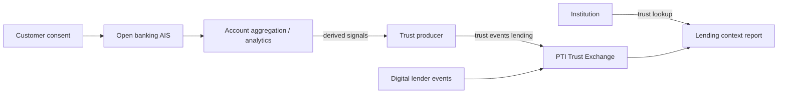

# PTI and Open Banking

Open banking regimes enable **consented access to financial account data** through standardized APIs — account information services (AIS), payment initiation services (PIS), and emerging open finance extensions. PTI does not replace open banking rails; it **consumes and orchestrates** financial data signals into portable trust intelligence across institutions.

## 1. What open banking is

Open banking is a **regulatory and technical framework** requiring banks to expose customer-permissioned data and payment services to third-party providers (TPPs). Key elements:

- **Consent management** — explicit, revocable customer authorization
- **AIS APIs** — account balances, transaction history, categorization
- **PIS APIs** — payment initiation from non-bank applications
- **Technical standards** — UK Open Banking, PSD2, Nigeria Open Banking, Brazil Open Finance, etc.
- **TPP registration** — licensed or registered third-party access

Open banking answers: *What financial account data can this customer share with this provider, under what consent?*

## 2. What problem open banking solves

| Problem | Open banking response |
|---------|------------------------|
| Data locked in incumbent banks | Standardized TPP access |
| Manual bank statement uploads | API-driven income verification |
| Payment friction | Account-to-account initiation |
| Innovation barrier for fintechs | Level playing field for data access |

Open banking solves **data access and payment initiation**. It does not inherently provide **cross-institution trust scoring**, **context isolation**, or **multi-domain signal composition** (rental + employment + merchant alongside cash-flow).

## 3. What PTI adds

  

    <h3>Open banking</h3>
    <ul>
      <li>Consented account and transaction data</li>
      <li>Payment initiation</li>
      <li>Per-consent, per-TPP access scope</li>
    </ul>
  

  

    <h3>PTI adds</h3>
    <ul>
      <li><strong>Cash-flow as trust signals</strong> — categorized inflows/outflows → lending context events</li>
      <li><strong>Cross-source fusion</strong> — open banking + partner repayment + community validation</li>
      <li><strong>Portable <code>pti_id</code></strong> — financial behavior linked to subject graph</li>
      <li><strong>Institution lookup API</strong> — decision-time trust report, not raw transaction dump</li>
    </ul>
  

Open banking data is often **high-sensitivity and consent-bound**. PTI ingests **derived trust signals** — income stability bands, recurring obligation patterns — not raw account numbers in consumer lookup responses, aligning with [Privacy](/pti/specification/v1.0/privacy) minimum-necessary disclosure.

## 4. How they compose together

**Integration pattern:**

1. Customer grants open banking consent to a **trust producer** (fintech, aggregator, or bank subsidiary).
2. Producer derives **non-raw trust events** — e.g., `income.regular`, `obligation.recurring`, `balance.volatility_band` — and emits to PTI under `lending` context.
3. Other partners contribute complementary signals (MFIs, utilities, merchants).
4. Lending institution requests PTI lookup — receiving **explainable drivers** without re-implementing open banking connectivity.

Open banking remains the **data access rail**; PTI is the **trust orchestration layer** above it.

## 5. When to use each

| Scenario | Open banking | PTI |
|----------|--------------|-----|
| Income verification for loan app | **Required** (data source) | **Recommended** (signal orchestration) |
| Account-to-account loan disbursement | PIS **Required** | Not involved |
| Portable trust across multiple lenders | OB alone insufficient | **Required** |
| Rental application without bank link | OB optional | **PTI rental context** |
| Regulatory AIS consent audit | **Required** | PTI respects consent gates |

Institutions should **not** expect PTI to substitute for open banking consent UX or TPP licensing — PTI composes what producers lawfully ingest.

## 6. Related PTI spec/RFC links

- [RFC-003 — Trust Events](/pti/rfcs/rfc-003-trust-events)
- [RFC-002 — Trust Contexts](/pti/rfcs/rfc-002-trust-contexts) (`lending`, `utilities`)
- [RFC-007 — Governance](/pti/rfcs/rfc-007-governance) (consent)
- [RFC-009 — Privacy](/pti/rfcs/rfc-009-privacy)
- [Reference Event Model](/pti/specification/v1.0/reference-event-model)

## See also

- [Credit bureaus](./credit-bureaus)
- [Digital public infrastructure](./digital-public-infrastructure)
- [Risk engines](./risk-engines)
