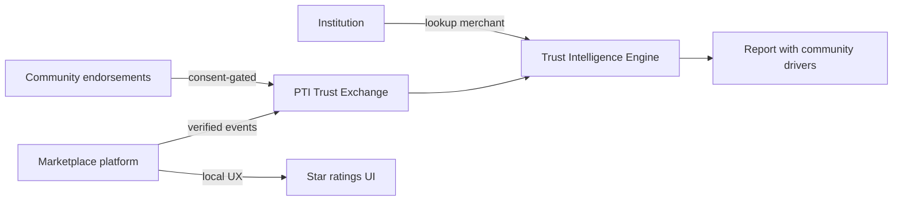

# PTI and Reputation Systems

Reputation systems collect **subjective feedback** — star ratings, reviews, endorsements, and social proof — typically locked to a single platform. PTI **does not replicate** consumer review UX; it **governs portable community trust signals** with evidence chains suitable for institutional decisions.

## 1. What reputation systems are

Reputation systems span consumer and B2B contexts:

- **Marketplace ratings** — seller/buyer stars, review text, dispute rates
- **Gig platform reputation** — completion rate, cancellation, rider/driver scores
- **Professional networks** — endorsements, recommendations, connection graphs
- **Community forums** — karma, badges, moderator flags
- **Social proof widgets** — aggregated sentiment and testimonial displays

Reputation systems answer: *How do other users on this platform perceive this actor?*

## 2. What problem reputation systems solve

| Problem | Reputation response |
|---------|---------------------|
| Counterparty quality uncertainty | Aggregated peer feedback |
| Platform trust bootstrapping | Cold-start default scores |
| Dispute prioritization | Low-reputation flagging |
| Search ranking | Reputation-weighted discovery |

Reputation systems excel at **in-platform coordination**. They suffer **portability failure** — a 4.9-star seller on one marketplace cannot prove reliability to a lender or landlord on another platform without manual screenshots and no verification chain.

## 3. What PTI adds

  

    <h3>Reputation systems</h3>
    <ul>
      <li>Platform-local ratings and reviews</li>
      <li>Subjective, often unverified feedback</li>
      <li>Gaming and review fraud exposure</li>
    </ul>
  

  

    <h3>PTI adds</h3>
    <ul>
      <li><strong>Governed community signals</strong> — endorsements with attestable events</li>
      <li><strong>Portability via <code>pti_id</code></strong> — reputation travels across institutions</li>
      <li><strong>Context scoping</strong> — merchant vs informal_sector vs creative contexts</li>
      <li><strong>Provenance weighting</strong> — verified partners outweigh anonymous stars</li>
    </ul>
  

PTI distinguishes **decorative social proof** from **institutional-grade community validation**. Endorsements ingested as trust events carry emitter identity, consent status, and conflict policies — not anonymous five-star aggregates alone.

## 4. How they compose together

**Integration pattern:**

1. Platform maintains **user-facing reputation UX** — stars, reviews, badges.
2. Platform emits **verified trust events** for durable facts — completed orders, dispute resolutions, tenure milestones — not raw review text in lookup responses.
3. Community endorsements flow through **consent-first** ingestion with anti-gaming policies.
4. Institution receives **weighted drivers** — e.g., `community_endorsement`, `merchant_fulfillment` — with provenance labels.

PTI is **not a social network**. It is infrastructure for **portable credibility** derived from platform and community activity.

## 5. When to use each

| Scenario | Reputation system | PTI |
|----------|-------------------|-----|
| In-app seller discovery ranking | **Required** | Not involved |
| Merchant loan underwriting | Platform stars insufficient | **PTI merchant + community** |
| Stokvel / ROSCA group trust | Informal ledger | **PTI informal_sector context** |
| Public review browsing | **Required** | Not involved |
| Cross-platform gig worker hire | Siloed ratings | **PTI employment + digital_platform** |

Use reputation for **discovery and UX**; use PTI when **institutions need portable, explainable community trust**.

## 6. Related PTI spec/RFC links

- [RFC-005 — Trust Graph](/pti/rfcs/rfc-005-trust-graph)
- [RFC-003 — Trust Events](/pti/rfcs/rfc-003-trust-events)
- [RFC-007 — Governance](/pti/rfcs/rfc-007-governance) (consent, anti-gaming)
- [Trust Context Catalogue](/pti/reference-architecture/trust-contexts) (`informal_sector`, `creative`, `faith_mutual_aid`)
- [Explainability guide](/pti/specification/v1.0/explainability)

## See also

- [Credit bureaus](./credit-bureaus)
- [Knowledge graphs](./knowledge-graphs)
- [Fraud systems](./fraud-systems)
