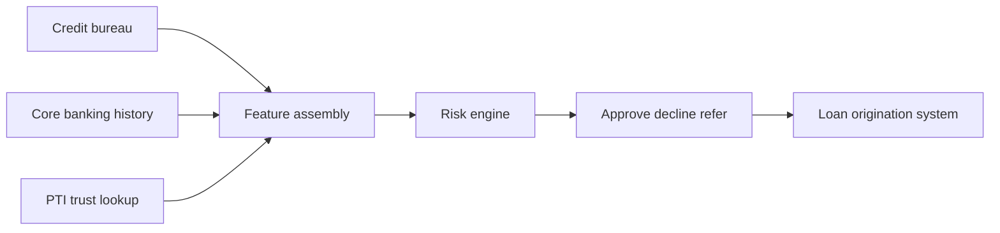

# PTI and Risk Engines

Risk engines (decision engines, credit policy platforms, rules orchestrators) evaluate **institution-specific policies** against applicant data — bureau scores, internal behavior, product rules, and regulatory constraints. PTI **feeds** risk engines with portable trust intelligence; it does not replace the institution's authority to approve or decline.

## 1. What risk engines are

Risk engines are **policy execution platforms** that combine data sources, models, and business rules into a decision outcome. Common forms:

- **Credit decision engines** — scorecards, cutoffs, reason codes
- **Business rules management (BRM)** — Drools, FICO Blaze, custom rule DSLs
- **ML model serving** — real-time feature vectors and model endpoints
- **Workflow orchestration** — refer, manual review, stipulation paths
- **Champion/challenger** — A/B policy testing and monitoring

Risk engines answer: *Given our policy and this applicant's data, what action do we take?*

## 2. What problem risk engines solve

| Problem | Risk engine response |
|---------|---------------------|
| Inconsistent manual underwriting | Codified policy rules |
| Regulatory reason code requirements | Structured decline explanations |
| Product-specific cutoffs | Tiered pricing and limits |
| Model governance | Versioned scorecards and audit |

Risk engines are **institution-owned decision systems**. They require **quality inputs** — but typically integrate each data source through bespoke connectors with no standard **trust intelligence envelope** across vendors and contexts.

## 3. What PTI adds

  

    <h3>Risk engines</h3>
    <ul>
      <li>Institution policy execution</li>
      <li>Final approve / decline / refer</li>
      <li>Product-specific scorecards</li>
    </ul>
  

  

    <h3>PTI adds</h3>
    <ul>
      <li><strong>Standard trust input</strong> — JSON envelope with drivers and confidence bands</li>
      <li><strong>Context-scoped features</strong> — request <code>lending</code> only, not global mashup</li>
      <li><strong>Provenance metadata</strong> — feature sources for model documentation</li>
      <li><strong>Coverage gaps</strong> — explicit thin-data flags for policy branching</li>
    </ul>
  

PTI implements the **Trust Intelligence Engine** conformance class — producing inputs suitable for risk engine feature pipelines. The institution **retains decision accountability**; PTI supplies governed external intelligence.

## 4. How they compose together

**Integration pattern:**

1. Origination workflow triggers parallel data fetches — bureau, internal, **PTI trust lookup** (`contexts: ["lending", "risk_compliance"]`).
2. PTI response maps to **feature variables** — `pti_lending_confidence_pct`, `pti_driver_repayment_weight`, `pti_coverage_gap_count`.
3. Risk engine applies institution scorecard — PTI features are **one input block**, not the decision itself.
4. Decline reason codes combine bureau reasons with PTI driver labels where policy requires.

Institutions SHOULD treat PTI as **adjacent data** subject to fair lending and model risk management — documenting feature usage in model cards.

## 5. When to use each

| Scenario | Risk engine | PTI |
|----------|-------------|-----|
| Final loan approve/decline | **Required** | Input only |
| Portable cross-MFI behavioral features | Engine cannot source alone | **Required** |
| Internal overdraft limit rules | **Required** | Optional |
| Multi-context tenant + employment check | Engine needs features | **PTI multi-context lookup** |
| Regulatory decision ownership | **Institution** | PTI never decides |

**Rule of thumb:** PTI is **upstream intelligence**; the risk engine is **downstream policy**.

## 6. Related PTI spec/RFC links

- [RFC-004 — Trust Lookup API](/pti/rfcs/rfc-004-trust-lookup-api)
- [Explainability guide](/pti/specification/v1.0/explainability) (`explain_score.v1`)
- [RFC-012 — Trust Evidence](/pti/rfcs/rfc-012-trust-evidence)
- [Reference API Specification](/pti/specification/v1.0/reference-api-specification)
- [Compliance guide](/pti/specification/v1.0/compliance)

## See also

- [Credit bureaus](./credit-bureaus)
- [Fraud systems](./fraud-systems)
- [AML](./aml)
