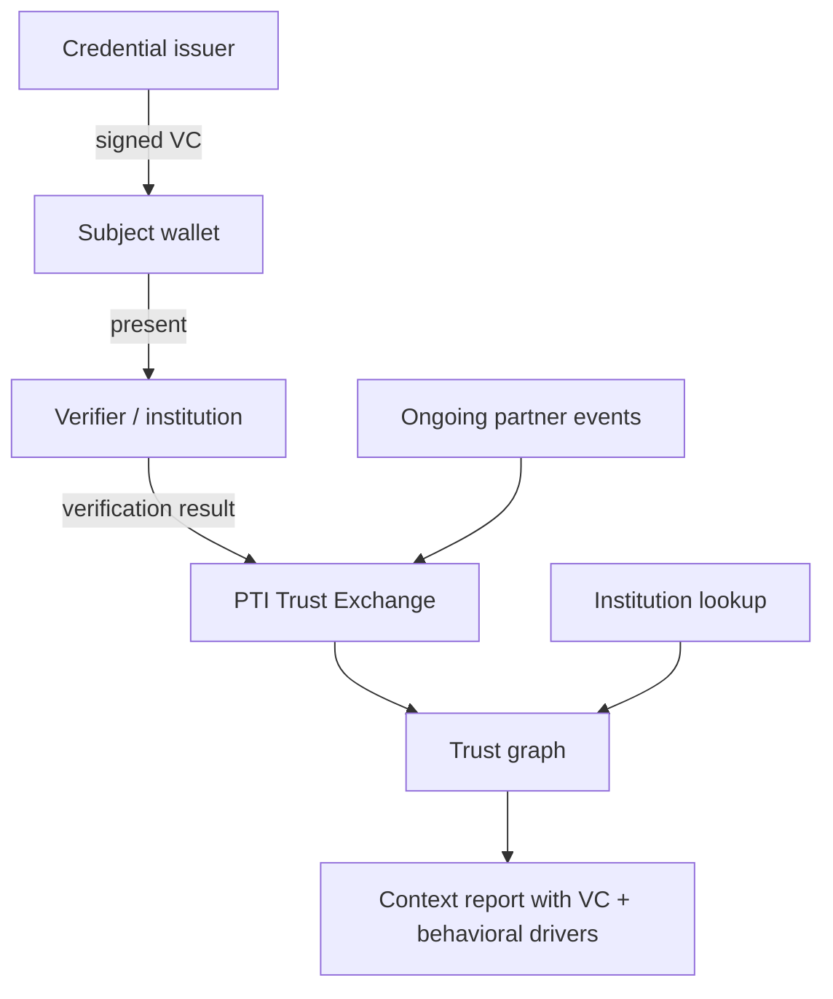

# PTI and Verifiable Credentials

Verifiable Credentials (VCs) are **cryptographically signed, tamper-evident digital claims** — diplomas, licenses, employment attestations, KYC passes — issued by authoritative parties and presented by holders. PTI does not replace VC standards; it provides **infrastructure to issue, verify, and compose** credentials into context-scoped trust intelligence.

## 1. What verifiable credentials are

VCs follow W3C and regional profiles (eIDAS 2.0, ISO mobile documents) with:

- **Issuer** — signs claims about a subject
- **Holder** — stores and presents credentials in a wallet
- **Verifier** — validates signature, revocation status, and schema
- **Trust registries** — issuer accreditation and schema governance
- **Selective disclosure** — reveal minimum necessary attributes (ZKP extensions)

VCs answer: *Is this signed claim valid, current, and from a trusted issuer?*

## 2. What problem verifiable credentials solve

| Problem | VC response |
|---------|-------------|
| Paper credential fraud | Cryptographic integrity |
| Over-disclosure of PII | Selective disclosure |
| Issuer verification | DID / X.509 trust chains |
| Offline verification | Signed payloads without live issuer call |

VCs excel at **portable attestations**. They do not alone provide **continuous behavioral trust**, **multi-partner signal fusion**, or **context-scoped scoring engines** for lending, rental, and merchant decisions.

## 3. What PTI adds

  

    <h3>Verifiable credentials</h3>
    <ul>
      <li>Signed static or semi-static claims</li>
      <li>Holder-presented verification</li>
      <li>Issuer-centric trust chain</li>
    </ul>
  

  

    <h3>PTI adds</h3>
    <ul>
      <li><strong>VC as trust evidence</strong> — verified credentials become graph edges</li>
      <li><strong>Continuous signals</strong> — ongoing events complement point-in-time VCs</li>
      <li><strong>Context-scoped lookup</strong> — employment VC weights in <code>employment</code> context</li>
      <li><strong>Institution-scale API</strong> — batch lookup without per-holder wallet UX</li>
    </ul>
  

PTI's [Trust Evidence](/pti/rfcs/rfc-012-trust-evidence) model accommodates **verification hooks** — VC signature validation results attach provenance to trust outcomes. Verifier institutions may consume credentials **through PTI verification APIs** rather than bespoke wallet integrations per use case.

## 4. How they compose together

**Integration patterns:**

1. **Verifier-as-producer** — institution validates VC, emits `verification.passed` trust event with schema ID and issuer DID.
2. **Wallet-to-lookup** — subject presents VC; platform verifies and refreshes trust graph before institution lookup.
3. **Hybrid** — static VC (degree, professional license) plus dynamic signals (payroll events, project completions) in `employment` context.

PTI **does not mandate** a specific VC format — implementations SHOULD profile W3C VC Data Model or regional equivalents in [Interoperability](/pti/specification/v1.0/interoperability) bindings.

## 5. When to use each

| Scenario | Verifiable credentials | PTI |
|----------|------------------------|-----|
| Prove university degree once | **VC ideal** | Optional (store verification) |
| Monitor seller trust over 12 months | VC alone insufficient | **PTI merchant context** |
| Government issues national digital ID VC | **VC / eID** | **PTI as trust exchange layer** |
| Institution batch pre-screen 10,000 applicants | Wallet UX heavy | **PTI lookup API** |
| Cross-border credential recognition | **VC standards** | PTI federation profiles |

Use VCs for **signed attestations**; use PTI to **operationalize** those attestations alongside behavioral trust at institution scale.

## 6. Related PTI spec/RFC links

- [RFC-012 — Trust Evidence](/pti/rfcs/rfc-012-trust-evidence)
- [RFC-006 — Trust Exchange](/pti/rfcs/rfc-006-trust-exchange)
- [Interoperability specification](/pti/specification/v1.0/interoperability)
- [RFC-011 — Identity Resolution](/pti/rfcs/rfc-011-identity-resolution)
- [Security specification](/pti/specification/v1.0/security)

## See also

- [Digital identity](./digital-identity)
- [KYC](./kyc)
- [Digital public infrastructure](./digital-public-infrastructure)
