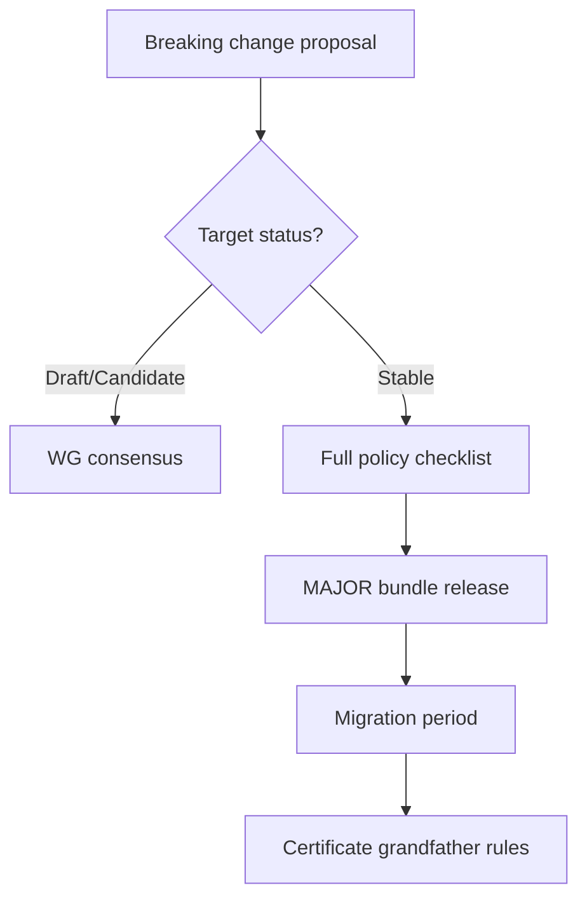

# Breaking Changes Policy

A **breaking change** is any normative change that causes previously conformant implementations to fail required [conformance tests](/pti/conformance/conformance-tests) or interoperate incorrectly with peers on the same declared profile and version.

This policy **MUST** be satisfied before breaking changes enter Stable RFCs or MAJOR specification bundles.

## Definition

| Breaking | Non-breaking (additive) |
|----------|-------------------------|
| Removing a required field | Adding optional field with default |
| Tightening validation (reject formerly valid messages) | Loosening validation where security allows |
| Changing semantic meaning of existing code | Adding new error code |
| Removing API operation | Adding new operation |
| Shortening deprecation notice below minimum | Clarifying ambiguous spec text with unchanged behavior |

When impact is uncertain, treat as breaking until proven otherwise with test evidence.

## Where breaking changes may appear

| RFC status | Breaking change allowed? |
|------------|--------------------------|
| Draft, Review | **MAY** freely |
| Candidate | **SHOULD** minimize; document migration |
| Accepted | **MAY** with WG consensus + notice |
| Stable | **MUST NOT** without MAJOR version or deprecation cycle |
| Deprecated / Retired | No new breaking edits except security retire |

## Approval requirements

Breaking changes targeting **Stable** specifications **MUST** satisfy all of:

1. **Written motivation** — interoperability, security, or privacy justification; convenience alone **MUST NOT** suffice
2. **ARB review** — impact on architecture and federation
3. **SRG review** — if security-related
4. **Compatibility analysis** — per RFC-010 template: affected profiles, operators, subjects
5. **Migration guide** — step-by-step for implementers and operators
6. **Test updates** — MAJOR bump to conformance suite
7. **Working Group vote** — ≥75% approval per [Decision Making](./decision-making)
8. **Public notice** — minimum periods below

## Minimum notice periods

| Change scope | Minimum notice before enforcement in certification |
|--------------|---------------------------------------------------|
| Wire format / API contract | 12 months |
| Lookup tier semantics | 12 months |
| Context isolation rules | 18 months |
| Security-mandatory fix | 72 hours to 90 days per SRG assessment |
| Retired RFC | 6 months after Deprecated (unless security) |

Notice **MUST** include: effective date, replacement, test suite version, certificate impact.

## Migration support

Implementations **SHOULD** provide:

- Dual-read / dual-write windows where feasible
- Version negotiation headers per RFC-006
- Subject-visible impact assessment when breaking changes affect explainability or consent scopes

Operators **MUST** notify institutional consumers ≥30 days before enforcing breaking behavior in production lookup paths, except active exploitation scenarios.

## Grandfathering certificates

When breaking changes ship in a MAJOR release:

| Certificate age | Policy |
|-----------------|--------|
| Active at announcement | **MAY** renew once on old MAJOR if within overlap window |
| New applications | **MUST** target Current MAJOR |
| Security exception | SRG **MAY** revoke grandfathering immediately |

Conformance Program **MUST** publish explicit grandfather tables per release.

## Anti-patterns

The following **MUST NOT** occur:

- "Silent breaking" via undocumented stricter validation
- Breaking Stable behavior in PATCH releases
- Vendor-specific extensions marketed as universal PTI without RFC
- Forcing migration by disabling old version without published timeline

## Related documents

- [Version Management](./version-management)
- [RFC Process](./rfc-process)
- [Specification Lifecycle](./specification-lifecycle)
- [RFC-010 Versioning](/pti/rfcs/rfc-010-versioning)
