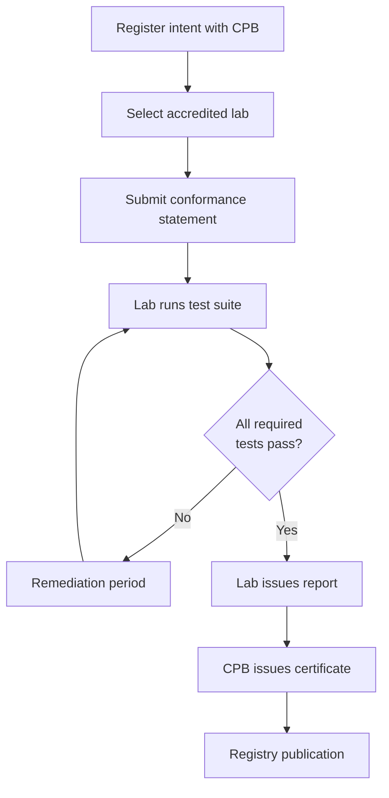

# Certification Process

**Accredited certification** provides independent verification that an implementation satisfies a declared [conformance profile](/pti/conformance/profiles) at a specific [specification version](./version-management).

Self-assessment is documented in the [Conformance guide](/pti/conformance/index). This document governs **formal certification**.

## Certification outcomes

A successful certification yields:

| Artifact | Content |
|----------|---------|
| **Certificate** | Signed attestation with profile, spec version, test suite version |
| **Conformance statement** | Public summary of capabilities and known limitations |
| **Test report** | Confidential to implementer unless published voluntarily |
| **Registry entry** | Public listing when implementer opts in |

Certification **MUST NOT** imply regulatory approval, creditworthiness, or fitness for a particular legal regime unless separately obtained.

## Prerequisites

Implementers **MUST**:

1. Declare target profile (Core, Enterprise, Government, or Edge)
2. Implement all **Stable** RFCs required for that profile
3. Pass current test suite for target [specification bundle](./version-management)
4. Publish a conformance statement template per [certification guide](/pti/conformance/certification-guide)
5. Agree to surveillance and revocation terms below

## Process flow

### Step 1 — Registration

Implementer notifies Conformance Program Board with:

- Legal entity name
- Product identifier and deployment model (SaaS, on-prem, hybrid)
- Target profile and specification version
- Contact for security advisories

### Step 2 — Lab engagement

Implementer **MUST** use a **CPB-accredited lab**. Labs **MUST** be independent of the implementer's internal QA for the certification engagement.

Lab criteria include:

- Demonstrated RFC and test suite competence
- Conflict-of-interest policies
- Secure handling of test artifacts
- Annual CPB audit

### Step 3 — Testing

Labs **MUST** execute the official [conformance tests](/pti/conformance/conformance-tests) without modification. Supplementary custom tests **MAY** inform the report but **MUST NOT** replace required tests.

Failed tests **SHOULD** receive a 90-day remediation window before final fail, except security-critical regressions.

### Step 4 — Certificate issuance

CPB **MUST** verify:

- Lab accreditation current
- Test report covers full profile scope
- Conformance statement matches tested capabilities
- No unresolved SRG hold on implemented RFCs

Default validity: **24 months** from issuance.

### Step 5 — Maintenance

Certified implementations **MUST**:

- Monitor [Security Disclosure](./security-disclosure) advisories
- Patch within severity SLAs or risk suspension
- Re-certify on MAJOR specification changes unless grandfathered
- Notify CPB of material product changes affecting certified scope

## Renewal

Renewal **REQUIRES**:

- Pass current test suite (may differ from initial certification)
- Updated conformance statement
- Fee to lab per commercial arrangement (fees set by labs, not specification license)

## Suspension and revocation

CPB **MAY** suspend or revoke certificates when:

| Trigger | Action |
|---------|--------|
| Failed surveillance audit | 30-day cure period |
| Misuse of certification marks | Immediate suspension |
| Unpatched Critical security issue | Revocation after notice |
| Fraudulent test submission | Permanent ban |

Appeals **SHOULD** follow [Decision Making](./decision-making) appeals path.

## Limitations and exclusions

Certificates **MUST** explicitly list:

- Supported trust contexts (if subset)
- Geographic or deployment constraints
- Known non-conformant optional features
- Federation partners tested (if Enterprise)

Omitting known limitations **MUST** be treated as misrepresentation.

## Relationship to TumiTrust

TumiTrust **MAY** hold certifications for its platform like any implementer. Certification of TumiTrust **MUST NOT** block other vendors from accredited lab access or imply exclusive "official" status.

## Related documents

- [Conformance Program](./conformance-program)
- [Certification guide](/pti/conformance/certification-guide)
- [Trademark and Branding](./trademark-branding)
- [Build Your Own PTI](/pti/build-your-pti/)
