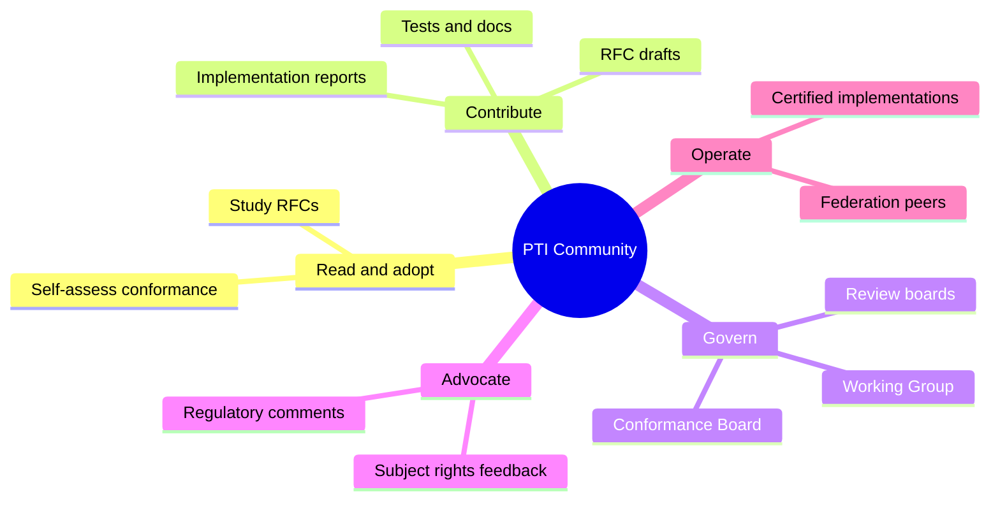

# Community Participation

PTI is a public specification category. Its longevity depends on diverse participation: independent implementers, academic researchers, civil-society advocates, institutional users, and contributors from steward organizations including TumiTrust.

Participation is **open** and **must not** require commercial licensing of the specification itself.

## Participation pathways

| Pathway | Commitment | Influence |
|---------|------------|-----------|
| **Reader / adopter** | None | Feedback via issues welcome |
| **Contributor** | CLA / license grant | Direct RFC and test influence |
| **Implementer** | Build to RFCs | Implementation reports affect Stable promotion |
| **Working Group member** | Regular review participation | Consensus on normative text |
| **Board member** | Recusal duties; time investment | Blocking recommendations on architecture/security |

## Expectations

Participants **SHOULD**:

- Assume good faith; critique ideas not people
- Disclose employer and conflicts per [Decision Making](./decision-making#conflicts-of-interest)
- Respect embargo during [Security Disclosure](./security-disclosure)
- Use inclusive language in normative examples ( diverse names, jurisdictions )

Participants **MUST NOT**:

- Harass, threaten, or discriminate
- Submit contributions containing malware or intentional vulnerabilities
- Misrepresent certification or Working Group endorsement for marketing
- Flood review with duplicate bad-faith comments to obstruct consensus

Maintainers **MAY** moderate or ban repeat violators after written warning.

## Inclusion and accessibility

Governance **SHOULD** reduce unnecessary barriers:

- Documentation **SHOULD** be readable without proprietary tools
- Meeting times **SHOULD** rotate across time zones quarterly
- Async review **MUST** be accepted; real-time attendance **MUST NOT** be required for consensus
- Non-native English speakers **SHOULD** receive reasonable time for written responses

Translation of **informative** guides **MAY** be community-driven; **normative RFCs** remain authoritative in English until officially translated versions are approved by the Working Group.

## Institutional participation

Banks, telcos, governments, and NGOs **MAY** participate without becoming "members" of a paywalled consortium. Institutional representatives **SHOULD**:

- Separate organizational procurement goals from specification neutrality
- Contribute operational constraints as **use cases**, not vendor mandates
- Support pilot interoperability events

## Individual and subject advocacy

Subjects are first-class stakeholders. Advocates **MAY** participate in review of RFCs affecting consent, explainability, deletion, and adverse action — especially [RFC-007](/pti/rfcs/rfc-007-governance), [RFC-009](/pti/rfcs/rfc-009-privacy), and lookup tier definitions.

Privacy regressions **SHOULD** be raised with the same blocking weight as interoperability failures.

## Recognition without capture

Contributors **SHOULD** be credited in RFC change logs. Sponsorship **MUST NOT** buy normative outcomes. Public recognition programs **MAY** highlight implementers who achieve certification or publish independent implementations.

## Communication norms

| Channel | Appropriate use |
|---------|-----------------|
| **Issue tracker** | Actionable bugs, errata, small proposals |
| **RFC PRs** | Normative text changes |
| **Public mailing list** | Announcements, broad design discussion |
| **Office hours** | Implementation Q&A, non-binding |
| **Private security contact** | Vulnerabilities only |

## Related documents

- [Contribution Process](./contribution-process)
- [Working Group](./working-group)
- [Why Governance Matters](./why-governance-matters)
- [Public Governance Statement](./public-governance-statement)
