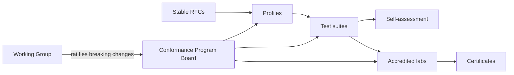

# Conformance Program

The **PTI Conformance Program** translates normative [RFCs](/pti/rfcs/) into **testable, certifiable claims**. It provides the evidentiary basis for interoperability and procurement without favoring any single vendor.

Detailed technical requirements live in the [Conformance documentation](/pti/conformance/). This document describes **program governance**.

## Mission

The program **MUST**:

1. Define [conformance profiles](/pti/conformance/profiles) aligned with real deployment classes
2. Maintain [conformance tests](/pti/conformance/conformance-tests) traceable to RFC assertions
3. Govern [certification](./certification-process) and accredited lab criteria
4. Preserve **vendor neutrality** — certification **MUST NOT** require use of TumiTrust or any specific cloud

The program **MUST NOT** certify "trustworthiness" of business outcomes — only **technical compatibility** with declared profiles.

## Program structure

## Conformance Program Board

The **Conformance Program Board** (CPB) operates under Working Group charter.

| Responsibility | Detail |
|----------------|--------|
| Profile definitions | Core, Enterprise, Government, Edge capabilities |
| Test suite releases | Semver per [Version Management](./version-management) |
| Lab accreditation | Criteria, renewal, revocation |
| Certificate policy | Validity period, renewal, revocation |
| Grandfather rules | Per [Breaking Changes Policy](./breaking-changes-policy) |

CPB decisions affecting existing certificates **MUST** be ratified by the Working Group when they introduce new required tests.

## Profiles overview

| Profile | Typical deployer | Primary RFC emphasis |
|---------|------------------|----------------------|
| **Core** | Single-domain operator | RFC-001–004, 007–012 basics |
| **Enterprise** | Multi-partner exchange | + RFC-006 federation |
| **Government** | Sovereign registry | + enhanced audit, data residency hooks |
| **Edge** | Constrained / offline-first | Reduced API surface, sync rules |

Full matrices: [Conformance profiles](/pti/conformance/profiles).

## Self-assessment vs accredited certification

| Level | Governance | Suitable for |
|-------|------------|--------------|
| **Self-assessment** | Implementer attestation; optional public registry | Development, pilots |
| **Accredited certification** | Independent lab; signed certificate | Production federation, government procurement |

Self-assessment **MUST NOT** use official certification marks. See [Trademark and Branding](./trademark-branding).

## Test suite governance

- Every **MUST** in a Stable RFC **SHOULD** map to ≥1 test ID
- Tests **MUST** be reproducible without proprietary datasets
- Test releases **MUST** changelog impact on profiles
- Implementers **MAY** contribute tests via [Contribution Process](./contribution-process)

## Relationship to specification

| Event | Conformance Program action |
|-------|---------------------------|
| RFC → Stable | Add required tests within one MINOR suite release |
| RFC Deprecated | Mark tests deprecated; set certificate sunset |
| MAJOR bundle | New profile IDs (e.g., `core-v2`) |
| Errata | PATCH test clarification if needed |

## Vendor neutrality statement

Certification evaluates **behavior against published tests**, not:

- Source code similarity to TumiTrust
- Commercial relationship with the founding steward
- Choice of database, cloud, or programming language

Any organization **MAY** implement using [Build Your Own PTI](/pti/build-your-pti/) and certify independently.

## Public registry

The CPB **SHOULD** maintain a public registry of active certificates listing:

- Implementer name
- Product / deployment identifier
- Profile and specification version
- Test suite version
- Validity dates and scope limitations

## Related documents

- [Certification Process](./certification-process)
- [PTI Conformance](/pti/conformance/)
- [Certification guide](/pti/conformance/certification-guide)
- [Conformance tests](/pti/conformance/conformance-tests)
- [Specification vs Implementation](./specification-vs-implementation)
