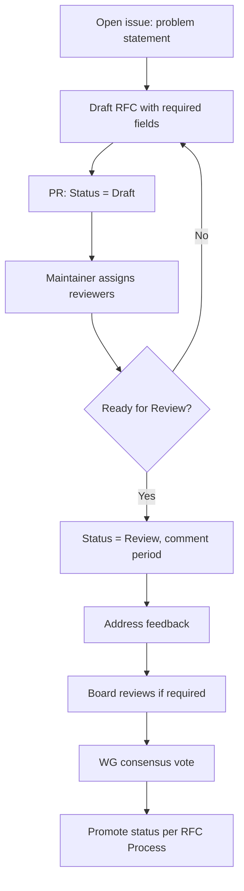

# Contribution Process

PTI evolves through contributions from implementers, researchers, institutions, and community members. This process applies to RFCs, [conformance tests](/pti/conformance/conformance-tests), governance documents, and non-normative guides such as [Build Your Own PTI](/pti/build-your-pti/).

## Who may contribute

Any participant **MAY** contribute without organizational membership or commercial relationship to the founding steward. Employers **SHOULD** be disclosed when contributions affect competitive areas.

## Contribution types

| Type | Path | Review |
|------|------|--------|
| **RFC draft or revision** | RFC repository PR | Maintainers + Reviewers + boards |
| **Conformance test** | Test suite PR | Conformance Program Board |
| **Governance doc** | This section PR | Maintainers + WG notice |
| **Errata** | Issue + minimal PR | Maintainer triage |
| **Implementation report** | Published artifact linked in RFC | Informative for Stable promotion |

## Step-by-step: RFC contribution

### 1. Problem statement

Before large drafts, contributors **SHOULD** open a public issue containing:

- Problem and affected roles (producer, consumer, subject)
- Proposed scope and non-goals
- Compatibility assessment (additive vs breaking)
- Related RFCs

### 2. Draft authoring

- Use [required RFC fields](./rfc-process#required-rfc-fields)
- Include testable **Conformance** subsection with proposed test IDs
- Reference [RFC-010](/pti/rfcs/rfc-010-versioning) for schema changes

### 3. Pull request

PRs **MUST**:

- State target RFC status
- Link issue and meeting discussion if applicable
- Pass automated checks (formatting, link validation, schema lint where configured)

### 4. Review

Reviewers **SHOULD** evaluate per [Governance Principles](./governance-principles#2-technical-merit). Maintainers **MUST** allow minimum comment periods from [RFC Process](./rfc-process).

### 5. Promotion

Status changes **MUST NOT** be self-merged by sole author unless Maintainer. Promotion **MUST** appear in WG minutes.

## Licensing and IP

Normative contributions (RFC text, normative test assertions) **MUST** be submitted under royalty-free terms granting the ecosystem perpetual rights to publish, modify, and redistribute for standardization purposes.

Contributors **MUST** confirm:

- They have authority to grant license from their employer if applicable
- Known patents directly reading on contributed normative claims are disclosed

Contributors **SHOULD** seek independent legal counsel; the Working Group **does not** provide legal advice.

## Code of conduct

All participants **MUST** adhere to [Community Participation](./community-participation) standards. Maintainers **MAY** restrict participation for sustained harassment or bad-faith disruption.

## Documentation contributions

Non-RFC documentation (implementation guides, comparisons) **SHOULD**:

- Clearly label normative vs informative content
- Cross-link authoritative RFCs rather than duplicating requirements
- Avoid vendor-specific requirements unless labeled as product documentation

## Recognition

RFC authors and significant reviewers **SHOULD** be credited in change logs. Organizational logos **MUST NOT** appear on normative RFC pages without trademark policy compliance.

## Getting started

| Goal | Resource |
|------|----------|
| Understand architecture | [RFC-001](/pti/rfcs/rfc-001-architecture) |
| Build a compatible system | [Build Your Own PTI](/pti/build-your-pti/) |
| Run self-assessment | [Conformance tests](/pti/conformance/conformance-tests) |
| Ask implementation questions | Working Group office hours |

## Related documents

- [RFC Process](./rfc-process)
- [Working Group](./working-group)
- [Decision Making](./decision-making)
- [Community Participation](./community-participation)
