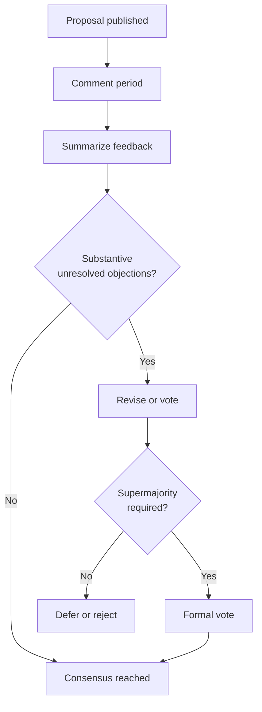

# Decision Making

PTI governance decisions **SHOULD** be made by **rough consensus** — wide agreement among participants, with unresolved objections examined on their technical merit rather than participant count alone. When consensus cannot be reached, documented voting rules apply.

Process rules use [RFC 2119](https://www.rfc-editor.org/rfc/rfc2119) keywords.

## Decision categories

| Category | Examples | Default mechanism |
|----------|----------|-------------------|
| **Routine** | Errata, editorial fixes, meeting scheduling | Maintainer discretion |
| **Technical** | RFC promotion to Candidate/Accepted | Rough consensus |
| **Architectural** | Cross-cutting design, breaking changes | Rough consensus + ARB sign-off |
| **Security** | Crypto suites, disclosure timelines | SRG recommendation + WG ratification |
| **Governance** | Changes to this document set | Supermajority vote |
| **Conformance** | Profile requirement changes | Conformance Board + WG ratification |

## Rough consensus procedure

Adapted from open-standards practice without copying any single organization's rules:

1. **Call for comments** — Proposal published with minimum review period
2. **Summarize positions** — Maintainer documents support, neutral, and objecting parties
3. **Resolve objections** — Authors **SHOULD** address each substantive objection in writing
4. **Assess remaining dissent** — If objections are narrow, specific, and technically grounded, **MAY** block; vague or procedural objections **SHOULD NOT** alone block
5. **Declare outcome** — Maintainer states consensus reached, deferred, or failed

### What counts as substantive

| Substantive (may block) | Non-substantive (should not alone block) |
|-------------------------|------------------------------------------|
| Demonstrated interoperability failure | Preference for different naming |
| Security flaw identified by SRG | Unimplemented "nice to have" |
| Privacy regression vs RFC-009 | Schedule pressure |
| Breaking change without policy compliance | Dislike of author's employer |

## Formal voting

Votes **MUST** be used when:

- Governance document amendments require supermajority
- Rough consensus fails after two revision cycles
- Stewardship Council appeals (Phase 1–2 only)

### Eligibility

During Phase 1–2, voting participants **SHOULD** include:

- Maintainers
- Contributors with merged RFC or test contributions in the last 12 months
- One delegate per accredited independent implementer organization (optional seat)

From Phase 3, eligibility rules **SHOULD** expand per [Ecosystem Roadmap](./ecosystem-roadmap).

### Thresholds

| Decision | Threshold | Quorum |
|----------|-----------|--------|
| RFC Accept / Stable | ≥75% approve, ≤2 blocking objections unaddressed | 50% of eligible voters |
| Governance rule change | ≥66% approve | 50% of eligible voters |
| Emergency security patch | SRG chair + 2 Maintainers | N/A |
| Deprecation of Stable RFC | ≥75% approve + 90-day notice | 50% |

Votes **SHOULD** run open ballot for transparency. Secret ballots **MAY** be used for personnel matters only.

## Board recommendations

| Board | Blocking? |
|-------|-----------|
| **ARB** | **SHOULD** block Stable promotion for architectural RFCs without written clearance or documented override |
| **SRG** | **MUST** block Accepted/Stable for security RFCs without review |
| **Conformance Board** | **MUST** block profile changes that invalidate certificates without grandfather plan |

Override of a board block **MUST** be recorded with public rationale and **SHOULD** require supermajority WG vote.

## Appeals

1. Appellant **MUST** file written appeal within 14 days of decision
2. Different Maintainer **SHOULD** triage; conflicted Maintainers **MUST** recuse
3. Appeal **MAY** reopen discussion or escalate to Stewardship Council (Phase 1–2)
4. Final specification interpretation for Stable RFCs **MAY** be referred to ARB for binding errata interpretation

## Decision records

Substantive decisions **MUST** publish:

| Field | Content |
|-------|---------|
| **ID** | Decision-YYYY-NNN |
| **Date** | ISO 8601 |
| **Subject** | RFC ID or policy section |
| **Outcome** | Approved / rejected / deferred |
| **Vote tallies** | If applicable |
| **Dissent summary** | Preserved for future reference |
| **Links** | PRs, issues, minutes |

## Conflicts of interest

Participants **MUST** recuse from votes where:

- Personal financial interest exceeds disclosed threshold
- Employer stands to gain exclusive advantage from non-neutral outcome
- Participant authored >50% of contested text without co-author

Recusal **MUST NOT** reduce independent reviewer minimums.

## Related documents

- [Governance Model](./governance-model)
- [Working Group](./working-group)
- [Governance Principles](./governance-principles)
- [RFC Process](./rfc-process)
