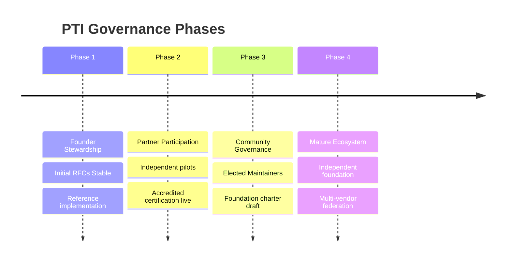

# Ecosystem Roadmap

PTI governance **MUST** evolve as the implementer base, institutional adoption, and public scrutiny grow. This roadmap defines **four phases** from founding stewardship to a mature ecosystem. Timelines are **indicative** — phase transitions require published criteria, not calendar dates alone.

## Phase overview

| Phase | Focus | Primary decision body | Success signal |
|-------|-------|----------------------|----------------|
| **1 — Founder Stewardship** | Establish RFCs, tests, reference impl | Appointed WG + Stewardship Council | v1.0 Stable; Core certification path |
| **2 — Partner Participation** | Independent implementers, labs | WG + expanding CPB | ≥2 certified non-steward implementations |
| **3 — Community Governance** | Elective leadership, public bylaws | Elected Maintainers + boards | Annual elections; transparency report |
| **4 — Mature Ecosystem** | Neutral legal home, federation scale | Foundation board + WG | Foundation operating; trademark transferred |

---

## Phase 1 — Founder Stewardship

**Objective:** Publish a coherent, certifiable PTI v1.0 and prove implementability.

### Characteristics

- Working Group convened with Maintainers appointed by founding steward
- TumiTrust operates flagship [reference implementation](./reference-implementation-policy)
- RFCs RFC-001 through RFC-012 reach **Stable** or documented path thereto
- [Conformance Program](./conformance-program) publishes Core profile and tests
- Governance documents in this section published and maintained

### Governance rules

- Rough consensus with appointed Maintainers; appeals to Stewardship Council
- Independent reviewer minimums **SHOULD** be met but may include steward affiliates with disclosure
- Trademark administered by steward per [Trademark and Branding](./trademark-branding)

### Exit criteria (all required)

1. [Specification v1.0](/pti/specification/v1.0/) bundle marked **Current**
2. Self-assessment and pilot lab certification available
3. Public [RFC Process](./rfc-process) operating ≥6 months
4. Phase 2 transition plan published

**Indicative duration:** 12–24 months from first public RFC bundle.

---

## Phase 2 — Partner Participation

**Objective:** Demonstrate vendor-neutral adoption beyond the founding steward.

### Characteristics

- ≥2 organizations run independent pilots using [Build Your Own PTI](/pti/build-your-pti/)
- Accredited labs certify implementations other than TumiTrust
- Enterprise profile tests available; federation pilots per RFC-006
- Partner institutions participate in WG plenary without fee

### Governance rules

- Maintainers **SHOULD** include ≥1 non-steward affiliate
- ARB **MUST** include ≥1 independent implementer representative
- Stewardship Council publishes **annual transparency report** (funding, trademarks, WG appointments)
- Certification registry public

### Exit criteria

1. ≥2 active certificates held by non-steward implementers
2. ≥12 months accredited certification operation
3. Documented independent implementer council
4. Supermajority WG vote to adopt Phase 3 election rules

**Indicative duration:** 18–36 months.

---

## Phase 3 — Community Governance

**Objective:** Transfer substantive governance authority to elected community leadership.

### Characteristics

- Maintainers elected by contributor electorate per [Decision Making](./decision-making)
- Board appointments include institutional user and public-interest seats
- Draft [Future Foundation Model](./future-foundation-model) charter circulated for comment
- Major RFC work includes implementation reports from ≥2 vendors

### Governance rules

- Steward **MUST NOT** hold majority of Maintainer seats
- Governance document changes require 28-day public comment
- Foundation formation exploratory committee chartered by WG

### Exit criteria

1. Two consecutive elected Maintainer terms completed
2. Foundation legal entity formed OR binding hosted-standards agreement signed
3. Trademark transfer plan approved
4. Multi-year funding committed for foundation runway

**Indicative duration:** 24–48 months.

---

## Phase 4 — Mature Ecosystem

**Objective:** Sustainable, neutral stewardship supporting global federation.

### Characteristics

- Independent foundation (or equivalent) owns trademarks and test IP
- Multiple certified implementations in production federation
- Government and enterprise profiles widely certified
- TumiTrust continues as **one** reference implementer among many

### Governance rules

- Board composition per [Future Foundation Model](./future-foundation-model)
- Working Group operates under foundation bylaws
- Stewardship Council dissolved or purely advisory
- [Public Governance Statement](./public-governance-statement) updated to reflect foundation

### Ongoing obligations

- Maintain Stable RFC cadence and security disclosure
- Never reintroduce single-vendor specification capture
- Publish conformance and transparency reports annually

---

## Cross-phase invariants

These **MUST NOT** regress across phases:

| Invariant | Document |
|-----------|----------|
| RFC 2119 normative process for breaking changes | [Breaking Changes Policy](./breaking-changes-policy) |
| Free RFC contribution | [Contribution Process](./contribution-process) |
| Certification vendor neutrality | [Conformance Program](./conformance-program) |
| Spec vs product separation | [Specification vs Implementation](./specification-vs-implementation) |
| Subject-facing privacy and explainability in RFCs | [RFC-009](/pti/rfcs/rfc-009-privacy), [RFC-012](/pti/rfcs/rfc-012-trust-evidence) |

## Current status

**As of publication:** Phase 1 — Founder Stewardship.

The Working Group **WILL** update this page when exit criteria for Phase 2 are met, including links to transparency reports and certification registry snapshots.

## Related documents

- [Future Foundation Model](./future-foundation-model)
- [Governance Model](./governance-model)
- [Why Governance Matters](./why-governance-matters)
- [PTI Conformance](/pti/conformance/)
