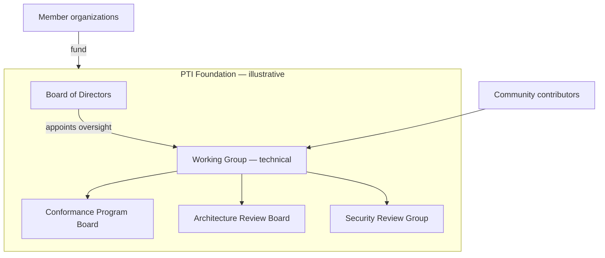

# Future Foundation Model

Phase 4 of the [Ecosystem Roadmap](./ecosystem-roadmap) envisions a **mature, multi-stakeholder ecosystem** where PTI stewardship is anchored in an **independent foundation** rather than a single commercial operator.

This document describes a **target model** for discussion — not an incorporated entity today. Specific legal form **SHOULD** be chosen with counsel in relevant jurisdictions.

## Why a foundation

| Risk without foundation | Mitigation |
|-------------------------|------------|
| Steward acquisition shifts priorities | Asset lock-in and mission charter |
| Trademark capture | Foundation-owned marks with public policy |
| Specification fork on vendor exit | Neutral home for RFC IP and test suites |
| Weak institutional trust | Multi-seat board with implementer and public interest |

Foundations succeed when they **steward assets**, not when they **operate production trust platforms**.

## Design principles for Phase 4

Adapted from mature open ecosystems without copying a single template:

1. **Mission lock** — Charter prioritizes vendor-neutral specification stewardship
2. **Minimal operational scope** — No mandatory cloud; optional shared test infrastructure only
3. **Multi-stakeholder board** — Implementers, users, academia, public interest
4. **Transparent funding** — Dues and grants disclosed; no pay-to-play RFC votes
5. **Trademark clarity** — Certification marks owned by foundation ([Trademark and Branding](./trademark-branding))
6. **Implementer freedom** — [Build Your Own PTI](/pti/build-your-pti/) remains unrestricted

## Proposed structure

### Board composition (illustrative)

| Seat type | Count | Selection |
|-----------|-------|-----------|
| **Implementers** | 3 | Elected by certified implementers |
| **Institutional users** | 2 | Elected by user council |
| **Public interest / privacy** | 2 | Nominated by civil-society shortlist |
| **Academic** | 1 | Rotating appointment |
| **Founding steward alumni** | 1 | Transitional ≤5 years |

No single organization **SHOULD** hold >20% board votes.

### Assets to transfer

| Asset | Notes |
|-------|-------|
| Trademark portfolio | PTI™, certification marks |
| RFC publication infrastructure | Repo, website, archival |
| Conformance test suites | Canonical test IP |
| Security disclosure program | SRG charter and contacts |
| Endowment or funding agreements | Multi-year runway target |

Commercial product code (e.g., TumiTrust) **MAY** remain with respective companies under separate licenses.

## Membership and funding

**Individual participation** in Working Group **MUST** remain free.

**Organizational membership** **MAY** fund:

- Test infrastructure and CI
- Legal and trademark maintenance
- Interoperability events
- Administrative staff (minimal)

Membership **MUST NOT** purchase:

- RFC approval votes
- Exclusive certification rights
- Mandatory implementer licensing

## Relationship to existing bodies

| Function | Phase 4 home |
|----------|--------------|
| RFC process | Foundation-hosted Working Group |
| Certification | Foundation CPB + accredited labs |
| Reference implementations | Independent vendors (including TumiTrust) |
| Production registries | Operators — not foundation |

## Transition triggers

Foundation formation **SHOULD** begin when **at least three** conditions are met:

1. ≥3 independently certified implementations across ≥2 legal jurisdictions
2. ≥12 months of public Working Group elections
3. Documented annual budget and trademark inventory
4. Signed letter of intent from ≥5 funding members for 3-year runway
5. Working Group supermajority vote to proceed

Until then, [founder stewardship](./ecosystem-roadmap#phase-1-founder-stewardship) continues under published governance.

## Alternatives considered

| Model | Benefit | Drawback |
|-------|---------|----------|
| **Hosted at existing standards body** | Legal maturity | Slower, less domain focus |
| **Consortium with paywall** | Fast funding | Weak public trust |
| **Informal GitHub org forever** | Low overhead | Trademark and liability gaps |
| **Independent foundation** | Neutral long-term home | Setup cost |

PTI **SHOULD** prefer independent foundation unless a compelling hosted-deal preserves neutrality and speed.

## Next steps (pre-Phase 4)

1. Publish annual stewardship transparency report
2. Grow independent implementer council
3. Draft foundation charter for public comment
4. Engage legal counsel on trademark transfer
5. Pilot elected Maintainer process

## Related documents

- [Ecosystem Roadmap](./ecosystem-roadmap)
- [Governance Model](./governance-model)
- [Public Governance Statement](./public-governance-statement)
- [Why Governance Matters](./why-governance-matters)
