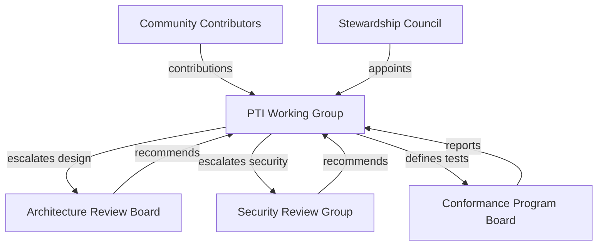

# Governance Model

PTI ecosystem governance combines practices proven in open internet standards and cloud-native foundations, adapted for regulated-adjacent trust infrastructure. This model is **inspired by** bodies such as the IETF, W3C, and CNCF — not a copy of any single organization's bylaws.

## Design goals

The governance model **MUST**:

1. Separate **specification authority** from **implementation and operations**
2. Enable **rough consensus** among diverse stakeholders
3. Provide **escalation paths** for architecture, security, and legal-adjacent questions
4. Support a **multi-phase transition** from founder stewardship to mature ecosystem ([Ecosystem Roadmap](./ecosystem-roadmap))
5. Remain **vendor-neutral** in normative outcomes

## Structural overview

## Layers of authority

### Layer 1 — Community (informal)

Anyone **MAY** participate in public review: comment on RFC drafts, file issues, run conformance self-assessments, and publish independent implementations. Community input **SHOULD** influence Working Group decisions but does not alone constitute approval.

### Layer 2 — Working Group (normative process)

The [Working Group](./working-group) owns the [RFC process](./rfc-process), [specification lifecycle](./specification-lifecycle), and [decision-making](./decision-making) rules. It **MUST** publish meeting notes and decision logs for substantive votes.

### Layer 3 — Review boards (specialized)

| Board | Mandate | Binding power |
|-------|---------|---------------|
| **Architecture Review Board (ARB)** | Cross-RFC coherence, layering, breaking-change impact | **SHOULD** block Accepted → Stable promotion without sign-off on architectural RFCs |
| **Security Review Group (SRG)** | Threat models, crypto choices, disclosure coordination | **MUST** review all RFCs touching authentication, encryption, or trust exchange |
| **Conformance Program Board** | Profiles, test suites, certification policy | **MUST** approve profile changes affecting certified implementations |

Review boards **RECOMMEND**; the Working Group **MUST** respond publicly to blocking recommendations.

### Layer 4 — Stewardship (transitional)

During early phases, a **Stewardship Council** (initially aligned with the founding steward) **MAY**:

- Fund infrastructure for RFC publication and test harnesses
- Appoint initial Maintainers and board members
- Execute trademark policy pending foundation transfer

The Stewardship Council **MUST NOT** unilaterally change Stable RFCs. Specification changes **MUST** follow Layer 2 process.

## Comparison to familiar models

| Aspect | IETF-style influence | W3C-style influence | CNCF-style influence | PTI adaptation |
|--------|---------------------|---------------------|----------------------|----------------|
| **Document unit** | Internet-Draft → RFC | Recommendation track | Project sandbox → incubating | PTI RFC lifecycle |
| **Consensus** | Rough consensus, running code | Group decision, AC review | Technical oversight committee | WG + ARB for architecture |
| **Implementation proof** | Interoperability demos valued | Implementation report |至少 two adopters for graduation | Conformance tests + pilot implementations |
| **Membership** | Individual participation | Member organizations | Vendor-neutral foundation | Open participation; no fee for RFCs |
| **IP policy** | Royalty-free standards | W3C patent policy | CNCF CLA | RF terms for normative contributions (see Contribution Process) |

PTI **does not** adopt any external body's membership fees, patent pools, or trademark rules wholesale. Implementers **SHOULD** consult counsel for IP implications in their jurisdiction.

## Decision types and forums

| Decision type | Primary forum | Appeal path |
|---------------|---------------|-------------|
| New RFC acceptance | Working Group | Re-open with new evidence; ARB review |
| RFC status promotion | Working Group + relevant board | Stewardship Council audit (Phase 1–2 only) |
| Profile / test change | Conformance Program Board | Working Group ratification |
| Security advisory | SRG → Working Group | Public disclosure timeline |
| Trademark dispute | Trademark policy owner | Documented escalation (Phase 3+) |
| Governance rule change | Working Group supermajority | Public comment period (minimum 28 days) |

## Transparency requirements

The following **MUST** be publicly accessible:

- Active RFC drafts and status history
- Accepted governance documents in this section
- Conformance profile definitions and test suite versions
- Security advisories after coordinated disclosure
- Annual stewardship report (from Phase 2 onward)

The following **MAY** be restricted temporarily:

- Embargo-stage vulnerability details
- Personal data in contribution attribution
- Pre-decision legal advice

## Phase-dependent governance

Governance authority expands with ecosystem maturity:

| Phase | Working Group | Stewardship | Independent foundation |
|-------|---------------|-------------|------------------------|
| **Phase 1** | Convened; Maintainers appointed | Strong operational role | Not yet |
| **Phase 2** | Elected Maintainers; partner seats | Shared funding | Exploratory |
| **Phase 3** | Community-elected leadership | Advisory | Forming |
| **Phase 4** | Foundation-directed | Minimal | Primary legal home |

See [Ecosystem Roadmap](./ecosystem-roadmap) and [Future Foundation Model](./future-foundation-model).

## Related documents

- [Working Group](./working-group)
- [Decision Making](./decision-making)
- [RFC Process](./rfc-process)
- [Public Governance Statement](./public-governance-statement)
