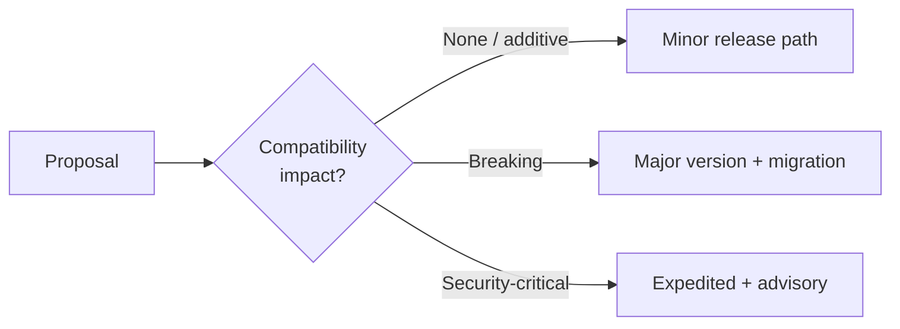

# Governance Principles

These principles guide every governance decision: RFC acceptance, version releases, certification criteria, and stewardship transitions. They complement — but do not replace — technical design principles in [Core Design Principles](/pti/introduction/design-principles) and operational rules in [RFC-007](/pti/rfcs/rfc-007-governance).

Process rules below use [RFC 2119](https://www.rfc-editor.org/rfc/rfc2119) keywords.

## 1. Open Evolution

The specification **MUST** evolve through public, documented processes. Substantive changes **MUST** enter via the [RFC process](./rfc-process) with review periods visible to all participants.

- Draft RFCs **SHOULD** be published before implementation-dependent deployments at scale
- Rejected proposals **SHOULD** retain public rationale for future reference
- Emergency security fixes **MAY** follow an expedited path defined in [Security Disclosure](./security-disclosure)

**Anti-pattern:** Normative behavior defined only in a vendor's private integration guide.

## 2. Technical Merit

Decisions **MUST** prioritize technical merit, interoperability evidence, and conformance impact over brand affiliation, revenue share, or participant size.

Evaluation criteria **SHOULD** include:

| Criterion | Question |
|-----------|----------|
| **Correctness** | Does the proposal satisfy stated use cases without contradictions? |
| **Interoperability** | Do at least two independent implementations benefit? |
| **Security** | What is the threat model delta? (SRG review) |
| **Privacy** | Does data minimization hold? |
| **Complexity** | Is the simplest sufficient design chosen? |
| **Evidence** | Are there test vectors, pilots, or formal analysis? |

## 3. Compatibility First

Backward compatibility **SHOULD** be preserved across minor and patch releases. Breaking changes **MUST** follow the [Breaking Changes Policy](./breaking-changes-policy) and **MUST NOT** appear in Stable RFCs without a major version or explicit deprecation cycle.

Implementers **SHOULD** treat [RFC-010 Versioning](/pti/rfcs/rfc-010-versioning) as binding for schema and API evolution.

## 4. Implementation Neutrality

The specification **MUST NOT** mandate a single vendor stack, cloud region, programming language, or reference codebase. Normative text **MAY** include non-binding examples; examples **MUST NOT** be the only definition of required behavior.

- Conformance **MUST** be evaluated against behavior, not source code similarity
- Reference implementations **MAY** exist but **MUST NOT** confer exclusive rights (see [Reference Implementation Policy](./reference-implementation-policy))

## 5. Security Responsibility

Security is a collective obligation spanning spec authors, implementers, and operators.

| Role | Responsibility |
|------|----------------|
| **Working Group / SRG** | Threat models, normative controls, coordinated disclosure |
| **Implementers** | Secure defaults, patch SLAs, production hardening |
| **Operators** | Incident response, audit, subject notification where required |
| **Researchers** | Responsible reporting per [Security Disclosure](./security-disclosure) |

Security regressions in Stable RFCs **MUST** be remediated; cosmetic issues **MAY** wait for scheduled releases.

## 6. Community Participation

Governance **MUST** provide meaningful participation paths for implementers, researchers, civil-society advocates, and institutional users — not only founding stewards.

- Contribution mechanics are defined in [Community Participation](./community-participation) and [Contribution Process](./contribution-process)
- Decision records **SHOULD** be public unless restricted for security or personal data
- Working Group meetings **SHOULD** publish minutes and agendas

**Requirement:** No fee **MAY** be required to submit RFC drafts or participate in public review.

## 7. Long-Term Stability

Institutions integrate trust infrastructure over years. Governance **MUST** optimize for predictable lifecycles:

| Mechanism | Purpose |
|-----------|---------|
| RFC status ladder | Draft → Stable with explicit semantics |
| Deprecation timelines | Minimum notice before Retired |
| Conformance versioning | Certificates bind to spec version |
| Stewardship roadmap | Transition to independent foundation ([Ecosystem Roadmap](./ecosystem-roadmap)) |

Short-term expedience **MUST NOT** override documented deprecation commitments without Working Group supermajority and public notice.

## Principle hierarchy

When principles conflict, resolve in this order:

1. **Subject safety and security** (including privacy)
2. **Compatibility commitments** already published as Stable
3. **Technical merit and interoperability**
4. **Open evolution and community participation**
5. **Implementation convenience**

## Related documents

- [Governance Model](./governance-model)
- [Decision Making](./decision-making)
- [Breaking Changes Policy](./breaking-changes-policy)
- [Public Governance Statement](./public-governance-statement)
