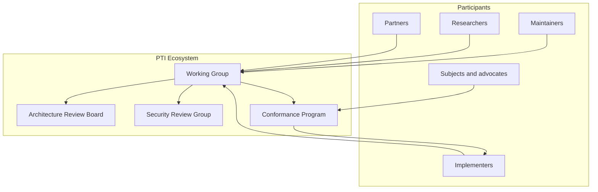

# PTI Ecosystem Governance

Portable Trust Infrastructure (PTI) is an open, vendor-neutral specification category for trust intelligence infrastructure. **Ecosystem governance** defines how the specification evolves, how participants collaborate, and how compatibility claims are validated.

This section covers **ecosystem governance** — the processes, roles, and policies that steward PTI as a public standard. It does **not** define operational trust governance inside a running platform (consent, retention, audit, subject rights). Those requirements live in [RFC-007 Governance](/pti/rfcs/rfc-007-governance) and the [PTI Specification v1.0 Governance](/pti/specification/v1.0/governance) document.

## What ecosystem governance covers

| Domain | Governed by | Examples |
|--------|-------------|----------|
| **Specification evolution** | PTI Working Group | RFC proposals, version releases, deprecation |
| **Technical direction** | Architecture Review Board | Cross-RFC coherence, breaking-change review |
| **Security of the standard** | Security Review Group | Threat models, disclosure coordination |
| **Compatibility claims** | Conformance Program | Profiles, certification, test suites |
| **Community participation** | [Contribution process](/pti/governance/contribution-process) · [Contributing](/pti/contributing/) | Issues, PRs, public review |
| **Brand and trademarks** | Trademark policy | Permitted use of PTI marks |

## What ecosystem governance does not cover

- Product roadmaps, pricing, or commercial terms of any single vendor
- Legal compliance of a specific deployment (implementers remain responsible)
- Day-to-day operation of a trust exchange, registry, or intelligence engine
- Assignment of `pti_id` values or registry operator selection in production networks

## Governance stakeholders

## Relationship to other documentation

| Document set | Scope |
|--------------|-------|
| [PTI Specification v1.0](/pti/specification/v1.0/) | Normative requirements for compatible implementations |
| [PTI RFCs](/pti/rfcs/) | Modular normative documents with defined lifecycle |
| [PTI Conformance](/pti/conformance/) | Profiles, tests, and certification |
| [Build Your Own PTI](/pti/build-your-pti/) | Independent implementer guide |
| RFC-007 / spec governance | In-platform trust data governance |

## Current stewardship

During Phase 1 (Founder Stewardship), the PTI Working Group is convened and initially staffed by contributors from the founding steward organization. **TumiTrust** currently serves as the **reference steward and reference implementation** — not as owner of PTI. Stewardship is transitional; see [The Origin of PTI](/pti/origin/), [Ecosystem Roadmap](./ecosystem-roadmap) and [Future Foundation Model](./future-foundation-model).

## Normative language

Process rules in this section use [RFC 2119](https://www.rfc-editor.org/rfc/rfc2119) keywords where indicated: **MUST**, **MUST NOT**, **SHOULD**, **SHOULD NOT**, **MAY**, and **RECOMMENDED**.

## Reading guide

| If you want to… | Start here |
|-----------------|------------|
| Understand why open governance matters | [Why Governance Matters](./why-governance-matters) |
| Distinguish spec from products | [Specification vs Implementation](./specification-vs-implementation) |
| Contribute an RFC or fix | [Contribution Process](./contribution-process) |
| Certify an implementation | [Conformance Program](./conformance-program) |
| Review public commitments | [Public Governance Statement](./public-governance-statement) |

## Document index

1. [Why Governance Matters](./why-governance-matters)
2. [Specification vs Implementation](./specification-vs-implementation)
3. [Governance Principles](./governance-principles)
4. [Governance Model](./governance-model)
5. [Working Group](./working-group)
6. [Specification Lifecycle](./specification-lifecycle)
7. [RFC Process](./rfc-process)
8. [Contribution Process](./contribution-process)
9. [Decision Making](./decision-making)
10. [Version Management](./version-management)
11. [Breaking Changes Policy](./breaking-changes-policy)
12. [Security Disclosure](./security-disclosure)
13. [Community Participation](./community-participation)
14. [Conformance Program](./conformance-program)
15. [Certification Process](./certification-process)
16. [Trademark and Branding](./trademark-branding)
17. [Reference Implementation Policy](./reference-implementation-policy)
18. [Future Foundation Model](./future-foundation-model)
19. [Public Governance Statement](./public-governance-statement)
20. [Ecosystem Roadmap](./ecosystem-roadmap)
