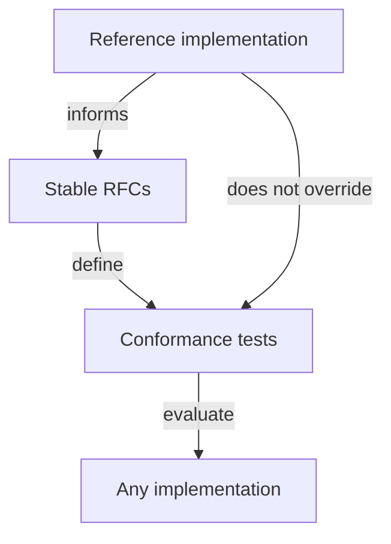

# Reference Implementation Policy

A **reference implementation** demonstrates that PTI [RFCs](/pti/rfcs/) are implementable, produces interoperability test vectors, and accelerates ecosystem learning. It is **informative for architecture** but **not normative** for compatibility.

**TumiTrust** is the current **flagship reference implementation**. Additional reference implementations **SHOULD** emerge as the ecosystem matures.

## Purpose

Reference implementations **SHOULD**:

| Goal | How |
|------|-----|
| **De-risk adoption** | Show production patterns for [Build Your Own PTI](/pti/build-your-pti/) |
| **Inform RFC stability** | Exercise edge cases before Stable promotion |
| **Supply test vectors** | Provide reproducible examples for [conformance tests](/pti/conformance/conformance-tests) |
| **Train implementers** | Document operational patterns (informative) |

Reference implementations **MUST NOT**:

- Define normative behavior absent from RFCs
- Block independent certification
- Require commercial license to implement PTI
- Capture Working Group governance indefinitely

## Normative hierarchy

When reference code disagrees with Stable RFCs, **RFCs prevail**. Reference bugs **SHOULD** be fixed or RFCs amended through [RFC Process](./rfc-process) — not silently codified in product docs as standard.

## Flagship reference: TumiTrust

TumiTrust provides:

- Operational mapping from RFC roles to platform services
- Partner connector patterns (informative)
- Public API documentation under `/tumitrust/`

TumiTrust-specific features **MAY** exceed PTI profiles. Such features **MUST** be labeled product capabilities, not PTI requirements.

### Stewardship vs reference role

| TumiTrust as steward | TumiTrust as reference |
|---------------------|------------------------|
| Funds early WG infrastructure | Ships code exercising RFCs |
| Appoints initial Maintainers | Contributes patches and tests |
| Holds transitional trademarks | Demonstrates deployment scale |

Stewardship is **time-limited** per [Ecosystem Roadmap](./ecosystem-roadmap). Reference availability **MAY** continue commercially independent of stewardship.

## Additional reference implementations

The Working Group **SHOULD** encourage ≥2 independent implementations before promoting protocol RFCs to Stable.

Independent reference implementations **MAY** receive:

- Public listing as "PTI reference implementation"
- Collaboration on shared test vectors
- Speaking slots at interoperability events

They **MUST NOT** receive exclusive certification privileges.

## Open source expectations

Reference implementations **SHOULD** open-source sufficient components to reproduce conformance-critical behavior — at minimum:

- API adapters for required profile operations
- Schema validators for RFC-003 and RFC-004
- Test harness integration points

Proprietary scoring models **MAY** remain closed if explainability and evidence requirements (RFC-012) are still met via interfaces.

## Contribution and neutrality

Employees of reference implementers **MAY** hold Maintainer roles with recusal duties per [Decision Making](./decision-making#conflicts-of-interest).

Reference implementers **MUST NOT**:

- Merge normative RFC text favoring undisclosed product quirks
- Delay publication of interoperability bugs to gain competitive advantage
- Require NDAs for access to RFC-mandatory behavior

## Deprecation

If a reference implementation discontinues a module:

- Migration guides **SHOULD** point to RFC-normative behavior, not replacement product features alone
- Test vectors **MUST** remain archived for certified implementations

## Related documents

- [Specification vs Implementation](./specification-vs-implementation)
- [Conformance Program](./conformance-program)
- [Trademark and Branding](./trademark-branding)
- [Build Your Own PTI](/pti/build-your-pti/)
