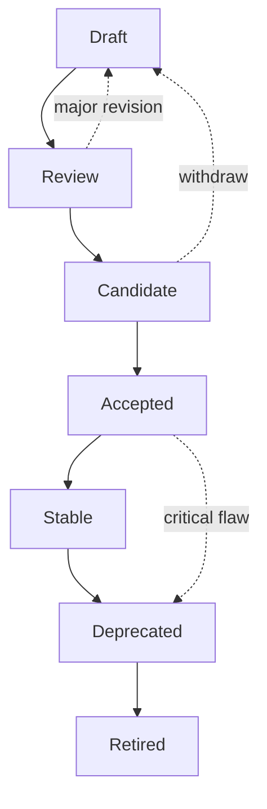

# RFC Process

PTI normative requirements are published as numbered **Request for Comments (RFC)** documents. The RFC process ensures public review, architectural coherence, and predictable implementation impact.

Normative keywords in RFC bodies follow [RFC 2119](https://www.rfc-editor.org/rfc/rfc2119). Process rules in **this document** also use RFC 2119 where stated.

## RFC lifecycle states



### Draft

**Purpose:** Author working copy visible to the community.

- Breaking changes **MAY** occur without deprecation notice
- **MUST NOT** be cited in conformance certificates
- Authors **SHOULD** solicit early feedback before requesting Review

**Entry:** Pull request or publication to RFC repository with complete [required fields](#required-rfc-fields).

### Review

**Purpose:** Structured community review before provisional commitment.

- Minimum public comment period: **28 days** for architectural RFCs; **14 days** for narrow extensions
- Maintainers **MUST** summarize substantive objections
- Authors **SHOULD** respond to each objection or defer with rationale

**Exit criteria:** No unresolved **must-fix** issues identified by Maintainers, ARB, or SRG (where applicable).

### Candidate

**Purpose:** Provisional normative text suitable for pilot implementations.

- At least one independent implementation **SHOULD** exist or be actively committed
- Conformance test stubs **SHOULD** be drafted
- Breaking changes **SHOULD** trigger return to Review

**Exit criteria:** Working Group rough consensus; board sign-offs complete.

### Accepted

**Purpose:** Normative specification for new development.

- **MUST** include backward-compatibility analysis per [RFC-010](/pti/rfcs/rfc-010-versioning)
- **MUST** update [conformance tests](/pti/conformance/conformance-tests) for affected profiles
- Implementers targeting certification **SHOULD** implement Accepted RFCs for their profile

### Stable

**Purpose:** Binding baseline for certification and long-term integration.

- At least **two** independent implementations **SHOULD** demonstrate interoperable behavior for protocol RFCs
- Test suite coverage **MUST** be complete for profile-required sections
- Changes limited to errata, security fixes, and non-semantic clarifications unless [Breaking Changes Policy](./breaking-changes-policy) applies

### Deprecated

**Purpose:** Signal supersession while allowing transition.

- **MUST** reference replacement RFC or bundle version
- **MUST** publish migration guide and minimum transition period (≥12 months for Stable RFCs unless SRG expedites for security)
- New certifications **MUST NOT** rely solely on Deprecated RFCs

### Retired

**Purpose:** Remove from active governance.

- Historical reference only
- Conformance Program **MUST NOT** issue new certificates referencing Retired RFCs
- Archives **MUST** remain publicly accessible

## Required RFC fields

Every RFC **MUST** include the following header table and sections:

### Header metadata

| Field | Required | Description |
|-------|----------|-------------|
| **RFC** | Yes | Number (e.g., 013) — assigned by Maintainers |
| **Title** | Yes | Concise descriptive title |
| **Status** | Yes | Draft, Review, Candidate, Accepted, Stable, Deprecated, Retired |
| **Version** | Yes | Semantic version of this RFC document |
| **Authors** | Yes | Names and affiliations |
| **Created** | Yes | ISO 8601 date |
| **Updated** | Yes | Last substantive change date |
| **Depends on** | Yes | Prerequisite RFCs (or "None") |
| **Updates** | If applicable | RFCs this document modifies |
| **Obsoletes** | If applicable | RFCs this document replaces |
| **Obsoleted by** | If applicable | Successor RFC |
| **Category** | Yes | Architecture, Protocol, Policy, Process |
| **Conformance** | Yes | Profiles affected (Core, Enterprise, Government, Edge) |

### Required sections

| Section | Content |
|---------|---------|
| **Abstract** | ≤200 words summarizing scope |
| **Motivation** | Problem statement and stakeholder impact |
| **Background** | Context, prior art, non-goals |
| **Terminology** | Definitions; reference RFC 2119 |
| **Specification** | Normative requirements |
| **Security considerations** | Threats and mitigations (SRG input) |
| **Privacy considerations** | Data handling impact |
| **Compatibility** | Analysis vs prior RFC versions |
| **Conformance** | Testable assertions linked to test IDs |
| **References** | Normative and informative |
| **Change log** | Per-version summary |

Optional sections **MAY** include: Examples, Appendix (test vectors), Implementation status.

### Example header

```markdown
| Field | Value |
|-------|-------|
| **RFC** | 004 |
| **Title** | Trust Lookup API |
| **Status** | Stable |
| **Version** | 1.0.0 |
| **Authors** | PTI Working Group |
| **Created** | 2025-06-01 |
| **Updated** | 2026-01-15 |
| **Depends on** | RFC-001, RFC-002 |
| **Updates** | — |
| **Category** | Protocol |
| **Conformance** | Core, Enterprise, Government, Edge |
```

## Numbering and allocation

- RFC numbers are **monotonic** and **never reused**
- Gap numbers **MAY** be reserved for planned series (e.g., 020–029 for context extensions)
- Process documents **MAY** use RFC-0xx reserved range or live only in governance docs — Working Group decision required

## Expedited paths

| Situation | Process |
|-----------|---------|
| **Security vulnerability** | SRG-led patch; minimum 72-hour implementer notice when active exploitation known |
| **Errata** | Maintainer fast-track; no status promotion |
| **Editorial** | Direct merge with reviewer |

Security expedite **MUST NOT** introduce breaking wire-format changes without Working Group notification.

## Relationship to Specification v1.0

The [Specification v1.0](/pti/specification/v1.0/) bundle integrates RFCs for readability. **RFCs are authoritative** on conflict; bundle integration **SHOULD** be updated within one patch release of RFC promotion.

## Submitting an RFC

See [Contribution Process](./contribution-process). New RFCs **SHOULD** begin as Draft with an issue describing scope before large pull requests.

## Related documents

- [Specification Lifecycle](./specification-lifecycle)
- [Breaking Changes Policy](./breaking-changes-policy)
- [Working Group](./working-group)
- [PTI RFC Index](/pti/rfcs/)
