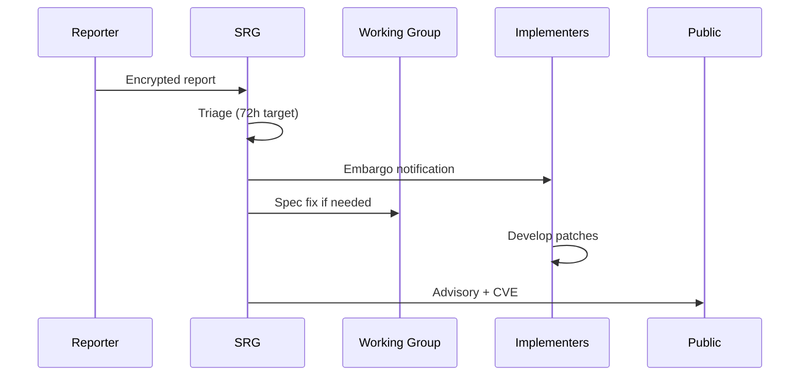

# Security Disclosure

Security vulnerabilities in PTI specifications, conformance tooling, or widely deployed reference implementations **MUST** be handled through coordinated disclosure. This protects subjects and institutions while giving implementers time to patch.

This policy covers **ecosystem-level** disclosure. Operator incident response remains governed by [RFC-008 Security](/pti/rfcs/rfc-008-security) and platform-specific runbooks.

## Scope

| In scope | Out of scope |
|----------|--------------|
| Normative flaws enabling bypass of RFC-008 controls | Individual tenant misconfiguration |
| Cryptographic weaknesses in specified algorithms | Social engineering of single bank staff |
| Trust exchange signature bypass | Non-PTI adjacent products |
| Conformance test suite vulnerabilities | Bug bounty scope of unrelated SaaS |
| Reference implementation CVEs with spec implications | Generic IT vulnerabilities without PTI impact |

## Reporting

Researchers and implementers **SHOULD** report to:

**security@pti-standard.org** (placeholder — operational address published by SRG)

Reports **SHOULD** include:

- Description and reproduction steps
- Affected RFCs or components
- Impact assessment (confidentiality, integrity, availability, subject privacy)
- Suggested remediation if known
- Disclosure preference and embargo request

Reports **MUST NOT** include live subject personal data. Use synthetic test identities only.

## Roles

| Role | Responsibility |
|------|----------------|
| **Reporter** | Good-faith disclosure; avoids public exploit during embargo |
| **SRG** | Triage, severity, CVE assignment, coordination |
| **Working Group** | Spec errata or RFC revision |
| **Implementers** | Patch deployment per severity SLA |
| **Stewardship** | Infrastructure for advisory publication |

## Severity and timelines

| Severity | Example | Spec fix target | Implementer patch target | Public disclosure |
|----------|---------|-----------------|--------------------------|-------------------|
| **Critical** | Lookup auth bypass exposing cross-context data | 7 days | 30 days | After patch or 90 days max |
| **High** | Signature verification flaw in exchange | 14 days | 60 days | Coordinated |
| **Medium** | Denial of service on registry API | 30 days | 90 days | With release |
| **Low** | Information leak in error messages | Next scheduled | Next scheduled | With release |

Active exploitation **MAY** shorten embargoes at SRG discretion with same-day implementer notice.

## Specification vs implementation flaws

| Finding type | Action |
|--------------|--------|
| **Spec silent / wrong** | Errata or RFC revision; SRG **MUST** document correct behavior |
| **Spec clear; implementation wrong** | CVE to implementer; conformance tests **SHOULD** add regression |
| **Both** | Spec fix first; CVE notes affected versions |

Reference implementation issues **MUST NOT** delay spec fixes when the spec is ambiguous.

## Embargo rules

- Default embargo: **90 days** from report acknowledgment
- Extensions **MAY** be granted once by mutual agreement
- Reporters **SHOULD** receive credit unless anonymity requested
- Public disclosure **MUST** include: CVE ID, affected versions, fixed versions, workaround if any

## Safe harbor

Good-faith security research consistent with this policy **SHOULD NOT** face legal action from stewardship organizations participating in the program. Safe harbor **does not** authorize access to production subject data or violation of applicable law.

## Post-disclosure

After publication, the Working Group **SHOULD**:

1. Update [conformance tests](/pti/conformance/conformance-tests) with regression cases
2. Review related RFCs for similar patterns
3. Publish lessons learned in SRG minutes (redacted)

## Related documents

- [RFC-008 Security](/pti/rfcs/rfc-008-security)
- [Working Group — SRG](./working-group#security-review-group-srg)
- [Governance Principles — Security Responsibility](./governance-principles#5-security-responsibility)
- [Breaking Changes Policy](./breaking-changes-policy)
