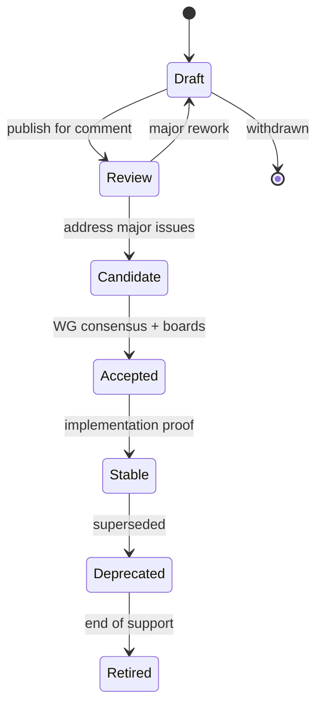

# Specification Lifecycle

The PTI specification exists at two levels: **individual RFCs** and **released specification bundles** (e.g., [Specification v1.0](/pti/specification/v1.0/)). This document describes how both evolve under ecosystem governance.

## RFC-level lifecycle

Each RFC follows the status ladder defined in [RFC Process](./rfc-process):

| Status | Normative weight | Implementer expectation |
|--------|------------------|-------------------------|
| **Draft** | Informative only | Prototype at own risk |
| **Review** | Informative; feedback solicited | Pilot interoperability tests welcome |
| **Candidate** | Provisional normative | May build against with migration expectation |
| **Accepted** | Normative for new work | **SHOULD** implement for target profile |
| **Stable** | Binding for certification | **MUST** implement for certified profile |
| **Deprecated** | Superseded | **SHOULD** migrate by published date |
| **Retired** | Historical | **MUST NOT** use for new certifications |

## Specification bundle lifecycle

A **specification bundle** (such as v1.0) is a curated snapshot referencing RFC statuses at release time.

### Bundle states

| Bundle state | Meaning |
|--------------|---------|
| **Current** | Recommended target for new implementations |
| **Maintained** | Receives errata and security fixes; no new features |
| **Extended support** | Critical security patches only |
| **End of life** | No further patches; certificates not renewed |

### Release types

Aligned with [Version Management](./version-management):

| Type | RFC impact | Bundle example |
|------|------------|----------------|
| **Major** | Breaking changes allowed with policy | v2.0 |
| **Minor** | Additive RFCs, new optional capabilities | v1.1 |
| **Patch / errata** | Clarifications, test fixes, non-semantic corrections | v1.0.1 |

A minor bundle release **MAY** promote RFCs from Accepted to Stable without a major version if no breaking change is introduced.

## Lifecycle gates

Promotion between bundle states **MUST** satisfy:

### Current → Maintained

- Successor minor or major release published
- Minimum 12 months as Current **RECOMMENDED**
- Migration guide available per [Breaking Changes Policy](./breaking-changes-policy)

### Maintained → Extended support

- Working Group vote with public notice (≥90 days)
- Conformance Program publishes sunset timeline for certifications

### Extended support → End of life

- All Stable RFCs in bundle **Deprecated** or **Retired** with replacements
- Final security advisory review by SRG

## Errata process

Errata correct unintended ambiguity without changing interoperable behavior.

1. Reporter files errata proposal with test case demonstrating ambiguity
2. Maintainer triages; **SHOULD** respond within 14 days
3. If behavior clarification affects implementations differently, treat as minor RFC revision — not errata
4. Accepted errata **MUST** update [conformance tests](/pti/conformance/conformance-tests) if applicable

## Relationship to conformance

| RFC / bundle status | Conformance impact |
|---------------------|-------------------|
| Stable RFC | **MUST** appear in profile requirements for applicable profiles |
| Accepted RFC | **MAY** be optional until Stable |
| Deprecated RFC | Removed from new certifications; grandfather period documented |
| Retired RFC | Existing certificates **MUST NOT** renew |

See [Conformance Program](./conformance-program).

## Publication artifacts

Each bundle release **MUST** publish:

- RFC index with statuses ([RFC Index](/pti/rfcs/))
- Changelog referencing RFC IDs and Git revisions
- Updated profile matrices
- Migration notes for implementers upgrading from prior bundle

## Related documents

- [RFC Process](./rfc-process)
- [Version Management](./version-management)
- [Breaking Changes Policy](./breaking-changes-policy)
- [Ecosystem Roadmap](./ecosystem-roadmap)
