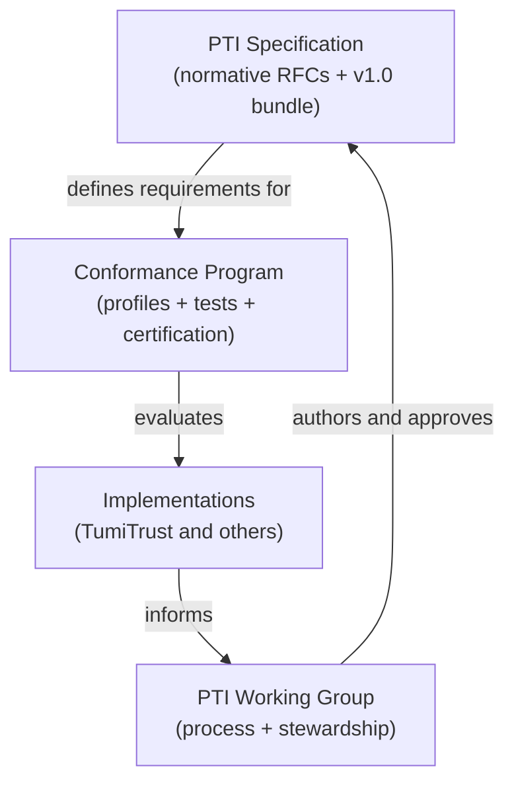

# Specification vs Implementation

Confusion between **the standard** and **a product** undermines portability, certification, and procurement. This document defines boundaries among four distinct entities in the PTI ecosystem.

## The four layers

## 1. PTI Specification

The **PTI Specification** is the vendor-neutral normative definition of Portable Trust Infrastructure.

| Attribute | Description |
|-----------|-------------|
| **Form** | Numbered [RFCs](/pti/rfcs/) plus the integrated [Specification v1.0](/pti/specification/v1.0/) bundle |
| **Ownership** | Public standard; no single company owns the category |
| **Change control** | [RFC process](./rfc-process) and [Working Group](./working-group) approval |
| **Compatibility** | Declared via [version management](./version-management) and [RFC-010](/pti/rfcs/rfc-010-versioning) |

The specification **MUST NOT** reference proprietary APIs, unreleased product features, or vendor-specific identifiers as normative requirements.

**Examples of specification artifacts:**

- RFC-003 trust event schema
- RFC-004 lookup tier definitions
- Conformance profile capability matrices (published under [Conformance](/pti/conformance/))

## 2. TumiTrust (reference implementation)

**TumiTrust** is a commercial trust platform that implements PTI. It is the **current reference implementation and founding steward** — not the specification itself.

| TumiTrust is… | TumiTrust is not… |
|---------------|-------------------|
| An example of how RFCs map to production services | The sole valid PTI deployment |
| A source of interoperability test vectors | A gatekeeper for who may implement PTI |
| A steward during early ecosystem phases | Owner of the PTI trademark category in perpetuity |
| A contributor to RFCs and conformance tests | A substitute for independent certification |

Product documentation under `/tumitrust/` describes TumiTrust behavior. When TumiTrust diverges from published RFCs, **the RFCs govern compatibility claims** until amended through governance.

See [Reference Implementation Policy](./reference-implementation-policy).

## 3. PTI Working Group

The **PTI Working Group** is the community body that stewards specification evolution.

| Responsibility | Out of scope |
|----------------|--------------|
| Review and accept RFCs | Operating production registries |
| Appoint review boards (ARB, SRG) | Commercial partner negotiations |
| Publish governance and process docs | Certifying implementations (delegated to Conformance Program) |
| Coordinate security disclosure | Legal advice to implementers |

Membership is open per [Working Group](./working-group) and [Community Participation](./community-participation) policies. During Phase 1, operational support may be provided by the founding steward's infrastructure.

## 4. Conformance Program

The **Conformance Program** translates normative RFCs into **testable, certifiable claims**.

| Component | Location |
|-----------|----------|
| Profiles | [Conformance profiles](/pti/conformance/profiles) |
| Test suites | [Conformance tests](/pti/conformance/conformance-tests) |
| Certification rules | [Certification guide](/pti/conformance/certification-guide) |
| Program governance | [Conformance Program](./conformance-program), [Certification Process](./certification-process) |

An implementation **MAY** be fully functional yet **not** PTI-compatible if it fails required tests. Conversely, a minimal implementation **MAY** certify for a narrow profile (e.g., Core) without implementing every optional capability.

## Comparison matrix

| Dimension | Specification | Working Group | Conformance Program | TumiTrust |
|-----------|---------------|---------------|---------------------|-----------|
| **Primary output** | RFCs | Decisions, process | Certificates, tests | Running platform |
| **Binding on others** | Normative for compatibility | Process rules | Certification requirements | Contractual to customers |
| **Vendor-neutral** | **MUST** be | **MUST** be | **MUST** be | Product (neutral spec, branded product) |
| **Open participation** | Via contributions | Yes | Accredited labs + self-assessment | Commercial |

## Common misconceptions

| Misconception | Correction |
|---------------|------------|
| "PTI is TumiTrust's API" | PTI is defined by RFCs; TumiTrust exposes one compatible API surface |
| "You need TumiTrust to build PTI" | See [Build Your Own PTI](/pti/build-your-pti/) |
| "Working Group approval equals certification" | Certification requires conformance testing per profile |
| "RFC-007 governs the Working Group" | RFC-007 governs in-platform trust data; this section governs the ecosystem |

## Language for public communication

When describing offerings:

| Acceptable | Unacceptable |
|------------|--------------|
| "PTI-compatible Core profile, v1.0" | "PTI-certified" without certificate |
| "Implements RFC-003 and RFC-004" | "The official PTI platform" (implies exclusivity) |
| "Reference implementation based on TumiTrust" | "PTI powered by [vendor]" as if vendor owns PTI |
| "Submitted RFC draft for community review" | "PTI standard includes our proprietary feature" |

## Related documents

- [Governance Principles](./governance-principles)
- [Reference Implementation Policy](./reference-implementation-policy)
- [Conformance Program](./conformance-program)
- [Trademark and Branding](./trademark-branding)
