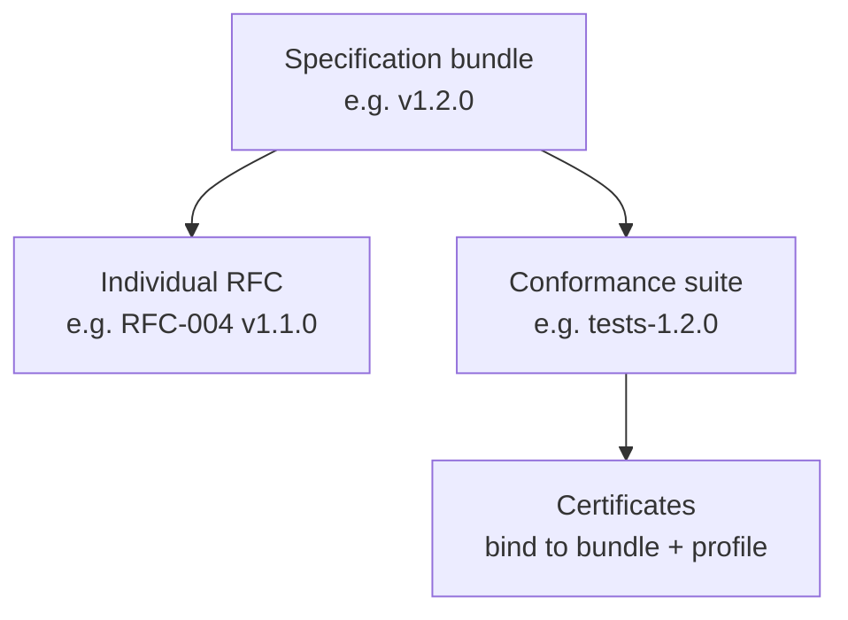

# Version Management

Predictable versioning enables institutions to plan integrations, certify implementations, and coordinate federation partners. PTI uses **semantic versioning** at three layers: specification bundles, individual RFCs, and conformance artifacts.

Technical schema rules **MUST** align with [RFC-010 Versioning](/pti/rfcs/rfc-010-versioning). This document defines **ecosystem release** policy.

## Version layers

## Specification bundle versioning

Format: **`MAJOR.MINOR.PATCH`**

| Component | Increment when | Example |
|-----------|----------------|---------|
| **MAJOR** | Breaking change to normative behavior in any Stable RFC | v1 → v2 |
| **MINOR** | Additive capabilities, new RFC Accepted/Stable, new optional fields | v1.0 → v1.1 |
| **PATCH** | Errata, clarifications, test fixes without behavior change | v1.1.0 → v1.1.1 |

### Current release policy

- Exactly one bundle **SHOULD** be marked **Current** at a time
- Prior major versions **SHOULD** enter **Maintained** status per [Specification Lifecycle](./specification-lifecycle)
- Working Group **MUST** publish release notes with RFC change summary

## RFC document versioning

Each RFC carries its own semver independent of the bundle:

| RFC change | Version bump |
|------------|--------------|
| Editorial / typo | PATCH |
| Additive optional section | MINOR |
| New normative requirement | MINOR if backward compatible; MAJOR if not |
| Removal or constraint tightening | MAJOR or deprecation cycle |

RFC status ([Draft through Retired](./rfc-process)) is orthogonal to semver but **SHOULD** be updated in the same PR when promotion occurs.

## API and schema identifiers

Implementations **MUST** expose:

- `spec_version` — bundle version implemented
- `rfc_versions` — map of RFC number to document version for audit

Wire formats **SHOULD** use explicit schema URIs or version fields per RFC-010. Silent schema drift **MUST NOT** occur in production APIs labeled Stable.

## Conformance artifact versioning

| Artifact | Versioning rule |
|----------|-----------------|
| **Test suite** | Semver; MAJOR bump when required tests added/removed |
| **Profiles** | Profile ID includes major bundle (e.g., `core-v1`) |
| **Certificates** | List bundle version, profile, test suite version, expiry |

Certification against v1.1 tests **MAY** be required for new certificates even if implementation remains on v1.0 bundle — Conformance Board **MUST** publish overlap rules.

## Release cadence

| Release type | Target cadence | Notice |
|--------------|----------------|--------|
| **PATCH** | As needed (security prioritized) | Advisory + changelog |
| **MINOR** | 2–4 per year when mature | 30-day preview of test changes |
| **MAJOR** | Multi-year; roadmap driven | ≥12-month deprecation per [Breaking Changes Policy](./breaking-changes-policy) |

Early phases **MAY** release minors more frequently while RFCs stabilize.

## Compatibility matrix obligation

Each MINOR or MAJOR release **MUST** publish:

- Forward compatibility (v1.1 consumer with v1.0 producer) where applicable
- Required migration steps
- Updated [Build Your Own PTI](/pti/build-your-pti/) migration examples when behavior changes

## Federation and multi-version operation

Trust exchange operators **SHOULD** support at least **two** minor bundle versions concurrently during transition windows documented in release notes.

Version negotiation **MUST** follow RFC-006 when federating. Unnegotiated cross-version assumptions **MUST NOT** be normative.

## Related documents

- [Breaking Changes Policy](./breaking-changes-policy)
- [Specification Lifecycle](./specification-lifecycle)
- [RFC-010 Versioning](/pti/rfcs/rfc-010-versioning)
- [Conformance Program](./conformance-program)
