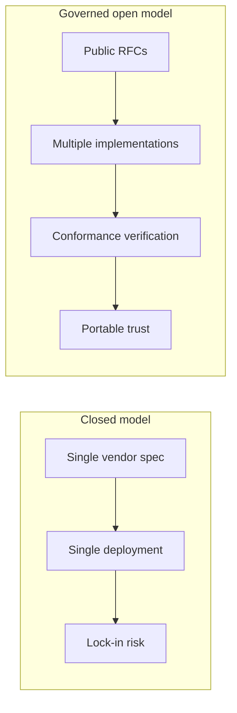

# Why Governance Matters

Trust infrastructure shapes access to credit, housing, employment, insurance, and public services. When a single vendor controls both the specification and the dominant deployment, subjects and institutions inherit that vendor's incentives, timelines, and failure modes. **Open ecosystem governance** exists so PTI remains a category standard — not a product line.

## The problem with closed standards

Historically, "trust" systems evolved as proprietary data networks: credit files, fraud scores, and identity graphs operated under contractual secrecy. That model produced predictable failures:

| Failure mode | Consequence |
|--------------|-------------|
| **Opaque scoring** | Subjects cannot understand or contest outcomes |
| **Vendor lock-in** | Institutions cannot switch providers without data loss |
| **Slow innovation** | New contexts and signal types require bilateral deals |
| **Weak accountability** | Breaches and misuse are disclosed on vendor timelines |
| **Fragmented portability** | Identity and trust history do not follow the subject |

PTI addresses these through architecture — context isolation, evidence chains, portable identifiers — but **architecture alone is insufficient**. Without governance, a capable design can still be captured by a single operator.

## What governance enables

### Institutional confidence

Regulators, procurement teams, and risk committees **SHOULD** be able to evaluate PTI against published RFCs and conformance profiles without negotiating proprietary addenda. Ecosystem governance makes that evaluation repeatable.

### Multi-vendor markets

Governance **MUST** preserve the conditions for competing implementations. When two operators both certify against the same profile, consumers **SHOULD** be able to compare behavior using shared test suites — not marketing claims.

### Subject protection

Technical governance in [RFC-007](/pti/rfcs/rfc-007-governance) defines consent, deletion, and explainability inside platforms. **Ecosystem governance** ensures those requirements cannot be silently removed from the standard to suit a single vendor's roadmap.

### Long-term stability

Institutions plan multi-year integrations. Governance provides:

- Predictable [version management](./version-management)
- Documented [breaking changes policy](./breaking-changes-policy)
- Transparent [RFC process](./rfc-process) with public review
- A path toward independent stewardship ([Future Foundation Model](./future-foundation-model))

## Trust without capture

## Governance vs product management

| Question | Product management answers | Ecosystem governance answers |
|----------|---------------------------|------------------------------|
| When do we ship feature X? | Next release train | Is X normative, optional, or out of scope? |
| Who pays? | Customer contracts | Who may implement without membership fees? |
| What breaks compatibility? | Customer migration plan | RFC status, deprecation timeline, test updates |
| Who is liable for a breach? | Operator terms of service | Disclosure process; spec security requirements |

Reference implementations — including [TumiTrust](/tumitrust/product-overview/) — **MAY** ship features faster than the RFC process. Those features **MUST NOT** be labeled "PTI-compatible" until reflected in normative documents and [conformance tests](/pti/conformance/conformance-tests).

## Who benefits

| Stakeholder | Benefit |
|-------------|---------|
| **Subjects** | Portable trust, explainability, and rights preserved across providers |
| **Institutions** | Vendor choice, auditable requirements, reduced integration risk |
| **Implementers** | Clear rules of engagement, merit-based influence, certification path |
| **Researchers** | Stable vocabulary, reproducible conformance baselines |
| **Regulators** | Inspectable standard with public change history |

## Related documents

- [Governance Principles](./governance-principles)
- [Specification vs Implementation](./specification-vs-implementation)
- [Public Governance Statement](./public-governance-statement)
- [Ecosystem Roadmap](./ecosystem-roadmap)
