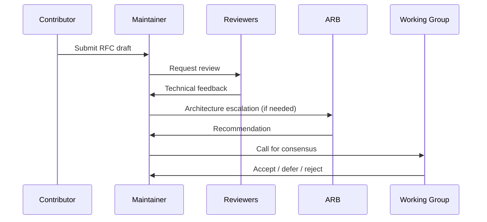

# Working Group

The **PTI Working Group** is the primary body responsible for specification evolution, governance policy maintenance, and coordination with the Conformance Program. It operates as an open technical community — not a closed industry consortium.

## Purpose

The Working Group **MUST**:

1. Review and advance [RFCs](/pti/rfcs/) through the [RFC process](./rfc-process)
2. Maintain ecosystem governance documents in this section
3. Appoint and oversee the Architecture Review Board and Security Review Group
4. Ratify Conformance Program profile changes with breaking impact
5. Publish [decision records](./decision-making) for substantive votes

The Working Group **MUST NOT** operate production trust platforms, issue commercial certifications directly, or negotiate bilateral data-sharing agreements on behalf of implementers.

## Membership

Membership is **open**. Any individual or organizational representative **MAY** participate provided they:

- Accept the [Contribution Process](./contribution-process) terms (including royalty-free licensing for normative contributions)
- Conduct themselves per [Community Participation](./community-participation) guidelines
- Disclose relevant employer or financial interest when reviewing RFCs in areas of direct commercial impact

There is **no membership fee** for Working Group participation.

## Roles

### Maintainers

**Maintainers** shepherd RFCs and governance docs through review. They **MUST** act impartially and **MUST NOT** merge normative changes without documented review.

| Responsibility | Detail |
|----------------|--------|
| Triage contributions | Assign reviewers; enforce [RFC fields](./rfc-process#required-rfc-fields) |
| Facilitate consensus | Summarize objections; propose compromises |
| Release coordination | Align RFC promotions with [version management](./version-management) |
| Board liaison | Route escalations to ARB and SRG |

Initial Maintainers are appointed by the Stewardship Council during Phase 1. From Phase 2 onward, Maintainers **SHOULD** be elected by active contributors per [Decision Making](./decision-making).

### Contributors

**Contributors** submit RFC drafts, patches, test cases, and documentation. Attribution **SHOULD** appear in RFC change logs.

### Implementers

**Implementers** build PTI-compatible systems ([Build Your Own PTI](/pti/build-your-pti/)). Their production feedback **SHOULD** inform RFC stability decisions. Implementers **MAY** participate without contributing code to the reference steward's codebase.

Running code **SHOULD** accompany promotion from Candidate to Accepted for protocol-facing RFCs.

### Researchers

**Researchers** provide formal analysis, privacy proofs, adversarial models, and benchmark studies. Research contributions **MAY** be cited in RFC rationale sections.

### Partners

**Partners** (data producers, institutions, integrators) **MAY** participate to ensure real-world operability. Partner participation **MUST NOT** confer veto rights over vendor-neutral outcomes.

### Reviewers

**Reviewers** provide structured feedback during RFC Review status. A normative RFC **SHOULD** receive at least two independent reviewer sign-offs before Candidate promotion, including one reviewer without employment conflict in the RFC's primary use case.

## Architecture Review Board (ARB)

The **ARB** guards structural integrity across the RFC series.

| Scope | Examples |
|-------|----------|
| Layering | Ensuring lookup APIs do not bypass context isolation |
| Identifier strategy | Consistency across RFC-002, RFC-011 |
| Federation model | RFC-006 alignment with registry roles |
| Breaking changes | Impact assessment per [Breaking Changes Policy](./breaking-changes-policy) |

**Composition:** 3–7 members with demonstrated architecture experience. At least one member **SHOULD** represent an implementation independent of the founding steward.

**Quorum:** Majority for recommendations; dissent **MUST** be recorded in the RFC thread.

## Security Review Group (SRG)

The **SRG** owns security quality of normative text and coordinates [Security Disclosure](./security-disclosure).

| Scope | Examples |
|-------|----------|
| RFC review | RFC-008, RFC-006, authentication extensions |
| Threat models | Updates when new attack surfaces are introduced |
| Advisories | CVE-style identifiers for specification-level issues |
| Crypto agility | Deprecation of weak algorithms in Stable RFCs |

**Composition:** 3–7 members with security engineering or research background. Membership **SHOULD** include at least one member outside the founding steward.

**Requirement:** RFCs touching cryptography or trust exchange **MUST NOT** reach Accepted status without SRG written review.

## Working Group operations

### Meetings

- **Public plenary:** Monthly; agenda published ≥7 days in advance
- **Office hours:** Weekly optional; implementation Q&A
- **Board sessions:** As needed; minutes published unless security-restricted

### Communication channels

Public mailing list, issue tracker, and RFC repository **SHOULD** be the system of record. Chat platforms **MAY** supplement but **MUST NOT** replace archived decisions.

## Relationship to TumiTrust

TumiTrust contributors **MAY** hold Maintainer and board roles during Phase 1, but **MUST** recuse from decisions where TumiTrust commercial interest conflicts with neutrality. Independent implementer representation **SHOULD** increase each roadmap phase.

## Related documents

- [Governance Model](./governance-model)
- [Contribution Process](./contribution-process)
- [RFC Process](./rfc-process)
- [Community Participation](./community-participation)
