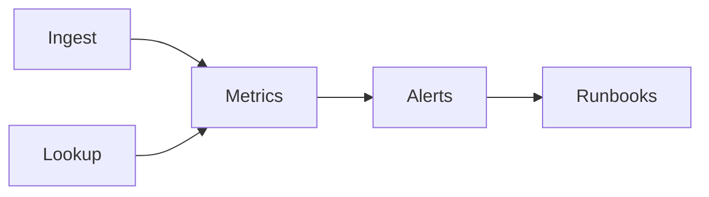

# Best Practices

Recommended patterns for robust PTI integrations. These practices support conformance with the normative specification and reduce operational risk.

## Identity and resolution

### Resolve before ingest

Always call Registry resolve (or use a cached `pti_id` from a prior successful link) before submitting events. Avoid lazy resolution inside batch jobs without error isolation.

### Stable partner references

Maintain a durable mapping table:

```
partner_entity_id → pti_id → last_verified_at
```

Refresh mappings when merge webhooks arrive.

### Document match confidence thresholds

Define internal rules:

| Confidence | Action |
|------------|--------|
| ≥ 0.95 | Auto-ingest |
| 0.80–0.94 | Ingest with review queue |
| &lt; 0.80 | Manual resolution |

## Event ingest

### Idempotency key design

Use deterministic templates:

```
{partner_id}:{event_type}:{business_key}:{occurred_date}
```

Never use random UUIDs for idempotency keys.

### Clock discipline

- Send `occurred_at` in UTC ISO 8601
- Synchronize producer servers with NTP
- Backfill historical data in chronological batches to simplify decay models

### Payload minimization

Include fields required by the event schema — no full profile dumps in `payload`. Sensitive attributes **SHOULD** be hashed or tokenized per privacy profile.

## Context strategy

### Enable only legitimate contexts

Map each product line to contexts you actually observe. Document the mapping in your internal data catalog.

### Lens contexts

Request lens contexts (e.g., `risk_compliance`) only when entitled; do not manually recompute lens scores client-side.

## Consumer lookups

### Tier discipline

Start with **Basic** or **Detailed** tiers in development. Promote to **Predictive** or **Screening** only after adverse-action and explainability workflows are ready.

### Purpose codes

Maintain an enumerated `purpose_code` list aligned with legal basis documentation.

### Present drivers, not just scores

UI and decision engines **SHOULD** display explainability drivers and `coverage_gaps` prominently. Thin data is not approval.

## Security

- Rotate API keys on schedule (90-day maximum recommended)
- Store secrets in vault systems, not application repos
- Verify webhook signatures before processing
- Log `correlation_id` on every support ticket

## Observability



Track:

| Metric | Alert threshold (example) |
|--------|---------------------------|
| `PTI-400x` rate | &gt; 2% over 15 minutes |
| Materialization lag | P95 &gt; 10 minutes |
| Lookup latency | P95 &gt; 3 seconds |
| Consent denials | Spike &gt; 3× baseline |

## Testing

- Maintain contract tests against `/capabilities` schema list
- Replay golden event fixtures after every mapper change
- Simulate `PTI-4091` idempotency conflicts in CI

## Related pages

- [Anti-Patterns](./anti-patterns)
- [Reference Event Model](/pti/specification/v1.0/reference-event-model)
- [Trust Producers](/pti/reference-architecture/trust-producers)
