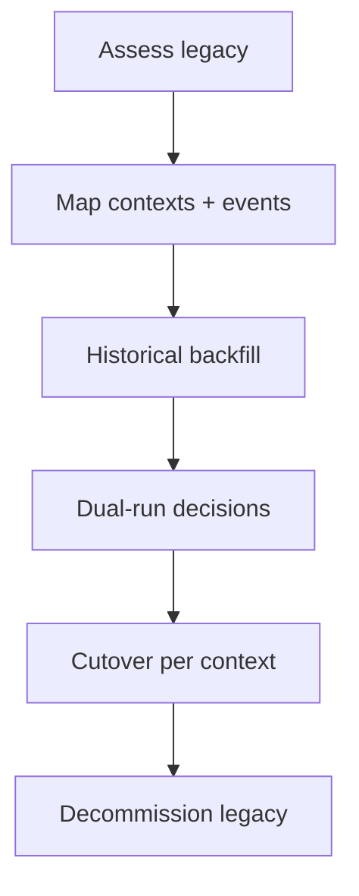

# Migration Guide

Guidance for organizations migrating from siloed trust or credit systems to Portable Trust Infrastructure (PTI).

## Migration scenarios

| Source | Typical challenges |
|--------|-------------------|
| **Internal-only score** | No portable ID, no provenance |
| **Credit bureau pull** | Regulatory category mismatch, limited contexts |
| **Partner CSV dumps** | Schema drift, duplicate entities |
| **Custom fraud engine** | Black-box features without drivers |

## Migration principles

1. **Parallel run** — operate legacy and PTI paths until score stability is validated.
2. **Context mapping** — translate legacy variables into PTI contexts, not a single score.
3. **Provenance first** — if a signal cannot cite a source event, defer migration of that signal.
4. **Incremental contexts** — pilot one context (e.g., `lending`) before enabling lenses.

## Phased migration



### Phase A — Assessment

Inventory:

- Data sources and refresh frequency
- Identifier types used for matching
- Legal basis for each use case
- Fields currently shown to underwriters or agents

Output: context/event catalog draft aligned with PTI registry.

### Phase B — Identity bridge

Create partner reference mappings:

```
legacy_customer_id → pti_id
```

Run Registry resolve for a statistically significant sample before bulk backfill.

### Phase C — Historical backfill

- Chunk CSV or API backfill by month
- Use chronological `occurred_at` ordering
- Monitor `PTI-400x` and `PTI-4091` rates per chunk
- Pause and fix mapper errors before continuing

Recommended batch size: 10k–50k records per job with per-row error reporting.

### Phase D — Dual run

| Decision | Legacy | PTI |
|----------|--------|-----|
| Approve | ✓ | ✓ |
| Decline | ✓ | ✓ |
| Refer | Compare drivers | Compare drivers |

Track divergence metrics:

- Approval rate delta per context
- Score correlation (Spearman ≥ 0.85 target for lending pilots)
- Explainability coverage (% decisions with non-empty drivers)

### Phase E — Cutover

Cut over per context when:

- Divergence within agreed tolerance for 30 days
- Operations runbooks tested (corrections, retractions, disputes)
- Staff trained on drivers and `coverage_gaps`

### Phase F — Decommission

Archive legacy raw stores per retention policy. Retain audit samples demonstrating mapping logic for regulatory examination.

## Mapping legacy attributes

| Legacy concept | PTI target |
|--------------|------------|
| Single risk score | Context scores per life area |
| Customer ID | `pti_id` + `partner_ref` |
| Payment history table | `lending.repayment.*` events |
| Manual verification flag | `employment.tenure.verified` assertion |
| Fraud rules hit | Signals in `merchant` or `risk_compliance` lens |

## Regulatory communication

Prepare examiner narrative covering:

- PTI as trust infrastructure, not a credit bureau replacement
- Context isolation and explainability
- Subject rights and consent flows
- Parallel-run validation methodology

## Rollback plan

Maintain ability to revert consumer decisions to legacy path for 90 days post-cutover. Rollback triggers:

- Materialization lag &gt; 1 hour sustained
- Score distribution shift &gt; 2 standard deviations without known cause
- Critical security incident on API credentials

## Common migration pitfalls

| Pitfall | Mitigation |
|---------|------------|
| Big-bang cutover | Per-context phased cutover |
| Skipping idempotency | Deterministic keys before backfill |
| Ignoring thin data | Train staff on `coverage_gaps` |
| Bureau field-for-field mapping | Refactor to event-sourced signals |

## Related pages

- [Best Practices](./best-practices)
- [Anti-Patterns](./anti-patterns)
- [Trust Lifecycle](/pti/reference-architecture/trust-lifecycle)
- [Versioning Strategy](/pti/specification/v1.0/versioning-strategy)
