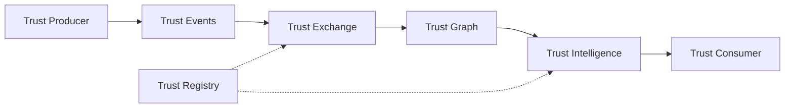

  

    
Portable Trust Infrastructure

    <h1 class="pti-spec-hero__title">Introduction to PTI</h1>
    
An infrastructure category for systems that produce, exchange, resolve, and consume trust across contexts — with portability, explainability, consent, and governance.

    

      PTI Specification v1.0
      Status: Stable
      Vendor-neutral
    

  

Portable Trust Infrastructure (PTI) separates **trust production** from **trust consumption**. Trust producers emit verifiable activity; the trust exchange normalizes signals into a governed trust graph; trust consumers resolve context-scoped intelligence at decision time.

## Core outcomes

- **Portable identity** — each subject receives a persistent `pti_id` across producers and contexts.
- **Context-scoped intelligence** — lending, merchant, rental, and other [trust contexts](/pti/reference-architecture/trust-contexts) remain isolated.
- **Provenance** — score changes trace to trust events, evidence, and policy — not opaque batch reruns.
- **Governed exchange** — consent, privacy, and audit are infrastructure concerns, not afterthoughts.

## Architectural roles

| Role | Responsibility |
|------|----------------|
| **Trust producer** | Emits trust events from verified activity |
| **Trust consumer** | Resolves trust lookups at decision time |
| **Trust exchange** | Normalizes, governs, and routes trust signals |
| **Trust registry** | Maintains contexts, policies, and participant metadata |
| **Trust intelligence engine** | Computes context scores with explainability |

## Trust flow

## Where to read next

| Topic | Document |
|-------|----------|
| Why PTI exists | [Why PTI exists](/pti/why-pti/) |
| PTI vs TumiTrust | [PTI and TumiTrust](/pti/tumitrust-and-pti/) |
| Architecture stack | [Trust infrastructure stack](/pti/architecture-stack/) |
| Design principles | [Core Design Principles](/pti/introduction/design-principles) |
| Normative specification | [PTI Specification v1.0](/pti/specification/v1.0/) |
| Reference architecture | [Reference Architecture](/pti/reference-architecture/) |
| Reference implementation | [TumiTrust reference implementation](/pti/reference-implementation/) |
| Build a compatible platform | [Build Your Own PTI](/pti/build-your-pti/) |

## Reference implementations

PTI is implementation-independent. [TumiTrust](/tumitrust/product-overview/) is the flagship reference implementation, providing product guides, platform APIs, and operational documentation under [TumiTrust Documentation](/tumitrust/product-overview/).
