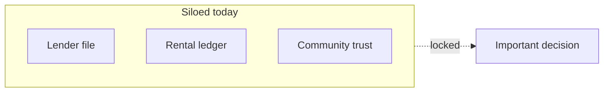

import PdfDownloadBar from '@site/src/components/PdfDownloadBar';

# Why Portable Trust Infrastructure?

  
Manifesto

  
TumiTrust is a <strong>trust platform</strong>, not a credit bureau. This page explains <em>why</em> Portable Trust Infrastructure exists.

<PdfDownloadBar title="Why PTI" />

## The problem: trust fragmentation

In emerging markets, credibility is **real** but **siloed**:

- A borrower repays a digital lender — that signal stays with one MFI
- A tenant pays rent faithfully — landlords cannot share that proof portably
- Community trade, mobile money, and endorsements never reach institutional decision systems

Traditional credit bureaus optimize for **formal financial history**. Millions of economically active people are **under-documented**, not untrustworthy.

## The thesis: one infrastructure layer

**Portable Trust Infrastructure (PTI)** separates:

1. **Trust generation** — partners ingest verified events into a shared network
2. **Trust consumption** — institutions run **trust lookups** at decision time

Same rails. Different jobs. Not a social network. Not a star-rating app.

## Trust → Portable → Programmable → Institution → Inclusion

| Stage | Meaning |
|-------|---------|
| **Trust** | Credibility built from verified activity, endorsements, and institutional badges |
| **Portable** | Trust signals travel with a person across **life-area contexts** (20+ documented) |
| **Programmable** | APIs, webhooks, and context-scoped reports institutions can integrate |
| **Institution** | Lenders, insurers, employers **make their own decisions** — we supply infrastructure |
| **Inclusion** | Under-documented people access opportunities through portable proof |

## Scope & contexts

TumiTrust documents **20+ trust contexts** — **10 primary** life areas plus **10 lens** cross-cutting views. Institutions and partners enable the contexts their contract needs; the same PTI map supports lending, rental, employment, insurance, civic, and more.

Rental, employment, insurance, agriculture, civic, and other primaries share the same APIs — enabled per contract, not implied as simultaneous launch scope.

## What we are not

- **Not a credit bureau** — we do not sell black-box "credit scores"
- **Not a lender** — we do not originate loans or hold deposits
- **Not decorative AI** — machine learning supports structured explainability and signal fusion

## Architecture (one sentence)

**Partner → Events → Signals → Trust lookup → Report → Explain → Verify**

See [PTI whitepaper](/pti/bibliography/whitepaper) and [Trust governance](/pti/specification/v1.0/governance).

## Next steps

- [Portable Trust Infrastructure overview](/pti/introduction/)
- [Trust governance framework](/pti/specification/v1.0/governance)
- [Trust context catalogue](/pti/reference-architecture/trust-contexts) — 20+ contexts, primaries + lenses
- [Get started](/tumitrust/product-overview/get-started)
