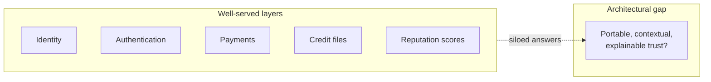
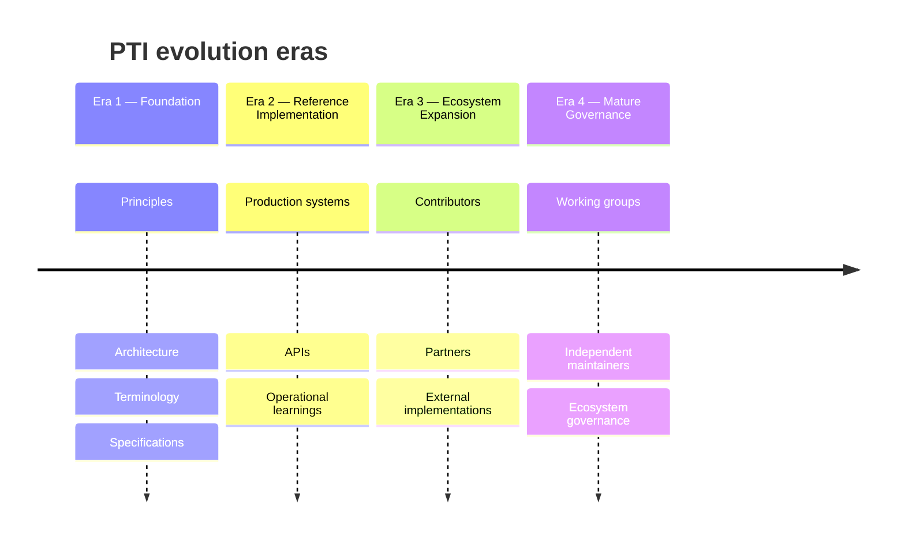
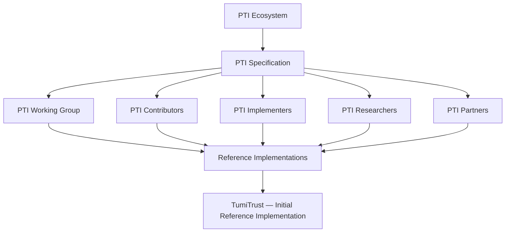

import SpecHero from '@site/src/components/SpecHero';

<SpecHero
  kicker="Historical foundation"
  title="The Origin of Portable Trust Infrastructure"
  lead="A record of how Portable Trust Infrastructure emerged as a technology category, how TumiTrust Technologies pioneered its foundations, and how the ecosystem is designed to grow beyond any single organization."
  badges={[
    {label: 'Category definition', variant: 'default'},
    {label: 'Founding steward', variant: 'default'},
    {label: 'Open ecosystem', variant: 'normative'},
  ]}
/>

## Three layers — read this first

| Layer | What it is | Relationship |
|-------|------------|--------------|
| **Portable Trust Infrastructure (PTI)** | A **technology category** — open architectural model, specification framework, and ecosystem for portable, programmable, interoperable trust | Vendor-neutral; welcomes independent implementations |
| **TumiTrust Technologies** | The organization that **conceived** the PTI model, **authored** initial specifications, and **built** the first production reference implementation | Founding steward — not owner of PTI |
| **Future PTI ecosystem** | Implementers, contributors, researchers, institutions, and partners who adopt, extend, and govern the standard over time | Success depends on breadth of participation |

---

## 1. The trust infrastructure gap

Digital infrastructure matured in **partial answers** to partial questions.

| System type | Question answered |
|-------------|-------------------|
| **Identity systems** | Who are you? |
| **Authentication systems** | Can you prove access? |
| **Payment systems** | Can value move? |
| **Credit systems** | What financial history exists? |
| **Reputation systems** | What do others think? |

Each layer solved an important problem. None answered the cross-cutting question institutions face at every consequential decision:

> **How can trust signals move with people and organizations across different contexts — remaining portable, explainable, governed, and reusable?**

Trust accumulated in **application silos**: a lender's ledger, a landlord's spreadsheet, a marketplace's star rating, a government's registry. Signals rarely crossed boundaries with **consent**, **context**, **provenance**, or **machine-readable semantics**.

Portable Trust Infrastructure addresses this gap as an **infrastructure layer** — not another app, bureau, or identity wallet.

---

## 2. The creation of PTI

Portable Trust Infrastructure was **conceived by TumiTrust Technologies** in response to fragmented trust systems that prevented individuals and organizations from carrying reputation, evidence, and relationships across digital ecosystems — especially in emerging markets where formal credit files under-represent economically active people.

**TumiTrust pioneered the Portable Trust Infrastructure model** and established the initial foundations for an emerging trust infrastructure category. The company developed:

| Foundation | Description |
|------------|-------------|
| **PTI conceptual model** | Separation of trust production, exchange, resolution, and consumption |
| **Initial architecture** | Registry, exchange, intelligence engine, and lookup surfaces |
| **Terminology framework** | Shared vocabulary — PTI-ID, trust context, trust signal, trust event, trust lookup |
| **Trust context model** | 20+ documented life-area scopes with isolation and lens derivation |
| **Trust graph approach** | Relationship-aware resolution across producers and subjects |
| **Trust exchange model** | Normalized ingest, attribution, and materialization of trust events |
| **First commercial implementation** | Production platform validating the model under real load |

The specification, RFCs, and reference architecture published in this documentation set encode those foundations for **independent implementers**. TumiTrust does **not** claim exclusive rights to PTI as a category; it claims **historical stewardship** of the first coherent definition and working implementation.

---

## 3. Why PTI was created

Trust in digital systems was — and remains — **fragmented**, **trapped**, **difficult to transport**, **difficult to verify**, **difficult to explain**, and **difficult to reuse**.

Organizations repeatedly **rebuild trust systems** instead of sharing interoperable trust infrastructure. Each rebuild duplicates identity resolution, event schemas, scoring logic, consent flows, and audit trails.

PTI introduces an infrastructure layer where trust can become:

| Property | Meaning for the ecosystem |
|----------|---------------------------|
| **Portable** | Signals and scores travel with a subject across institutions |
| **Programmable** | APIs and events integrate into automated decision workflows |
| **Composable** | Multiple producers contribute to one governed trust map |
| **Contextual** | Lending, rental, employment, and other contexts stay isolated |
| **Explainable** | Consumers receive attributable evidence, not opaque scores |
| **Auditable** | Provenance, consent, and retention are specification requirements |
| **Interoperable** | Independent implementations exchange trust via shared semantics |

See also [Why PTI exists](/pti/why-pti/) and [Problems with existing systems](/pti/introduction/problems-with-existing-systems) for comparative analysis.

---

## 4. TumiTrust: the PTI reference implementation

**TumiTrust** is the **first commercial implementation** demonstrating how PTI principles operate in production environments. It exists to **validate the specification through real-world deployment** — not to replace the specification with product behavior.

| Capability | Role in the reference implementation |
|------------|--------------------------------------|
| **Architecture** | Multi-tier platform — web, APIs, async workers, graph and compute services |
| **Trust platform API** | Institution and partner integration at `https://tumitrust.com/api/v1/` |
| **Trust engine** | Context-scoped intelligence, debounced recompute, explainability outputs |
| **Trust contexts** | 20+ documented primaries and lenses — [catalogue](/pti/reference-architecture/trust-contexts) |
| **Identity resolution** | Entity-to-`pti_id` mapping — [RFC-011](/pti/rfcs/rfc-011-identity-resolution) |
| **Trust profiles** | Subject-facing and institution-facing views of the same underlying graph |
| **Institutional integrations** | Lookup studio, reports, webhooks, partner connectors |
| **Developer platform** | OpenAPI, sandbox keys, conformance-oriented integration paths |

Product documentation describes **how TumiTrust implements** PTI: [TumiTrust Platform overview](/tumitrust/platform/trust-platform-overview). Specification documentation describes **what any compatible implementation must do**: [PTI Specification v1.0](/pti/specification/v1.0/).

---

## 5. Stewarding the PTI specification

During the foundation era, **TumiTrust maintains stewardship** of the public specification assets:

- PTI specifications and version releases
- [RFC process](/pti/governance/rfc-process) and modular normative documents
- [Architecture documentation](/pti/reference-architecture/) and reference models
- [Terminology standards](/pti/glossary/) and editorial conventions
- [Implementation guidance](/pti/implementation-guide/) and [Build Your Own PTI](/pti/build-your-pti/)

This responsibility exists to:

1. **Maintain consistency** across documents, APIs, and conformance tests
2. **Protect interoperability** so independent implementations can exchange trust
3. **Establish technical foundations** before ecosystem governance fully matures

Stewardship is **transitional**, not permanent sole control. See [Ecosystem roadmap](/pti/governance/ecosystem-roadmap) and [Governance model](/pti/governance/governance-model).

---

## 6. Building PTI together

Although TumiTrust pioneered PTI, **long-term success depends on broader ecosystem participation**.

The specification is designed so that **developers**, **researchers**, **financial institutions**, **governments**, **technology companies**, **universities**, and **infrastructure providers** can:

- Implement PTI-compatible systems without TumiTrust code
- Propose improvements through the [contribution process](/pti/governance/contribution-process)
- Participate in [conformance](/pti/conformance/) and certification programs
- Build applications, connectors, and regional trust networks on shared semantics

> The strongest infrastructure ecosystems are those where many organizations can build, innovate, and participate — while preserving a coherent public standard.

[Community participation](/pti/governance/community-participation) · [Public governance statement](/pti/governance/public-governance-statement) · [Reference implementations](/pti/governance/reference-implementations)

---

## 7. PTI evolution roadmap

| Era | Focus | Primary artifacts |
|-----|-------|-------------------|
| **1 — Foundation** | Define the category | PTI principles, architecture, terminology, [Specification v1.0](/pti/specification/v1.0/), [RFC index](/pti/rfcs/) |
| **2 — Reference implementation** | Prove production viability | TumiTrust platform, [Trust platform API](/tumitrust/developer-guides/trust-platform-api), operational runbooks |
| **3 — Ecosystem expansion** | Multiply implementers | Partner integrations, third-party profiles, [conformance badges](/pti/conformance/implementation-badges) |
| **4 — Mature governance** | Distribute stewardship | [Working Group](/pti/governance/working-group), independent maintainers, [future foundation model](/pti/governance/future-foundation-model) |

---

## 8. PTI governance model

**How to read this diagram**

- **PTI Specification** is the normative center — implementations conform to it; it does not belong to one vendor.
- **Working Group, contributors, implementers, researchers, and partners** evolve the spec through RFCs, review, and operational feedback.
- **Reference implementations** prove feasibility; multiple may exist over time.
- **TumiTrust** is the **initial** reference implementation and founding steward — the first production proof, not the only permitted builder.

Full process detail: [PTI Ecosystem Governance](/pti/governance/).

---

## 9. Founding statement

Portable Trust Infrastructure (PTI) was pioneered by **TumiTrust Technologies** to establish an architectural model for portable, interoperable trust across institutions and life contexts.

TumiTrust authored the initial specifications, terminology, and reference implementation, and feeds operational learnings back into the public standard.

PTI is an **open ecosystem**: independent implementations are encouraged, conformance is verifiable, and governance is designed to mature beyond any single organization.

Governance commitments are documented in the [Public governance statement](/pti/governance/public-governance-statement).

---

## 10. The PTI foundation vision

Over time, a **neutral ecosystem body** may steward PTI — analogous to how mature standards communities operate. This is an **evolution path**, not a present legal entity.

A future PTI foundation could facilitate:

| Function | Purpose |
|----------|---------|
| **Working groups** | Domain-specific specification maintenance |
| **Standards governance** | RFC approval, version releases, deprecation policy |
| **Contribution models** | Clear paths for issues, proposals, and implementer feedback |
| **Certification** | Independent conformance testing and badge issuance |
| **Research collaboration** | Published threat models, interoperability studies, academic partnerships |

Today, these functions are **distributed** across the [governance section](/pti/governance/) with TumiTrust as founding steward. See [Future foundation model](/pti/governance/future-foundation-model) for the documented transition criteria.

---

## Continue reading

| Audience | Next steps |
|----------|------------|
| **Architects** | [Reference architecture](/pti/reference-architecture/) · [Specification v1.0](/pti/specification/v1.0/) |
| **Implementers** | [Build Your Own PTI](/pti/build-your-pti/) · [Conformance profiles](/pti/conformance/profiles) |
| **Integrators** | [TumiTrust Trust platform API](/tumitrust/developer-guides/trust-platform-api) |
| **Policy & partnerships** | [Governance](/pti/governance/) · [Comparisons](/pti/comparisons/) |
| **Researchers** | [Bibliography / whitepaper](/pti/bibliography/whitepaper) · [RFC index](/pti/rfcs/) |

---

Normative requirements are in the [PTI Specification v1.0](/pti/specification/v1.0/) and [RFCs](/pti/rfcs/).
