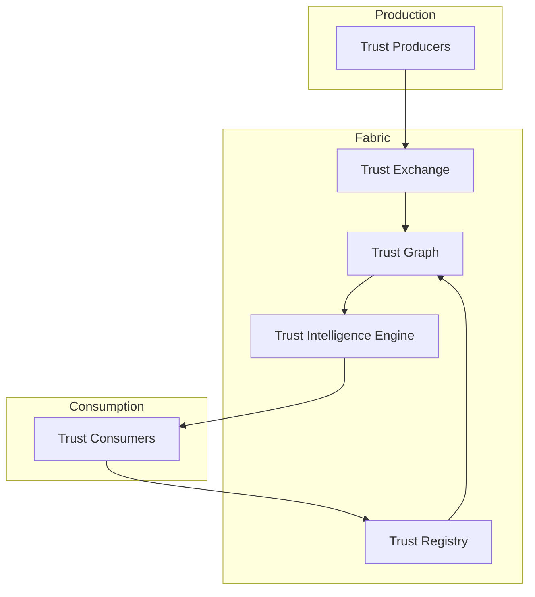

# Reference Architecture

The PTI reference architecture describes how trust is generated, exchanged, resolved, and consumed across institutional boundaries. These pages are **informative** companions to the normative [Specification v1.0](/pti/specification/v1.0/).

## Architectural intent

Portable Trust Infrastructure separates three concerns that traditional credit and identity systems often conflate:

1. **Signal production** — partners and verifiers attest real-world activity.
2. **Trust fabric operations** — registry, exchange, graph, and intelligence derivation.
3. **Decision-time consumption** — institutions request context-scoped trust intelligence.

## Component catalogue

| Page | Topic |
|------|-------|
| [Trust Flow](./trust-flow) | End-to-end signal and lookup flow |
| [Trust Lifecycle](./trust-lifecycle) | States from event ingest to report expiry |
| [Trust Graph](./trust-graph) | Nodes, edges, and temporal relationships |
| [Trust Signals](./trust-signals) | Normalized activity representations |
| [Trust Evidence](./trust-evidence) | Documents, endorsements, and attestations |
| [Trust Assertions](./trust-assertions) | Signed claims about subjects |
| [Trust Events](./trust-events) | Canonical ingest unit |
| [Trust Producers](./trust-producers) | Organizations that emit signals |
| [Trust Consumers](./trust-consumers) | Institutions that run lookups |
| [Trust Exchange](./trust-exchange) | Routing and policy enforcement layer |
| [Trust Registry](./trust-registry) | Identity directory and catalogs |
| [Trust Resolution](./trust-resolution) | Matching partner entities to `pti_id` |
| [Trust Intelligence Engine](./trust-intelligence-engine) | Scoring, confidence, explainability |
| [Trust APIs](./trust-apis) | Integration surfaces for each role |

## Trust contexts

Contexts partition the trust graph into life-area scopes (e.g., lending, rental, employment) and cross-cutting lens views (e.g., risk compliance, digital platform). See [Trust Context Catalogue](./trust-contexts) for the documented context map.

## Planes vs components

| Plane | Components |
|-------|------------|
| **Production** | Producers, ingest gateways, event normalizers |
| **Fabric** | Registry, exchange, graph store, intelligence engine |
| **Consumption** | Lookup APIs, verification, policy gateway |

Physical deployments may colocate components, but logical separation remains required for security and governance.

## Reading paths

**Integrators (producers):** [Trust Producers](./trust-producers) → [Trust Events](./trust-events) → [Trust Exchange](./trust-exchange) → [Trust APIs](./trust-apis)

**Integrators (consumers):** [Trust Consumers](./trust-consumers) → [Trust Resolution](./trust-resolution) → [Trust Intelligence Engine](./trust-intelligence-engine) → [Trust APIs](./trust-apis)

**Architects:** [Trust Flow](./trust-flow) → [Trust Graph](./trust-graph) → [Trust Registry](./trust-registry) → [Specification Architecture](/pti/specification/v1.0/architecture)

## Related normative documents

- [PTI Specification v1.0](/pti/specification/v1.0/)
- [Glossary](/pti/glossary/)
- [Implementation Guide](/pti/implementation-guide/)
