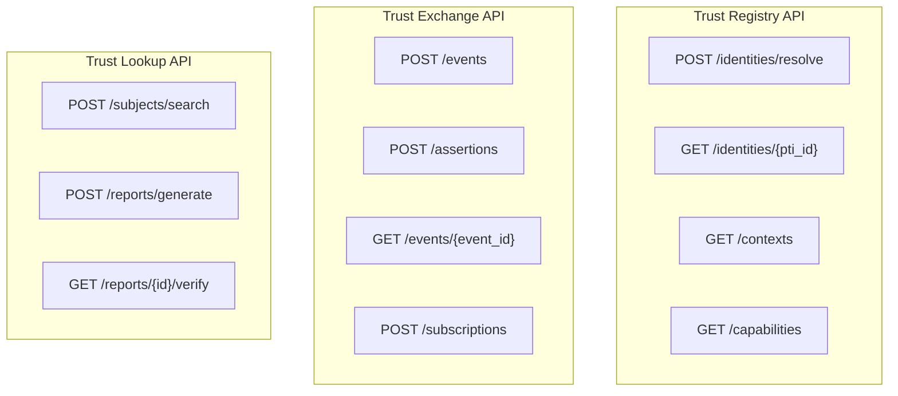

# Trust APIs

PTI exposes three abstract API families for registry, exchange, and lookup operations. Concrete HTTP bindings **MUST** preserve semantics defined in the [Reference API Specification](/pti/specification/v1.0/reference-api-specification).

## API map

## Role-to-API matrix

| Role | Primary APIs | Scopes |
|------|--------------|--------|
| **Producer** | Exchange ingest, Registry resolve | `events:write`, `identities:resolve` |
| **Consumer** | Lookup search/generate/verify | `lookup:search`, `lookup:generate` |
| **Verifier** | Exchange assertions | `assertions:write` |
| **Registry admin** | Catalog and entitlement CRUD | `registry:write`, `catalog:manage` |
| **Subject agent** | Self export and consent | `subject:read_self`, `consent:manage` |

## Common headers

| Header | Required |
|--------|----------|
| `Authorization` | Yes |
| `X-PTI-Version` | Yes |
| `X-Correlation-Id` | Yes |
| `X-Tenant-Id` | Yes (service accounts) |

## Producer quick path

1. `POST /registry/v1/identities/resolve` — map entity to `pti_id`
2. `POST /exchange/v1/events` — submit trust event
3. `GET /exchange/v1/events/{event_id}` — poll async status
4. Receive webhook `event.materialized`

## Consumer quick path

1. `POST /lookup/v1/subjects/search` — find candidate subjects
2. `POST /lookup/v1/reports/generate` — request intelligence
3. `GET /lookup/v1/reports/{id}/verify` — confirm authenticity

## Error handling

All APIs return the standard error envelope with `PTI-` codes. Clients **MUST** log `correlation_id` for support.

## Version negotiation

Clients read `GET /registry/v1/capabilities` at startup and pin `X-PTI-Version` accordingly.

## Sandboxing

Sandbox base URLs **MUST** use separate credentials. Sandbox **SHOULD** support full API surface with synthetic data.

## OpenAPI profiles

Implementations **MAY** publish OpenAPI documents per profile (`pti-producer/v1`, `pti-consumer/v1`). Generated clients **SHOULD NOT** hardcode field sets that bypass `schema_version` checks.

## Related pages

- [Reference API Specification](/pti/specification/v1.0/reference-api-specification)
- [Authentication Model](/pti/specification/v1.0/authentication-model)
- [Authorization Model](/pti/specification/v1.0/authorization-model)
- [Reference Error Codes](/pti/specification/v1.0/reference-error-codes)
