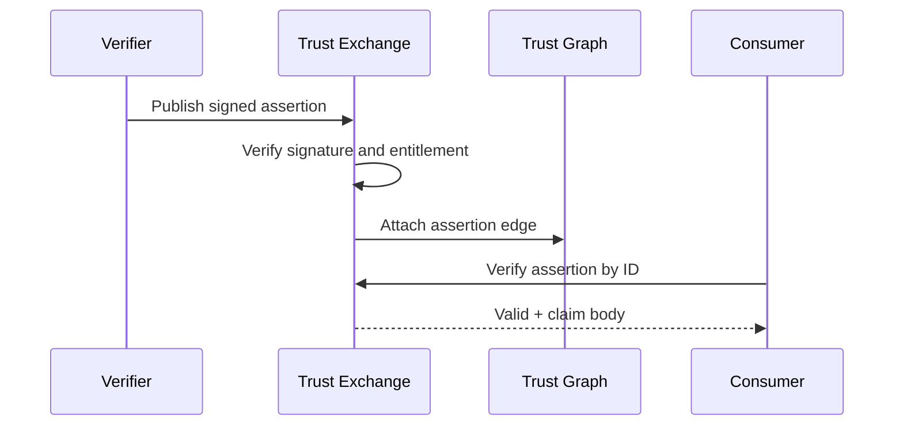

# Trust Assertions

A trust assertion is a signed, context-scoped claim about a subject that can be independently verified.

## Assertion vs signal

| Aspect | Trust signal | Trust assertion |
|--------|--------------|-----------------|
| Origin | Derived from events | Issued by attestor |
| Form | Normalized graph node | Signed claim document |
| Typical use | Scoring input | Portable proof export |
| Verification | Provenance walk | Cryptographic signature |

Signals feed the intelligence engine; assertions **MAY** be exchanged across registry boundaries as portable proofs.

## Assertion structure

```json
{
  "assertion_id": "asr_7c4d9e2f",
  "pti_id": "pti_7f3c9a2b1e",
  "context_id": "employment",
  "claim": {
    "type": "employment.verified",
    "employer": "org_pti_abc123",
    "role": "field_agent",
    "tenure_months": 18
  },
  "confidence": 0.95,
  "evidence_ids": ["evd_3f8a1c2b"],
  "issuer_id": "ver_hr_registry",
  "issued_at": "2026-04-01T12:00:00Z",
  "expires_at": "2027-04-01T12:00:00Z",
  "signature": "eyJhbGciOiJFZERTQSIs..."
}
```

## Issuance flow



## Verification requirements

Verifiers **MUST** validate:

1. Signature algorithm and public key from issuer trust store
2. `issued_at` / `expires_at` window
3. `pti_id` still active and not suppressed
4. Issuer entitled for `context_id` and claim type

Failed verification **MUST** return `PTI-4222`.

## Federation

Cross-operator assertion exchange uses signed envelopes per [Interoperability Specification](/pti/specification/v1.0/interoperability). Receiving registries **MAY** import assertions as read-only graph edges without re-signing.

## Revocation

Assertions **MAY** be revoked before `expires_at` via:

- Revocation list published by issuer
- Registry suppression event
- Subject dispute upholding retraction

Revoked assertions **MUST NOT** appear in new trust reports.

## Trust Passport linkage

Portable proof bundles (sometimes called a **Trust Passport**) aggregate multiple assertions and recent context summaries for subject-controlled sharing. Passports **SHOULD** include verify URIs for each constituent assertion.

## Related pages

- [Trust Evidence](./trust-evidence)
- [Trust Exchange](./trust-exchange)
- [Security Specification](/pti/specification/v1.0/security)
