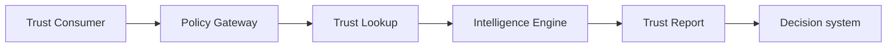
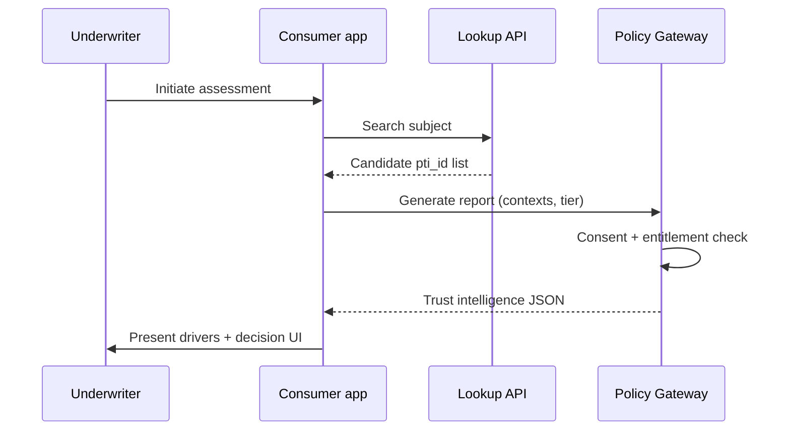

# Trust Consumers

Trust consumers request context-scoped trust intelligence at decision time — underwriting, onboarding, hiring, compliance, and risk assessment.

## Consumer role

Consumers **MUST** authenticate with consumer-scoped credentials and declare `purpose_code` on lookups where policy requires.

## Consumer categories

| Category | Typical contexts | Decision examples |
|----------|------------------|-------------------|
| **Lenders** | `lending`, `risk_compliance` | Credit line approval |
| **Insurers** | `insurance`, `risk_compliance` | Policy underwriting |
| **Employers** | `employment`, `education` | Background verification |
| **Landlords** | `rental` | Tenant screening |
| **Platforms** | `merchant`, `digital_platform` | Seller onboarding |
| **Government** | `civic`, `employment` | Benefit eligibility |

## Lookup tiers

| Tier | Depth | Typical use |
|------|-------|-------------|
| **Basic** | Score band + coverage summary | Pre-qualification |
| **Detailed** | Drivers + provenance summary | Standard underwriting |
| **Predictive** | Model features with explainability | Advanced risk pricing |
| **Screening** | Sanctions, PEP, adverse media hooks | Compliance dossier |

Consumers **MUST** hold entitlement for requested tier and context combination.

## Lookup workflow

## Policy obligations

Consumers **MUST**:

- Use explainability artifacts for adverse decisions affecting subjects.
- Store reports per organizational retention policy.
- Respect suppression and erasure flags immediately.
- Avoid republishing raw trust data outside contractual purpose.

## External subjects

When directory search misses, consumers **MAY** route to external screening profiles if entitled. External routes **SHOULD** bill separately and label provenance distinctly from native graph signals.

## Verification

Consumers **SHOULD** verify report authenticity via:

- `verify_uri` QR or link for human auditors
- `GET /reports/{id}/verify` for automated checks

## Hybrid tenants

Organizations acting as both producer and consumer **MUST** use separate credentials and entitlements per role to preserve audit clarity.

## Related pages

- [Trust Intelligence Engine](./trust-intelligence-engine)
- [Trust APIs](./trust-apis)
- [Privacy Specification](/pti/specification/v1.0/privacy)
