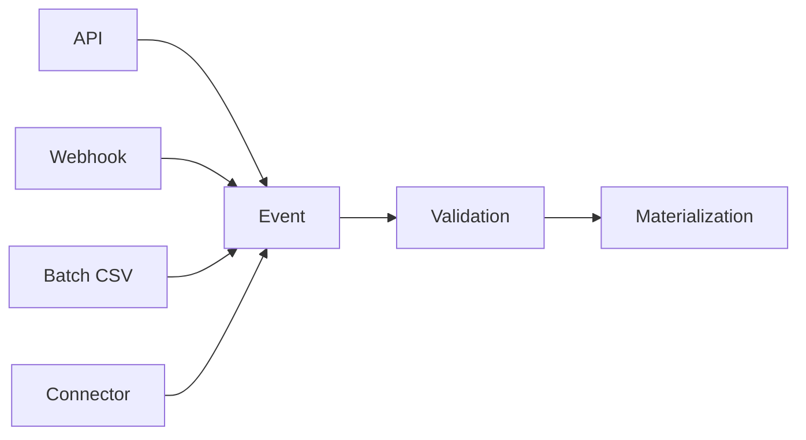

# Trust Events

Trust events are the canonical ingest unit in PTI — every signal ultimately traces to an accepted event.

## Event as system of record



## Ingest channels

| Channel | Characteristics |
|---------|-----------------|
| `api` | Synchronous, real-time integrations |
| `webhook` | Partner-initiated HTTP push |
| `csv` | Batch backfill with row-level status |
| `connector` | Managed adapter to third-party systems |

All channels **MUST** produce identical canonical envelopes after normalization.

## Event catalog binding

Each `event_type` registers:

- Allowed `context_id`
- Payload JSON schema URI
- Signal mapping rules
- Idempotency key template guidance

Unregistered event types **MUST** be rejected at validation.

## Minimal envelope (reference)

```json
{
  "schema_version": "trust_event.v1",
  "event_id": "550e8400-e29b-41d4-a716-446655440000",
  "idempotency_key": "partner:action:entity:date",
  "event_type": "merchant.transaction.settled",
  "context_id": "merchant",
  "pti_id": "pti_7f3c9a2b1e",
  "producer_id": "prt_marketplace",
  "occurred_at": "2026-07-01T09:15:00Z",
  "payload": {}
}
```

## Processing pipeline

1. **Authenticate** producer credentials
2. **Validate** schema and entitlements
3. **Resolve** `pti_id` if partner reference supplied
4. **Persist** immutable event record
5. **Enqueue** materialization job
6. **Emit** webhook `event.materialized` or rejection notice

## Corrections and retractions

| Operation | event_type suffix | Effect |
|-----------|-------------------|--------|
| Correction | `.corrected` | Supersedes prior event |
| Retraction | `.retracted` | Withdraws signals |

See [Trust Lifecycle](./trust-lifecycle) for state transitions.

## Batching semantics

Batch ingest returns per-record outcomes:

```json
{
  "batch_id": "bat_9912",
  "accepted": 980,
  "rejected": 20,
  "errors": [
    {"row": 42, "code": "PTI-4005", "message": "Invalid context_id"}
  ]
}
```

## Observability

Events **MUST** propagate `correlation_id` through materialization and score refresh for support tracing.

## Related pages

- [Trust Flow](./trust-flow)
- [Trust Producers](./trust-producers)
- [Reference Event Model](/pti/specification/v1.0/reference-event-model)
