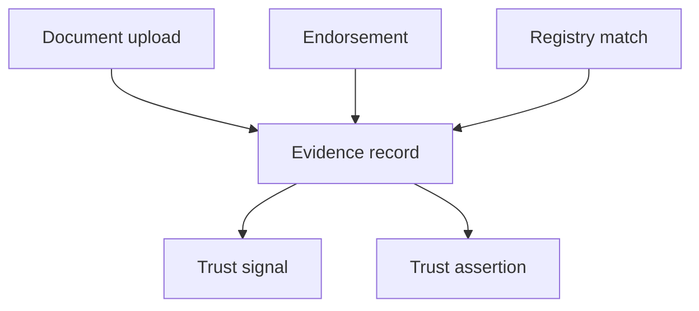

# Trust Evidence

Trust evidence comprises artifacts and attestations that support signals and assertions with verifiable provenance.

## Evidence in the trust stack



Evidence **MAY** exist independently until linked to a signal or assertion.

## Evidence types

| Type | Description | Typical attestor |
|------|-------------|------------------|
| `document` | ID, payslip, utility bill, business registration | Verifier or subject |
| `endorsement` | Peer or institutional vouch | Subject or institution |
| `registry_match` | Government or commercial registry hit | Registry connector |
| `badge` | Credential or certification marker | Accrediting body |
| `third_party_report` | Screening or bureau supplement | External provider |

## Evidence record

```json
{
  "evidence_id": "evd_3f8a1c2b",
  "evidence_type": "document",
  "uri": "https://vault.example/evidence/evd_3f8a1c2b",
  "hash": "sha256:9b1c...",
  "attestor_id": "ver_gov_id",
  "attested_at": "2026-05-10T08:00:00Z",
  "metadata": {
    "document_class": "national_id",
    "verification_method": "ocr_plus_manual"
  }
}
```

## Integrity controls

- Content **SHOULD** be stored in tamper-evident object storage.
- `hash` **MUST** be computed at ingest for document types.
- Access to evidence URIs **MUST** require entitled credentials; public lookups **MUST NOT** expose raw document URIs.

## Verification levels

| Level | Meaning |
|-------|---------|
| `self_attested` | Subject-provided without independent check |
| `partner_attested` | Producer confirms from operational data |
| `verifier_attested` | Independent verifier confirms |
| `registry_confirmed` | Authoritative registry match |

Higher verification levels increase signal weight caps in intelligence derivation.

## Chain of custody

Evidence chains **SHOULD** record:

1. Upload or capture timestamp
2. Verification steps applied
3. Operator or system identity performing validation
4. Linkage to resulting signals

Chains support audit requests and dispute resolution.

## Retention

Evidence retention follows governance policy:

- Identity documents may have longer retention where KYC law requires.
- Superseded evidence **SHOULD** be archived, not deleted, until dispute window closes.
- Erasure requests **MUST** remove or irreversibly anonymize evidence linked to erased subjects.

## Related pages

- [Trust Assertions](./trust-assertions)
- [Trust Signals](./trust-signals)
- [Governance Specification](/pti/specification/v1.0/governance)
