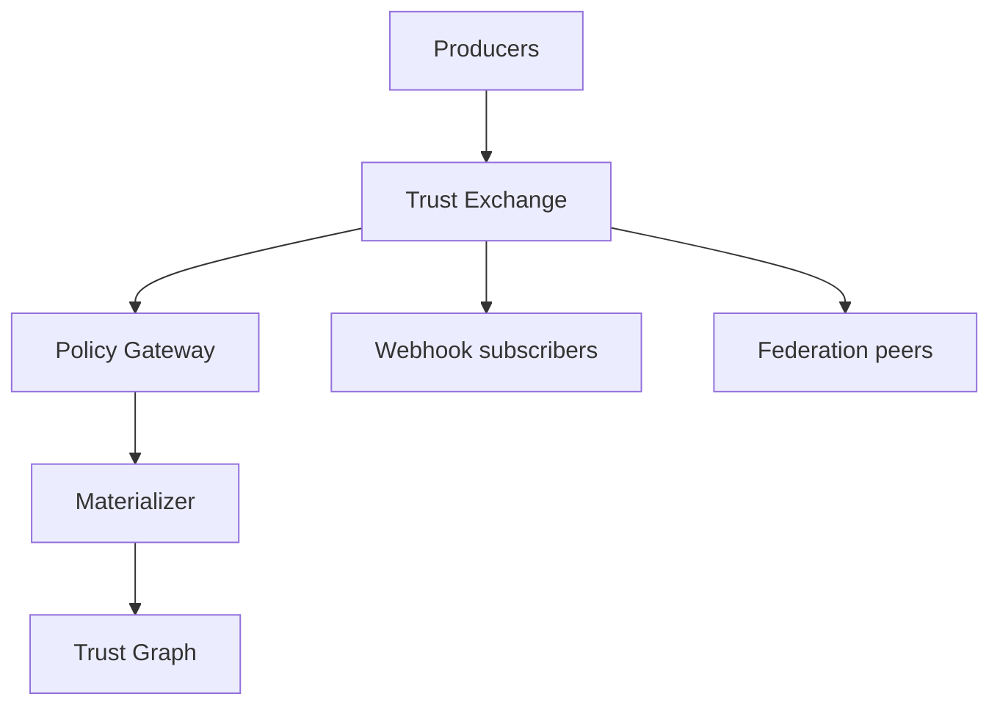

# Trust Exchange

The Trust Exchange is the routing and policy enforcement layer between producers, the trust graph, and federation partners.

## Exchange responsibilities

Core functions:

1. Accept and validate trust events and assertions
2. Enforce producer entitlements and policy packs
3. Route materialization jobs to intelligence pipeline
4. Fan-out notifications to subscribers
5. Exchange signed artifacts with peer registries

## Ingest gateway

The ingest gateway performs:

| Step | Action |
|------|--------|
| AuthN | Validate producer credentials |
| AuthZ | Check context and event type entitlement |
| Schema | Validate `schema_version` and payload |
| Idempotency | Detect duplicate `idempotency_key` |
| Persist | Write immutable event record |

## Policy gateway

Before materialization or outbound federation:

- Verify producer not suspended
- Check subject not erased or suppressed
- Apply geo and data-category restrictions
- Evaluate quarantine rules for anomalous ingest

Denials return standard `PTI-403x` / `PTI-422x` codes.

## Assertion routing

Signed assertions traverse a parallel path:

1. Signature verification
2. Issuer trust store lookup
3. Graph edge attachment
4. Optional webhook `assertion.published`

## Subscriptions

| Topic | Payload |
|-------|---------|
| `event.materialized` | `event_id`, `pti_id`, `context_id` |
| `event.rejected` | `event_id`, error code |
| `assertion.published` | `assertion_id`, `issuer_id` |
| `identity.merged` | `survivor_pti_id`, `merged_pti_id` |

Subscribers **MUST** verify webhook signatures before processing.

## Federation

Exchange peers replicate:

- Assertion envelopes (read-only import)
- Suppression and erasure directives
- Catalog updates

Conflict resolution follows federation profile precedence rules.

## Reliability

- At-least-once delivery **SHOULD** be guaranteed for accepted events.
- Materialization **MUST** be idempotent per `event_id`.
- Dead-letter queues **SHOULD** capture permanent materialization failures for operator replay.

## Related pages

- [Trust Events](./trust-events)
- [Trust Registry](./trust-registry)
- [Interoperability Specification](/pti/specification/v1.0/interoperability)
