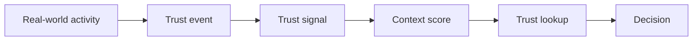
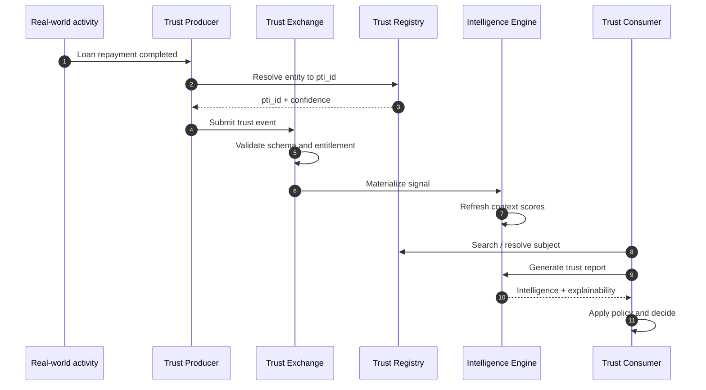

# Trust Flow

Trust flow describes how activity becomes decision-ready intelligence in Portable Trust Infrastructure.

## High-level flow

## Detailed sequence

## Flow stages

### 1. Activity capture

A trust producer observes verifiable activity — repayment, lease completion, employment verification, merchant transaction, or community endorsement. The producer maps activity to a catalogued `event_type` and `context_id`.

### 2. Identity resolution

Before ingest, the producer resolves the local entity identifier to a `pti_id` through the Trust Registry. Resolution may be deterministic (exact identifier match) or probabilistic (scored candidate match).

### 3. Event ingest

The producer submits a canonical trust event to the Trust Exchange. The exchange validates schema version, producer entitlement, and idempotency.

### 4. Signal materialization

Accepted events produce trust signals — normalized, context-bound representations suitable for graph queries and scoring. Signals retain provenance links to source events.

### 5. Intelligence refresh

The Trust Intelligence Engine updates context scores, confidence bands, driver weights, and coverage gaps. Refresh may be synchronous for low-latency tiers or asynchronous for batch contexts.

### 6. Trust lookup

A trust consumer searches for a subject and requests a context-scoped report at an entitled tier. The policy gateway enforces consent, purpose, and data minimization before returning fields.

### 7. Verification and decision

Consumers verify report authenticity (QR, API verify endpoint, or signature) and incorporate outcomes into underwriting, onboarding, hiring, or compliance workflows.

## Parallel paths

| Path | Description |
|------|-------------|
| **Assertion publish** | Verifiers publish signed assertions directly to exchange |
| **Endorsement** | Community or institutional endorsements create graph edges |
| **External screening** | Directory miss routes to external verification with separate billing |
| **Correction / retraction** | Producers issue lifecycle events that supersede prior signals |

## Failure branches

- Validation failure → producer receives `PTI-400x`; no signal created.
- Policy denial → `PTI-403x`; event rejected at exchange.
- Consent missing → consumer receives `PTI-4033` at lookup.
- Thin data → report returns explicit `coverage_gaps` rather than implied approval.

## Related pages

- [Trust Lifecycle](./trust-lifecycle)
- [Trust Events](./trust-events)
- [Trust Intelligence Engine](./trust-intelligence-engine)
- [Reference Event Model](/pti/specification/v1.0/reference-event-model)
