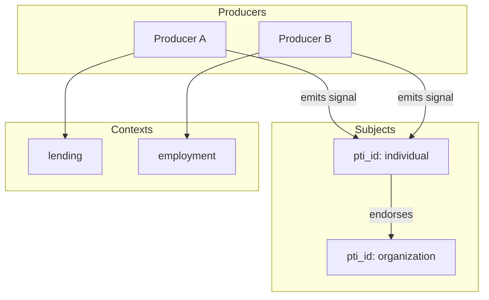

# Trust Graph

The trust graph is the persistent structure connecting subjects, producers, contexts, signals, and relationships in PTI.

## Graph model



## Node types

| Node | Key attributes |
|------|----------------|
| **Subject** | `pti_id`, `identity_type`, `verification_level` |
| **Producer** | `producer_id`, entitled contexts |
| **Consumer** | `consumer_id`, lookup tiers |
| **Context** | `context_id`, `context_tier` |
| **Signal** | `signal_id`, `polarity`, `weight`, `effective_at` |
| **Evidence** | `evidence_id`, `evidence_type`, `hash` |

## Edge types

| Edge | Semantics |
|------|-----------|
| `EMITTED` | Producer → Signal |
| `AFFECTS` | Signal → Subject |
| `SCOPED_TO` | Signal → Context |
| `SUPPORTED_BY` | Signal → Evidence |
| `ENDORSES` | Subject → Subject |
| `EMPLOYS` | Organization → Individual |
| `VERIFIED_BY` | Assertion → Producer |

Edges **SHOULD** carry `valid_from` and optional `valid_to` for temporal queries.

## Temporal history

The graph is inherently temporal. Intelligence engines query signals as-of a point in time for audit replay:

```
signals(S, C, t) = { σ | σ.AFFECTS = S ∧ σ.SCOPED_TO = C ∧ σ.effective_at ≤ t ∧ ¬expired(σ, t) }
```

Historical replay supports dispute investigation and regulatory examination.

## Trust relationships

A **trust relationship** is a durable edge between subjects or between subject and institution:

- Employment relationship (organization employs individual)
- Landlord-tenant relationship
- Counterparty partnership
- Community endorsement

Relationships may unlock relationship-scoped signals (e.g., employer verification) without exposing unrelated contexts.

## Graph isolation

Context isolation is enforced by constraining traversals:

- Lending lookups traverse lending-scoped signals unless lens derivation rules expand scope.
- Cross-context inference **MUST** be explicit in lens `derivation_rules`.

## Query patterns

| Pattern | Use case |
|---------|----------|
| **Neighborhood** | All signals for subject in context |
| **Provenance walk** | Signal → event → producer |
| **Path trust** | Endorsement chain depth and strength |
| **Coverage analysis** | Detect thin subgraphs |

## Federation

Federated deployments replicate subject nodes and foreign assertion edges. Conflict resolution prefers higher-confidence registry merges and signed assertion precedence.

## Storage considerations

Implementations typically combine:

- **OLTP store** — identity and entitlement records
- **Event log** — immutable event stream
- **Graph index** — traversal-optimized signal adjacency
- **Derived cache** — materialized context scores

## Related pages

- [Trust Signals](./trust-signals)
- [Trust Resolution](./trust-resolution)
- [Trust Intelligence Engine](./trust-intelligence-engine)
- [Reference Data Model](/pti/specification/v1.0/reference-data-model)
