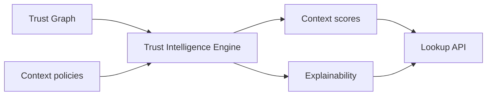
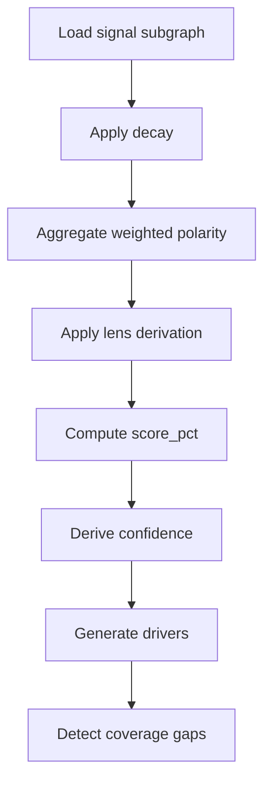

# Trust Intelligence Engine

The Trust Intelligence Engine derives context-scoped outcomes, confidence bands, and explainability artifacts from the trust graph.

## Engine position



## Inputs

| Input | Description |
|-------|-------------|
| Active signals | Context-filtered signal subgraph |
| Evidence weights | Verification level multipliers |
| Relationship edges | Endorsement and employment links |
| Policy tables | Decay, caps, lens derivation rules |
| Historical outcomes | Optional calibration datasets |

## Outputs

| Output | Description |
|--------|-------------|
| `score_pct` | 0–100 normalized context score |
| `band` | `thin`, `fair`, `good`, `strong` |
| `confidence` | Model certainty 0.0–1.0 |
| `drivers` | Ranked explanatory factors |
| `coverage_gaps` | Explicit thin-data flags |
| `provenance_summary` | Producer diversity and freshness |

## Scoring pipeline



## Context Score vs Trust Score

| Term | Scope |
|------|-------|
| **Context Score** | Single `context_id` outcome |
| **Trust Score** | Informative umbrella term; implementations **SHOULD** avoid presenting a single cross-context number without explicit aggregation policy |

PTI emphasizes **context-scoped** outcomes to prevent context collapse.

## Explainability contract

Explainability artifacts follow `explain_score.v1` structure:

```json
{
  "confidence": {
    "score_pct": 72,
    "band": "good",
    "drivers": [
      {"id": "repayment_on_time", "label": "On-time repayments", "weight": 0.34}
    ]
  },
  "coverage_gaps": ["thin_insurance_history"]
}
```

Drivers **MUST** map to auditable signal classes, not opaque latent features, in conformant profiles.

## Model governance

Operators **SHOULD** maintain:

- Versioned model cards per context
- Bias and fairness review cadence
- Champion/challenger promotion process
- Rollback path for score distribution drift

## Refresh modes

| Mode | Trigger |
|------|---------|
| **Event-driven** | New materialized signal |
| **Scheduled** | Nightly batch for low-velocity contexts |
| **On-demand** | Lookup requests stale cache |

Stale cache **SHOULD** expose `computed_at` so consumers judge freshness.

## Screening integration

Screening dimensions (sanctions, PEP, identity registry) **MAY** attach as adjunct `compliance_intelligence` blocks without replacing context scores.

## Related pages

- [Trust Signals](./trust-signals)
- [Trust Consumers](./trust-consumers)
- [Explainability Specification](/pti/specification/v1.0/explainability)
